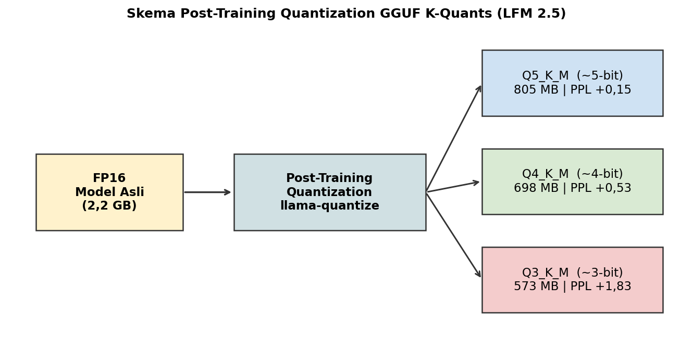
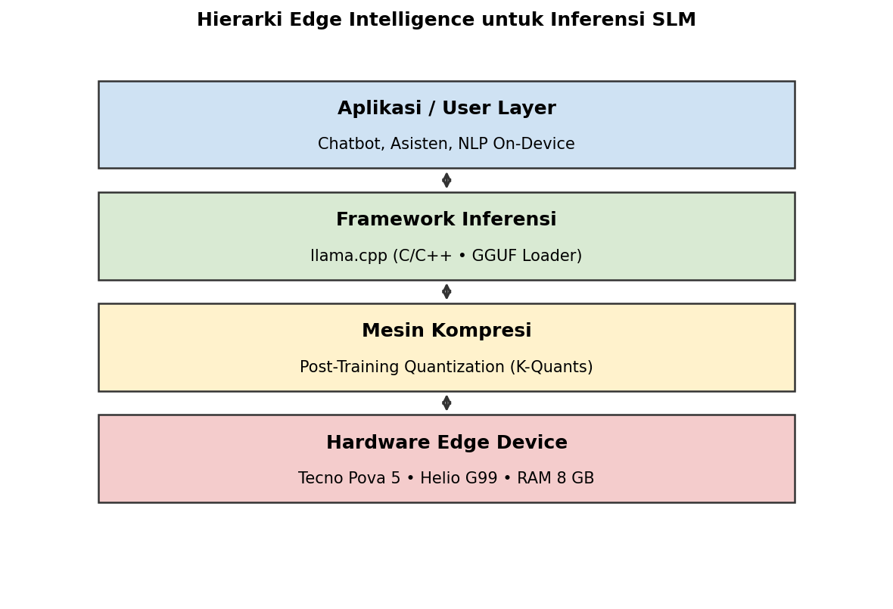
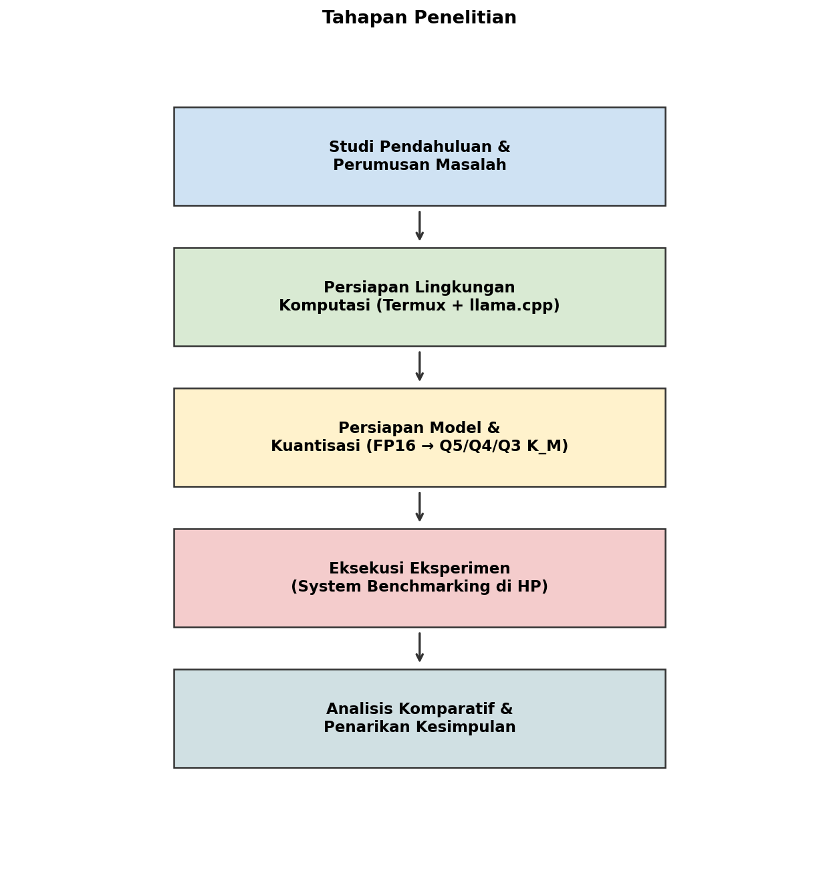
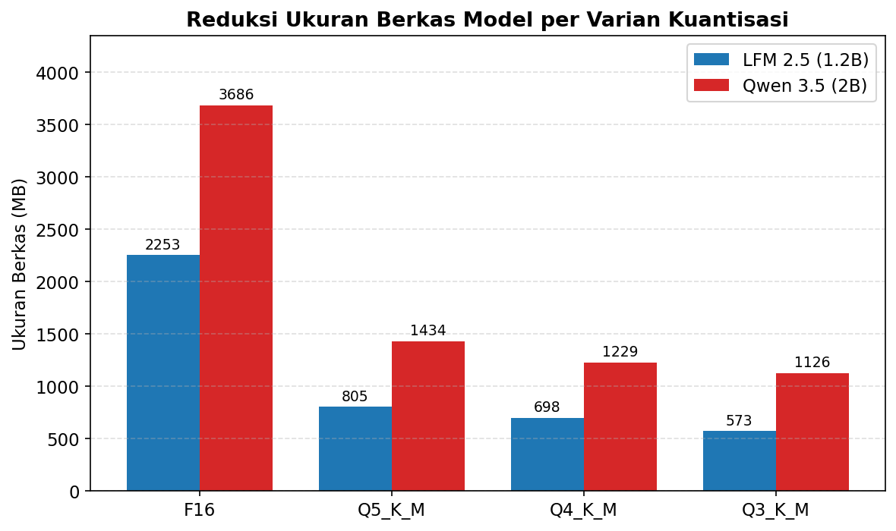
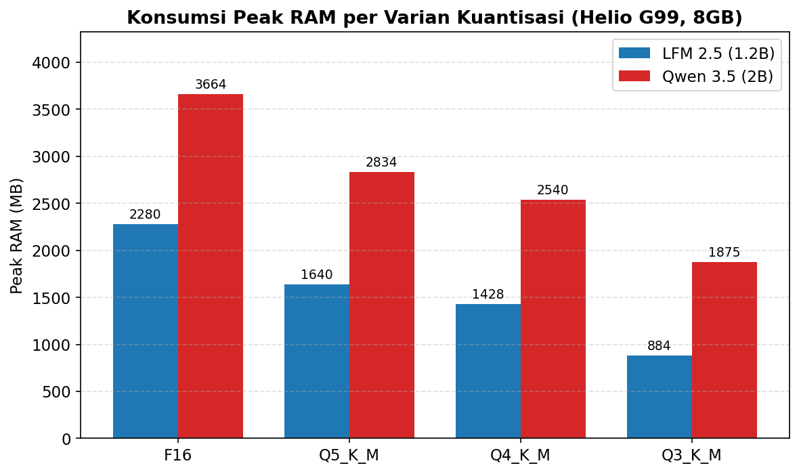
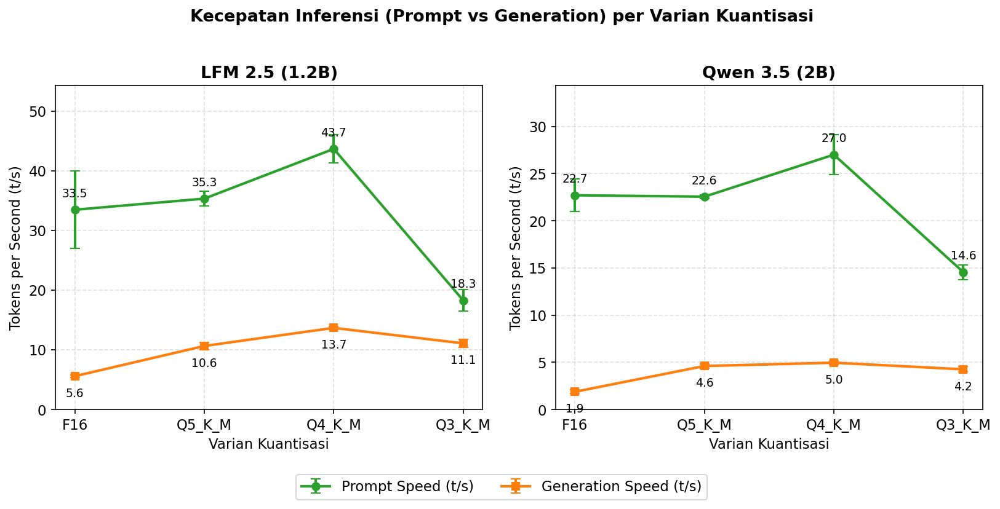
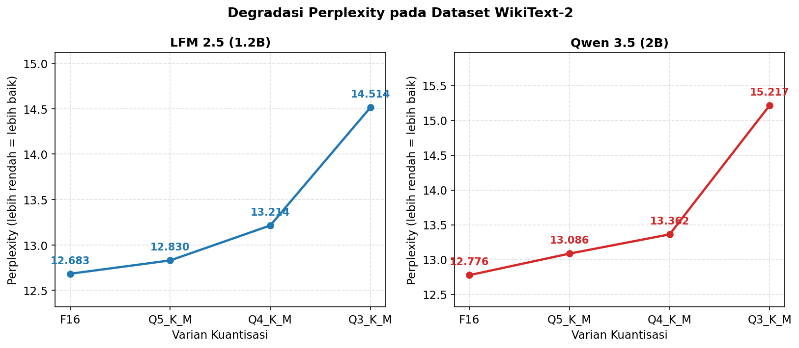
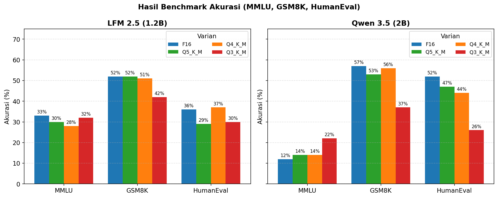
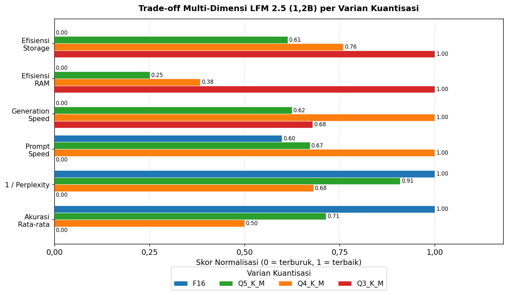

\newpage

# ABSTRAK

Pemanfaatan *Small Language Model* (SLM) secara *on-device* di lingkungan Android terkendala oleh kapasitas RAM 8 GB yang dibagi-pakai (*shared memory*) bersama sistem operasi dan layanan latar belakang, sehingga pemuatan model presisi penuh FP16 berisiko memicu *Out of Memory* (OOM) dan *Force Close*. Penelitian ini menganalisis performa metode *Post-Training Quantization* (PTQ) dengan format GGUF *k-quants* pada rentang 3-bit hingga 5-bit (Q3\_K\_M, Q4\_K\_M, dan Q5\_K\_M) terhadap dua arsitektur SLM, yaitu LFM 2.5 (1,2 miliar parameter) dan Qwen 3.5 (2 miliar parameter), pada perangkat Tecno Pova 5 (SoC MediaTek Helio G99, RAM 8 GB) melalui lingkungan terminal Termux dan mesin inferensi `llama.cpp`. Metode yang digunakan adalah eksperimen kuantitatif komparatif (*ablation study*) dengan mengukur (1) reduksi ukuran berkas, (2) konsumsi *peak* RAM, (3) kecepatan *prompt* dan *generation* dalam satuan *tokens per second* (TPS), serta (4) degradasi kognitif melalui *Perplexity* (WikiText-2) dan akurasi MMLU, GSM8K, dan HumanEval. Hasil menunjukkan bahwa varian Q4\_K\_M merupakan titik keseimbangan (*sweet spot*) terbaik karena mampu menekan ukuran berkas hingga 68% dan konsumsi RAM 30–37% dibanding FP16, mempercepat *generation* hingga 2,7 kali lipat, dengan tambahan *perplexity* di bawah 0,6 poin dan rata-rata penurunan akurasi di bawah 4%. Sebaliknya, varian Q3\_K\_M memicu anomali *bit-shifting* pada CPU ARM serta degradasi GSM8K dan HumanEval yang signifikan, sehingga tidak direkomendasikan sebagai konfigurasi produksi.

**Kata kunci:** *Post-Training Quantization*, *Small Language Model*, *Edge Computing*, GGUF, *k-quants*, Android, Helio G99, *Perplexity*.

\newpage

# KATA PENGANTAR

Puji syukur penulis panjatkan ke hadirat Tuhan Yang Maha Esa atas selesainya penyusunan skripsi yang berjudul **"Analisis Performa *Post-Training Quantization* (PTQ) pada *Small Language Model* untuk Implementasi *Edge Computing* Berbasis Android"**. Skripsi ini disusun sebagai salah satu syarat untuk menyelesaikan program sarjana pada Program Studi Teknologi Informasi, Fakultas Teknik dan Informatika, Universitas Bina Sarana Informatika.

Penulis menyampaikan terima kasih kepada dosen pembimbing, rekan-rekan mahasiswa, serta keluarga yang telah memberikan dukungan moral, masukan teknis, dan akses sumber daya selama proses penelitian berlangsung. Penulis menyadari bahwa skripsi ini masih jauh dari sempurna, sehingga kritik dan saran yang membangun sangat diharapkan demi penyempurnaan karya tulis serupa di masa depan.

Jakarta, [Tanggal] [Bulan] [Tahun]

Penulis,

[Nama Mahasiswa]

\newpage

# BAB I — PENDAHULUAN

## 1.1 Latar Belakang Masalah

Lanskap teknologi kecerdasan buatan, terkhusus pada domain *Natural Language Processing* (NLP), saat ini mengalami disrupsi fundamental akibat penetrasi *Large Language Models* (LLM). Model berskala masif ini telah mendefinisikan ulang batas atas kemampuan komputasi mesin dalam menguraikan makna semantik dan membangkitkan teks yang setara dengan gaya kognitif manusia. Kendati menawarkan performa luar biasa, arsitektur LLM kontemporer menuntut spesifikasi infrastruktur komputasi—terutama *Graphics Processing Unit* (GPU)—yang besar dan eksklusif. Ketergantungan absolut pada perangkat keras kelas atas ini pada akhirnya memicu fenomena defisit alokasi memori (*Out of Memory*) yang pasti terjadi apabila model dipaksakan beroperasi di atas perangkat keras komputasi reguler milik konsumen akhir (Touvron dkk., 2023).

Di sisi lain, pergeseran paradigma mobilitas digital meningkatkan tuntutan masyarakat akan asisten virtual pintar yang proaktif dan responsif secara *real-time* tanpa latensi jaringan. Kebutuhan praktis ini terlihat pada berbagai implementasi sektoral yang krusial, mulai dari layanan sistem informasi rumah sakit (Ahmad & Safudin, 2024) hingga integrasi simpul LLM dalam infrastruktur pemantauan jaringan nirkabel pada ekosistem kawasan urban (Sevim & Ibrahim, 2024). Namun, pemanfaatan layanan AI terpusat melalui *Cloud API* komersial menghadirkan eskalasi risiko keamanan yang fatal, terutama yang bersinggungan dengan jaminan privasi data pengguna. Untuk merespons ancaman tersebut, para ahli keamanan siber merekomendasikan agar pemrosesan AI dilokalisasi: eksekusi inferensi harus bergeser untuk dioperasikan secara otonom dan *offline* di titik terluar jaringan (*Edge Device*), seperti pada *smartphone* bersistem operasi Android. Langkah mitigasi ini esensial guna meredam potensi kebocoran rekam medis, rahasia korporat, maupun pangkalan data pribadi masyarakat (Zhan dkk., 2025).

Sebagai antitesis atas tuntutan privasi tersebut, *Small Language Models* (SLM) dirancang dengan rasio pemangkasan parameter yang signifikan agar lebih akomodatif terhadap kapasitas komputasi perangkat personal. Sayangnya, hambatan mekanis justru berasal dari fondasi arsitektur fisik gawai konsumen. Rata-rata *smartphone* kelas menengah hanya dibekali RAM 8 GB. Persoalan menjadi kian rumit karena kapasitas terbatas ini mengusung topologi *Unified Memory*, sebuah sistem di mana alokasi RAM harus dibagi-pakai (*shared memory*) dan diperebutkan secara ketat oleh sistem operasi Android beserta layanan latar belakang. Arsitektur tersebut tidak dirancang untuk menahan beban matriks model AI yang masih berwujud presisi tinggi 16-bit (*Floating-Point*/FP16). Apabila pemuatan model orisinal tetap dipaksakan, utilitas pengawas memori bawaan Android (*Low Memory Killer Daemon*) akan memicu protokol intervensi perlindungan dan mengeksekusi *Force Close*. Demi menghindari kelumpuhan operasional ini, optimasi *Edge Intelligence* menjadi prosedur yang mutlak diselenggarakan (Zhang dkk., 2024).

Salah satu intervensi komputasional paling krusial untuk menekan *memory footprint*—sehingga model AI dapat dimuat secara aman ke dalam sempitnya RAM *smartphone*—adalah melalui *Post-Training Quantization* (PTQ). Berbagai kajian terkini memvalidasi bahwa teknik pemadatan bobot menuju tingkat presisi menengah ke bawah (3-bit hingga 5-bit) terbukti secara empiris mampu mereduksi kebutuhan memori hingga kurang dari sepertiga dimensi aslinya, tanpa perlu melewati fase pelatihan ulang yang mahal (Dettmers dkk., 2023; Frantar dkk., 2023). Walaupun skema PTQ menawarkan efisiensi yang menjanjikan, mutilasi presisi pada matriks bobot tidak luput dari ancaman gangguan matematis (*perturbation*). Proses pemotongan presisi ini berisiko menghilangkan sebaran komponen parameter ekstrem yang berperan sebagai jangkar jaringan (*outliers*). Hilangnya *outliers* dapat bermuara pada degradasi akurasi logika kognitif serta kualitas tata bahasa model (Gong dkk., 2024).

Berangkat dari rangkaian determinan pada ekosistem *mobile edge computing* tersebut, penelitian ini difokuskan pada pengujian empiris atas performa algoritma kompresi PTQ dengan pendekatan presisi campuran (*mixed-precision k-quants*) yang dikonfigurasi bergradasi dari 3-bit hingga 5-bit (varian Q3\_K\_M, Q4\_K\_M, dan Q5\_K\_M). Target utama eksperimen ini adalah melokalisasi inferensi murni di dalam emulator terminal Android (Termux). Melalui matriks pengujian terstruktur pada dua SLM dengan ukuran berbeda (1,2 miliar dan 2 miliar parameter), penelitian ini bertujuan membuktikan secara empiris batas efektivitas kompresi yang paling sanggup menyelamatkan margin RAM dari *Force Close*, sembari menginvestigasi akselerasi *Tokens per Second* (TPS) pada CPU ARM dan signifikansi degradasi *Perplexity* yang menyertainya.

## 1.2 Identifikasi Permasalahan

Berdasarkan elaborasi latar belakang, dapat ditarik beberapa permasalahan utama yang menjadi fokus penelitian ini, yaitu:

1. **Kerentanan privasi pada arsitektur komputasi *cloud*.** Terdapat ketergantungan absolut pada layanan *cloud* komersial untuk pemrosesan instruksi LLM, yang rentan terhadap peretasan dan kebocoran data sensitif. Hal ini memicu urgensi akan hadirnya sistem AI otonom yang murni beroperasi secara *offline* langsung dari *edge device* pengguna.
2. **Limitasi arsitektur RAM pada *on-device deployment*.** Kapasitas RAM Android rata-rata 8 GB rawan mengalami krisis memori (*Out of Memory*) sehingga memicu *Force Close* saat memuat model FP16. Hingga kini belum ditemukan landasan empiris yang memetakan tingkat kompresi ideal yang paling seimbang dan aman untuk menetralisir anomali tersebut pada lingkungan *shared memory* Android.
3. **Risiko penurunan kecerdasan akibat kompresi ekstrem.** Pemadatan matriks SLM ke format ketat (Q3\_K\_M hingga Q5\_K\_M) menyimpan bahaya laten berupa halusinasi model dan meluruhnya kapabilitas nalar AI. Masih terdapat *research gap* yang signifikan mengenai persentase degradasi kecerdasan tatkala mesin dipaksa beroperasi di bawah tekanan kompresi tertingginya pada *smartphone*.

## 1.3 Perumusan Masalah

Berdasarkan identifikasi permasalahan di atas, rumusan masalah yang akan dijawab oleh penelitian ini adalah:

1. Berapa besar efisiensi penyimpanan (*storage efficiency*) dan reduksi konsumsi RAM yang dihasilkan oleh setiap varian kuantisasi GGUF (Q3\_K\_M, Q4\_K\_M, dan Q5\_K\_M) terhadap baseline FP16 pada model LFM 2.5 (1,2B) dan Qwen 3.5 (2B)?
2. Bagaimana perbandingan kualitas linguistik—diwakili oleh *Perplexity* (WikiText-2)—serta akurasi kognitif (MMLU, GSM8K, dan HumanEval) yang dipertahankan oleh masing-masing varian kuantisasi terhadap baseline FP16?
3. Seberapa besar peningkatan kecepatan inferensi (*Prompt Processing* t/s dan *Text Generation* t/s) yang dapat dicapai pada perangkat MediaTek Helio G99 dengan RAM 8 GB melalui kompresi PTQ?
4. Berdasarkan tinjauan *trade-off* multi-dimensi (efisiensi penyimpanan, RAM, TPS, *Perplexity*, dan akurasi), varian model dan tingkat kuantisasi mana yang paling optimal untuk diterapkan pada *smartphone* berkapasitas RAM 8 GB?

## 1.4 Tujuan dan Manfaat

### 1.4.1 Tujuan Penelitian

1. Mengimplementasikan dan mengevaluasi kelayakan operasional varian PTQ presisi campuran (Q3\_K\_M, Q4\_K\_M, dan Q5\_K\_M) pada arsitektur SLM, sekaligus mengidentifikasi batas aman toleransi RAM Android terhadap pemicu *Force Close*.
2. Melakukan komparasi faktual melalui *benchmarking* yang membandingkan perilaku model FP16 dengan ketiga varian kuantisasinya, guna membuktikan persentase efisiensi alokasi RAM, akselerasi *Tokens per Second* (TPS), serta fluktuasi degradasi *Perplexity* dan akurasi MMLU/GSM8K/HumanEval.
3. Menetapkan rekomendasi konfigurasi (model parameter-size dan tingkat kuantisasi) yang paling optimal sebagai *sweet spot* operasional untuk perangkat Android berkapasitas RAM 8 GB.

### 1.4.2 Manfaat Penelitian

**Bagi Penulis:**

a. Sebagai sarana pemenuhan salah satu syarat akademik untuk meraih kelulusan pada Program Sarjana, Program Studi Teknologi Informasi, Fakultas Teknik dan Informatika, Universitas Bina Sarana Informatika.

b. Memperluas wawasan dan pengalaman praktis terkait implementasi *Mobile Edge Computing* serta strategi optimasi arsitektur kecerdasan buatan di lingkungan seluler yang terbatas.

c. Menjadi sarana penerapan teori perkuliahan, khususnya pada irisan multidisiplin *Machine Learning*, arsitektur perangkat keras mikro, dan algoritma pengolahan bahasa alami (NLP).

**Bagi Objek Penelitian (Pengembang Aplikasi *Edge AI*):**

a. Menyediakan pedoman purwarupa operasional bagi perancangan infrastruktur AI yang memberikan garansi keamanan privasi data, karena interaksi dilangsungkan secara lokal (*offline*).

b. Menawarkan alternatif resolusi finansial guna menekan biaya pemeliharaan IT, di mana pengguna atau korporasi tidak lagi tergantung pada layanan *Cloud API* komersial berbiaya bulanan.

c. Menghasilkan basis data telemetri yang presisi mengenai daya tahan RAM 8 GB Android terhadap beban eksekusi model AI pasca-kompresi.

d. Memberikan rekomendasi format bagi para pengembang *independent developer* guna merakit *chatbot* pintar yang tertanam (*embedded*) di gawai kelas menengah.

**Bagi Pembaca:**

Membuka cakrawala pemahaman teoretis maupun operasional bagi pembaca akademik dan praktisi industri perihal anatomi teknik kompresi PTQ, berikut tata laksana *deployment* SLM secara *offline* dan mandiri pada peranti Android.

## 1.5 Metode Penelitian

Penelitian ini menggunakan pendekatan **empiris kuantitatif eksperimental**. Kerangka kerja dirancang untuk memfasilitasi pemantauan utilitas perangkat keras yang presisi, merekam indikator efisiensi memori, dan menguji tingkat kecerdasan AI pada ekosistem komputasi seluler. Eksperimen dilangsungkan sepenuhnya *on-device* pada *smartphone* Tecno Pova 5 melalui *terminal emulator* Termux, dengan mesin inferensi `llama.cpp` yang dikompilasi ulang secara natif untuk CPU ARM Helio G99. Setiap varian PTQ dijalankan melalui skenario terstandardisasi yang sama (jumlah token *prompt*, jumlah *thread*, dan dataset evaluasi) agar perbedaan performa benar-benar dapat dikaitkan dengan tingkat kompresi, bukan variabel eksternal.

## 1.6 Teknik Pengumpulan Data

### A. Observasi (Eksperimental)

Observasi dilakukan dengan mengekstraksi log secara deterministik atas seluruh dinamika perangkat keras dan perangkat lunak di dalam Termux saat siklus inferensi AI berjalan. Konsumsi *peak* RAM diamati melalui utilitas `htop`, sedangkan metrik *Tokens per Second* (TPS) dan *Perplexity* diekstraksi dari keluaran *backend* `llama.cpp` (modul `./llama-bench` dan `./llama-perplexity`). Pencatatan dilakukan pada setiap transisi resolusi kompresi (FP16, Q5\_K\_M, Q4\_K\_M, dan Q3\_K\_M) untuk kedua model.

### B. Studi Pustaka

Studi pustaka dilakukan dengan menghimpun dan memetakan referensi dari berbagai karya tulis ilmiah, baik jurnal nasional maupun internasional, yang dipublikasikan pada rentang 2023–2026. Fokus telaah literatur mencakup teori fundamental arsitektur LLM/SLM (Touvron dkk., 2023), teori gangguan matematis pada kuantisasi (Gong dkk., 2024), pedoman *Edge Intelligence* (Zhang dkk., 2024), serta validasi empiris penerapan `llama.cpp` di perangkat ARM dengan sumber daya terbatas (Ray & Pradhan, 2026). Referensi pilar dari Dettmers dkk. (2023), Frantar dkk. (2023), Lin dkk. (2023), dan Jin dkk. (2024) digunakan sebagai instrumen landasan teori sekaligus pemandu standar parameter kalibrasi pada tahap evaluasi.

## 1.7 Ruang Lingkup

Agar trajektori analisis tidak melebar dari sumbu permasalahan utama, ruang lingkup penelitian ini dibatasi sebagai berikut:

1. **Perangkat Keras Uji.** Seluruh proses inferensi AI dipusatkan pada satu *smartphone* kelas menengah, yaitu Tecno Pova 5 yang ditenagai SoC MediaTek Helio G99 (arsitektur ARM *big.LITTLE*), RAM LPDDR4x 8 GB, dan ROM UFS 2.2 256 GB.
2. **Lingkungan Eksekusi.** Lingkungan komputasi dikerahkan di atas Android 13 melalui aplikasi emulator terminal *non-root* Termux, dengan kompilasi mandiri `llama.cpp` agar instruksi CPU ARM dapat dieksploitasi secara natif.
3. **Model Uji.** Penelitian menguji dua SLM berbobot ringan, yaitu **LFM 2.5 (1,2 miliar parameter)** sebagai objek uji utama dan **Qwen 3.5 (2 miliar parameter)** sebagai pembanding *stress-test*.
4. **Metode Kompresi.** Fokus PTQ dibatasi pada format GGUF presisi campuran (*k-quants*) yang diturunkan secara gradual melintasi rentang 3-bit hingga 5-bit, yakni **Q3\_K\_M**, **Q4\_K\_M**, dan **Q5\_K\_M**, dengan FP16 sebagai *baseline*.
5. **Metrik Evaluasi.** Metrik dibatasi pada (a) ukuran berkas, (b) *peak* RAM, (c) *Prompt* dan *Generation Speed* dalam TPS, (d) *Perplexity* WikiText-2, serta (e) akurasi MMLU, GSM8K, dan HumanEval—masing-masing dibatasi 100 sampel per *benchmark*.

## 1.8 Hipotesis

Hipotesis utama yang akan dibuktikan keabsahannya pada penelitian ini adalah:

**H1:** Implementasi PTQ format GGUF presisi campuran pada rentang 3-bit hingga 5-bit akan secara progresif mereduksi ukuran berkas dan konsumsi RAM SLM secara drastis, sehingga arsitektur SLM dapat dimuat secara stabil ke dalam RAM 8 GB Android tanpa memicu *Force Close* (OOM Killed). Reduksi *bandwidth* memori ini sekaligus akan meningkatkan *Tokens per Second* (TPS) pada CPU ARM secara berlipat ganda jika dibandingkan baseline FP16. Sebaliknya, kompromi degradasi kualitas yang muncul akibat pemotongan presisi diprediksi bersifat minor pada varian Q5\_K\_M dan Q4\_K\_M (kenaikan *Perplexity* di bawah 1 poin dengan rata-rata penurunan akurasi di bawah 5%), namun akan menjadi signifikan pada varian Q3\_K\_M—khususnya pada dimensi nalar matematis (GSM8K) dan logika pemrograman (HumanEval)—sehingga **Q4\_K\_M diperkirakan menjadi titik keseimbangan (*sweet spot*) operasional yang paling optimal** untuk perangkat Android berkapasitas RAM 8 GB.

\newpage

# BAB II — LANDASAN TEORI

## 2.1 Tinjauan Pustaka

Bab ini memaparkan konsep-konsep fundamental dan rujukan literatur terkait kecerdasan buatan, model bahasa, keterbatasan perangkat keras, serta teknik optimasi memori komputasi yang menjadi landasan teoritis bagi penelitian ini.

### 2.1.1 *Natural Language Processing* (NLP) dan Pergeseran ke *Edge Computing*

*Natural Language Processing* (NLP) merupakan cabang ilmu kecerdasan buatan yang memungkinkan mesin mengurai, memahami, dan membangkitkan bahasa alami manusia secara kontekstual. Evolusi NLP terus berakselerasi seiring meluasnya implementasi algoritma *Deep Learning*. Salah satu contoh integrasi NLP pada aplikasi riil di ranah industri lokal adalah pengembangan asisten *chatbot* kesehatan interaktif berbasis kecerdasan buatan, yang terbukti meningkatkan efisiensi operasional dan kualitas pelayanan rumah sakit serta menjadi kanal konsultasi *real-time* yang dapat diandalkan oleh masyarakat (Ahmad & Safudin, 2024).

Namun, pengolahan bahasa yang canggih sering menuntut kapabilitas komputasi server *cloud*. Ketergantungan pada komputasi awan menjadi persoalan dalam penanganan kasus yang menuntut kerahasiaan absolut, seperti data diagnosis rekam medis pasien. Sebagai mitigasi risiko keamanan, pengembangan NLP mulai diarahkan pada arsitektur *offline* atau lokalisasi pemrosesan pada perangkat seluler konsumen (*Mobile Edge Computing*). Paradigma *offline* memastikan kelancaran fungsionalitas sistem AI sekaligus menjamin privasi informasi sensitif dari intervensi jaringan internet terbuka (Zhan dkk., 2025).

Untuk memaksimalkan operasi AI di lingkungan gawai berbasis RAM terbatas, pendekatan *Edge Intelligence Optimization* sangat diperlukan. Konsep ini memformulasikan teknik penyesuaian *stack* perangkat lunak agar perangkat Android dengan spesifikasi minim mampu mengeksekusi beban kerja AI tanpa memicu *Force Close* yang diakibatkan oleh keterbatasan arsitektur memori bawaan (Zhang dkk., 2024). Hierarki sistem *Edge Intelligence* dapat dilihat pada Gambar 2.2.

### 2.1.2 *Large Language Models* (LLM) dan Fleksibilitasnya

*Large Language Models* (LLM) merujuk pada arsitektur *neural network* skala masif yang dilatih menggunakan volume data teks dalam triliunan token. Sebagai fondasi dasar, LLaMA merupakan salah satu pelopor *open-source foundation language model* berskala besar yang dibangun murni menggunakan dataset publik, dengan kapasitas parameter mulai 7 miliar hingga 65 miliar (Touvron dkk., 2023). Fleksibilitas arsitektur LLM bahkan telah dimanfaatkan sebagai agen kognitif untuk otomatisasi penyusunan jaringan nirkabel di kawasan urban cerdas (Sevim & Ibrahim, 2024), yang menegaskan bahwa model bahasa modern berperan layaknya otak virtual universal.

### 2.1.3 *Small Language Models* (SLM) dan Limitasi Perangkat Seluler

Sebagai respons atas mahalnya ongkos inferensi LLM raksasa, para peneliti berinovasi menciptakan *Small Language Models* (SLM). Arsitektur SLM menyuguhkan desain jaringan parameter yang jauh lebih ramping (umumnya 1–7 miliar parameter) namun sanggup mempertahankan kompetensi analitis yang memadai. Keringkasan arsitektur SLM menjadikannya primadona untuk disematkan langsung ke dalam *smartphone*. Namun tantangan utamanya adalah arsitektur *shared memory*: RAM 8 GB pada Android harus dibagi untuk OS, antarmuka layar, dan aplikasi latar belakang. Apabila SLM dimuat penuh dan ukurannya melebihi ruang yang tersisa, *Out of Memory Killer* akan menghentikan paksa (*Force Close*) proses AI demi menyelamatkan sistem dari *freeze*.

### 2.1.4 Arsitektur Dasar *Transformer*

Di balik kapabilitas LLM maupun SLM terdapat arsitektur *Transformer* dengan mekanisme *Self-Attention* yang memungkinkannya membaca seluruh kata dalam satu kalimat secara simultan, lalu menimbang keterikatan makna antar-token secara kontekstual. Kalkulasi bobot atensi antar-token ini melibatkan operasi matriks masif yang dilakukan lapis demi lapis (*layer-by-layer*), sehingga *Transformer* secara bawaan sangat rakus memori dan akan menuntut alokasi gigabyte RAM tambahan seiring dengan panjangnya *prompt* yang diberikan pengguna.

### 2.1.5 Konsep Kuantisasi, Presisi Campuran (*K-Quants*), dan Rentang 3-Bit hingga 5-Bit

Kuantisasi (*Quantization*) adalah algoritma kompresi fundamental yang digunakan untuk merampingkan kebutuhan ruang penyimpanan dan *memory footprint*. Saat sebuah model AI dilatih, bobot matriks jaringannya direkam dalam *floating-point* berpresisi tinggi, umumnya 16-bit (FP16). Format murni ini memiliki ketepatan akurasi yang tinggi namun memakan kapasitas RAM secara eksesif. Kuantisasi menyederhanakan rangkaian pecahan desimal ini menjadi bilangan bulat yang lebih padat (INT5, INT4, atau bahkan INT3) (Dettmers dkk., 2023).

Di dalam ekosistem `llama.cpp`, teknik kompresi standar pada awalnya memukul rata semua lapisan model menjadi format bit yang sama. Pendekatan ini memiliki kelemahan: rusaknya bobot penting yang menyebabkan AI mudah berhalusinasi. Untuk mengatasi defisit kecerdasan ini, diciptakanlah metode generasi baru bernama **K-Quants** (ditandai huruf "K"). Pendekatan ini menggunakan presisi campuran (*mixed-precision*): bagian tensor yang menentukan logika utama (seperti *output layers*) dipertahankan pada presisi yang lebih aman (misalnya 6-bit), sementara bagian model yang sifatnya pelengkap dan memiliki redundansi tinggi ditekan hingga rentang 3-bit hingga 5-bit. Dalam eksplorasi *resource-constrained edge*, tiga varian *k-quants* yang lazim dievaluasi secara bertahap (*ablation study*) adalah **Q5\_K\_M** (rata-rata mendekati 5-bit), **Q4\_K\_M** (mendekati 4-bit), dan **Q3\_K\_M** (mendekati 3-bit). Pencarian *sweet spot* menjadi krusial: kompresi yang kurang padat (>5-bit) tidak cukup menekan RAM 8 GB, namun kompresi yang terlalu agresif (≤3-bit) berisiko menyebabkan kerusakan kognitif total. Alur transformasi dari FP16 menuju varian Q\*\_K\_M diilustrasikan pada Gambar 2.1.

{width=92%}

**Gambar 2.1** Skema *Post-Training Quantization* GGUF *K-Quants* (LFM 2.5). Sumber: olahan penulis.

### 2.1.6 Karakteristik Inferensi *Mobile*: Limitasi CPU dan *Bandwidth* Memori

Pada arsitektur *System-on-Chip* (SoC) ARM *big.LITTLE*, kecepatan inferensi model AI tunduk pada dua hukum komputasi. Pertama, limitasi *Memory Bandwidth*: inti CPU mungkin sanggup berhitung cepat, namun aliran data parameter SLM kerap memacetkan jalur transfer RAM. Ketika model FP16 dikuantisasi ke 5-bit hingga 3-bit, berkas model menjadi sangat ringan sehingga kemacetan transfer data dari RAM ke CPU ARM terurai. Inilah fondasi argumen mengapa perampingan memori berkorelasi langsung dengan peningkatan *Tokens per Second* (TPS).

{width=88%}

**Gambar 2.2** Hierarki *Edge Intelligence* untuk inferensi SLM. Sumber: olahan penulis berdasarkan (Zhang dkk., 2024).

### 2.1.7 Format File GGUF (*GPT-Generated Unified Format*)

GGUF adalah format biner komprehensif yang dirancang spesifik untuk membungkus arsitektur *neural network* AI generatif dalam satu berkas tertutup. Diciptakan sebagai evolusi dari GGML, GGUF mampu menampung seluruh parameter identitas model beserta *metadata*-nya. Format ini esensial bagi ekosistem Linux Android (Termux) karena strukturnya dioptimalkan untuk mendistribusikan beban komputasi ke arsitektur CPU dan bersahabat dengan berbagai skema kompresi presisi campuran (*K-Quants*).

### 2.1.8 *Framework* Inferensi `llama.cpp` di Android

Untuk perangkat konsumen ringan, dunia komputasi *Machine Learning* sangat bergantung pada `llama.cpp`. Berbeda dengan *framework* berbasis Python (PyTorch/TensorFlow) yang menuntut adanya *overhead* pustaka besar, `llama.cpp` ditulis dalam C/C++ secara *bare-metal*. Struktur transparan ini memungkinkannya untuk dikompilasi secara manual agar sesuai dengan instruksi CPU ARM pada Android, sehingga gawai dapat menjalankan beban kalkulasi *Transformer* layaknya mesin server (Ray & Pradhan, 2026).

### 2.1.9 Tantangan Gangguan Matematis (*Perturbation*)

Pemotongan presisi bobot dari pecahan desimal berukuran gigabyte menjadi angka bulat yang sempit selalu menyisakan efek negatif. Dalam kajian kuantisasi, dampak simplifikasi numerik ini disebut sebagai *perturbation*. Kendala tersulit adalah keberadaan nilai pencilan (*outliers*) yang tidak terprediksi—nilai-nilai ini rentan tersapu saat sistem membulatkan ke integer 3-bit hingga 5-bit terdekat. Hilangnya tumpuan *outliers* inilah yang sering menumpulkan parameter atensi AI dan menyebabkan model berhalusinasi atau menghasilkan jawaban kosong (Gong dkk., 2024). Oleh karena itu, mengevaluasi titik batas kerusakan kompresi (*degradation*) memegang peranan krusial.

### 2.1.10 Metrik Evaluasi Performa *Edge Computing*

Kelayakan operasional SLM di Android (*Mobile Edge*) dievaluasi melalui rasio efisiensi perangkat keras (Jin dkk., 2024). Dua variabel pengamatan esensial mencakup:

a. ***System Memory Usage*** (Konsumsi RAM Sistem). Indikator primer untuk mengukur jumlah absolut RAM yang termakan model saat dimuat. Variabel ini wajib dijaga pada batas yang aman (idealnya 1–3 GB) agar OS Android tidak memicu *OOM Killer*.
b. ***Tokens per Second*** **(TPS)**. Tolok ukur dinamis untuk mengukur laju pemrosesan *prompt* per detik (*Prompt Processing*) dan laju ekstraksi karakter per detik (*Generation*).

### 2.1.11 Standar Pengujian Kognitif dan Linguistik

Untuk memvalidasi bahwa pengorbanan memori tidak menghasilkan model "tuli atau bisu", diperlukan tes validasi standar:

a. ***Perplexity*** **(PPL)**. Penilaian dasar kelugasan sintaksis. Semakin rendah PPL, semakin rasional dan natural rangkaian kalimat yang dihasilkan model.
b. **MMLU** (*Massive Multitask Language Understanding*). Dataset penguji wawasan intelektual komprehensif (sejarah, sains, hingga sosiologi) untuk melacak defisit memori faktual pasca-kompresi.
c. **GSM8K** (*Grade School Math 8K*). Tes nalar matematika sekolah dasar, digunakan untuk membongkar kerusakan logika kalkulasi akibat pemotongan presisi.
d. **HumanEval**. Pengujian fungsional logika pemrograman (Python) untuk menakar tingkat kerusakan sintaks model.

## 2.2 Penelitian Terkait

Demi menempatkan keaslian gagasan penelitian ini dalam lanskap literatur yang relevan, peneliti merujuk pada konstruksi pemikiran dari berbagai studi pilar sebelumnya yang mengedepankan telaah teknis implementasi AI pada ekosistem memori terbatas.

Trobosan konseptual efisiensi krisis memori diperkenalkan secara revolusioner oleh Dettmers dkk. (2023) melalui mekanisme kompresi **QLoRA**. Studi ini menjustifikasi secara empiris bahwa pemaksaan struktur bobot dari skala besar ke wadah presisi 4-bit (NF4) sanggup mereduksi *footprint* hingga sepertiganya, sembari menghindarkan sistem dari *Out of Memory* tanpa mengebiri utilitas 16-bit asli arsitektur dasar. Argumen efisiensi ini dikukuhkan oleh GPTQ (Frantar dkk., 2023) dan AWQ (Lin dkk., 2023), yang membuktikan bahwa PTQ dengan fokus pada perlindungan *salient weights* sangat cocok dan stabil bila dibebankan pada SoC seluler.

Akan tetapi, di balik efisiensi memori tersebut terdapat jejak reduksi kualitas kognitif. Studi ekstensif Gong dkk. (2024) dengan lensa *perturbation* membedah kenyataan bahwa simplifikasi paksa bobot menjadi integer terkompresi sering kali membantai *outliers*, menginduksi rusaknya pemahaman linguistik AI (ditandai memburuknya *Perplexity*).

Terlepas dari risiko cacat penalaran, urgensi lokalisasi AI generatif di perangkat mandiri makin tak terbendung. Hal ini dipantik oleh kerentanan latensi dan *bandwidth* komputasi awan di kawasan urban (Sevim & Ibrahim, 2024). Melalui tinjauan medis, Zhan dkk. (2025) menegaskan bahwa instansi yang berhubungan dengan kerahasiaan data tidak boleh menyerahkan pemrosesan teks ke layanan *Cloud API*. Kebutuhan asisten cerdas instan, seperti *chatbot* RS Brawijaya (Ahmad & Safudin, 2024), merupakan manifestasi valid akan urgensi AI lokal.

Demi menstrukturkan matriks pengujian SLM secara objektif, penulis merujuk pada metodologi evaluasi gubahan Jin dkk. (Jin dkk., 2024) dan arsitektur pengujian latensi dari Zhang dkk. (Zhang dkk., 2024). Kedua referensi tersebut menegaskan bahwa kualitas LLM tidak cukup dinilai dari rasio kebenaran, melainkan harus dipadukan dengan skor *Perplexity* dan TPS. Sebagai klimaks landasan studi terapan, riset observasional Ray dan Pradhan (Ray & Pradhan, 2026) digunakan sebagai pijakan validasi: pengujian PTQ GGUF di atas C++ (`llama.cpp`) pada Raspberry Pi RAM 8 GB membuktikan TPS yang stabil. Tesis empiris ini dipadukan dengan keunggulan arsitektur model lokal seperti Qwen (Nurohim dkk., 2025) dan LLaMA (Touvron dkk., 2023), yang menjadi konfirmasi bahwa komputasi AI *offline* di atas Android dengan RAM setara merupakan keniscayaan terapan yang krusial untuk dieksplorasi.

Pemaparan ringkas 12 penelitian pilar yang mendasari riset ini disajikan pada Tabel 2.1.

**Tabel 2.1** Matriks Perbandingan *State of the Art*

| No | Penulis & Tahun | Judul Penelitian | Metode & Fokus | Hasil Temuan | Kesesuaian (Gap) |
|:--:|---|---|---|---|---|
| 1 | Dettmers dkk. (2023) | QLoRA: Efficient Finetuning of Quantized LLMs | Kompresi presisi 4-bit (NF4). | Pemadatan 4-bit terbukti mencegah OOM tanpa merusak fungsi 16-bit asli. | Dasar komparasi efisiensi RAM dan *footprint* antar presisi. |
| 2 | Gong dkk. (2024) | What Makes Quantization for LLMs Hard? An Empirical Study | Analisis matematis kerentanan kuantisasi LLM terhadap *outliers*. | Pembulatan *outliers* berisiko merusak kualitas teks AI. | Instrumen analisis penyebab turunnya skor *Perplexity*. |
| 3 | Zhan dkk. (2025) | Quantized LLMs in Biomedical NLP | Pengujian AI lokal pada ruang privasi tinggi (medis). | AI *offline* wajib menjaga privasi; kuantisasi sukses menekan jejak RAM. | Fondasi urgensi inferensi AI lokal tanpa Cloud API. |
| 4 | Jin dkk. (2024) | A Comprehensive Evaluation of Quantization Strategies for LLMs | Evaluasi holistik kuantisasi: kapasitas, kelugasan, efisiensi. | Penentuan PPL dan beban RAM sebagai standar ukur kelayakan pasca-kuantisasi. | Diadopsi sebagai rancangan matriks metodologi evaluasi. |
| 5 | Ray & Pradhan (2026) | Performance Analysis of Localised LLMs in Resource-Constrained Edge | Eksperimen SLM via `llama.cpp` pada RAM terbatas. | LLM GGUF dapat dieksekusi stabil pada ARM (Raspberry Pi 8 GB). | Kerangka landasan implementasi `llama.cpp` di SoC ARM Android (Termux). |
| 6 | Frantar dkk. (2023) | GPTQ: Accurate Post-Training Quantization | Kompresi *one-shot weight quantization* (PTQ). | GPTQ memadatkan model menjadi 3–4 bit dengan degradasi minim. | Landasan algoritma; menjelaskan mengapa Q4 dipilih untuk Android. |
| 7 | Lin dkk. (2023) | AWQ: Activation-Aware Weight Quantization | Kuantisasi *on-device* berbasis aktivasi untuk melindungi 1% bobot penting. | Perlindungan *salient weights* drastis mengurangi *error*. | Memperkuat argumen kecocokan PTQ untuk *on-device deployment*. |
| 8 | Zhang dkk. (2024) | Edge Intelligence Optimization for LLM Inference with Batching and Quantization | Optimasi *throughput* eksekusi LLM di *edge*. | Optimasi memori lokal memaksimalkan TPS dan memangkas latensi. | Rujukan utama evaluasi TPS di CPU ARM. |
| 9 | Touvron dkk. (2023) | LLaMA: Open and Efficient Foundation Language Models | Pengenalan arsitektur *foundation models* yang efisien dan terbuka. | Model parameter kecil terlatih banyak token mampu mengungguli GPT-3 (175B). | Literatur arsitektur dasar *Transformer* LFM/SLM yang dieksekusi di Termux. |
| 10 | Sevim dkk. (2024) | LLMs Assisted Wireless Network Deployment in Urban Settings | Evaluasi LLM di ekosistem urban dengan kendala *bandwidth*. | LLM berbasis *cloud* sangat bergantung pada kestabilan internet. | Mempertegas urgensi desentralisasi ke *Mobile Edge Computing*. |
| 11 | Nurohim dkk. (2025) | Analisis Komparatif LLM DeepSeek dan Qwen dalam Klasifikasi Sentimen | Komparasi SLM *open-source* pada bahasa lokal (Indonesia). | Qwen memiliki kemampuan bahasa Indonesia yang akurat. | Justifikasi mengapa Qwen 3.5 layak dipilih untuk dievaluasi di Android. |
| 12 | Ahmad & Safudin (2024) | Pengembangan Chatbot AI LLM untuk Layanan Informasi RS Brawijaya | Implementasi asisten AI lokal untuk respons *real-time*. | Sistem respons cerdas instan meningkatkan kepuasan pelayanan. | Representasi *end-goal* riset: TPS di HP berguna untuk merakit asisten pintar. |

## 2.3 Tinjauan Objek Penelitian

Objek penelitian dibagi menjadi dua kategori fundamental: ekosistem perangkat keras/perangkat lunak Android, dan spesifikasi arsitektur *Small Language Model* yang diuji.

### 2.3.1 Ekosistem Uji Keras: Tecno Pova 5 dengan Termux

Objek operasional dibatasi pada satu *smartphone* kelas reguler, yaitu Tecno Pova 5. Perangkat ini ditenagai SoC MediaTek Helio G99 berbasis ARM, dengan RAM sistem 8 GB. Mengingat status gawai *non-rooted* (bawaan pabrik tanpa akses *root*), lingkungan pengujian virtual dibangun di atas aplikasi emulator Linux portabel **Termux**. Melalui kompilasi mandiri di Termux inilah `llama.cpp` di-*build* ulang dalam konfigurasi C/C++ serupa lingkungan server, agar instruksi CPU ARM dapat dieksekusi secara optimal.

### 2.3.2 Objek Arsitektur SLM: LFM 2.5 (1,2B) dan Qwen 3.5 (2B)

Riset komparatif ini menggunakan dua model SLM yang sengaja diambil dari dua kelas paradigma berbeda agar variabel "paradigma kognitif" dan "ukuran parameter" dapat dikomparasikan secara berdampingan pada perangkat keras yang identik.

Objek uji pertama adalah **LFM 2.5 (1,2 miliar parameter)** yang mewakili paradigma ***non-reasoning Small Language Model***. Model ini direkayasa untuk merespons instruksi secara langsung (*direct response*) tanpa membangkitkan *intermediate reasoning trace* (rantai pemikiran antara) di dalam keluarannya. Karakter inilah yang menjadikan LFM 2.5 representatif sebagai *ultra-light footprint baseline* pada rentang 1B—golongan SLM paling ramping yang lazim direkomendasikan untuk *deployment on-device*.

Objek uji kedua adalah **Qwen 3.5 (2 miliar parameter)** yang mewakili paradigma ***reasoning Small Language Model***. Model ini secara *built-in* membangkitkan blok *Thinking Process* terlebih dahulu (*chain-of-thought*) sebelum menerbitkan jawaban final. Konsekuensinya, jumlah token keluaran membengkak (overhead *reasoning*) dan total waktu eksekusi bertambah signifikan—sebuah fenomena yang justru dibutuhkan riset ini sebagai tolok ukur ekstrem *worst-case* terhadap kapasitas RAM 8 GB dan throughput CPU ARM Helio G99.

Kombinasi keduanya membentuk **matriks komparatif 2 × 2** yang ringkas: (i) ukuran parameter (1B vs 2B) dan (ii) paradigma kognitif (*non-reasoning* vs *reasoning*). Dengan kedua sumbu pengamatan ini, penelitian dapat menjawab dua pertanyaan sekaligus: "Berapa biaya RAM/TPS ketika menambah 0,8 miliar parameter?" dan "Berapa *overhead* yang diintroduksi oleh paradigma *reasoning* di atas perangkat *edge*?"—tanpa harus memperluas matriks pengujian ke kelas parameter di luar jangkauan operasional.

Versi mentah FP16 untuk kedua arsitektur ini selanjutnya dibandingkan dengan tiga varian *K-Quants* (Q5\_K\_M, Q4\_K\_M, dan Q3\_K\_M) pada fase *ablation study*, sehingga total terdapat delapan konfigurasi yang diuji (4 varian × 2 model).

### 2.3.3 Justifikasi Batas Kelas Parameter (1B–2B) dan Peran Kuantisasi

Penentuan batas atas kelas parameter pada angka 2 miliar bukan pilihan acak, melainkan konsekuensi langsung dari topologi RAM 8 GB Android. Pada perangkat Tecno Pova 5 dengan SoC MediaTek Helio G99, RAM 8 GB sudah dipotong terlebih dahulu oleh OS Android 13 (rata-rata 1,5–2,5 GB) dan beragam *background service* (cache aplikasi, *system server*, *zygote*, *surfaceflinger*, dsb.), sehingga *free* RAM aktual yang tersedia saat lingkungan Termux idle hanya berkisar **2,7–3,9 GB** (lihat kolom `Free RAM Start` pada `docs/data/hasilv2.csv`). Angka ini menjadi *budget* keras yang harus dipatuhi proses inferensi `llama.cpp` agar OS tidak memicu *Low Memory Killer Daemon*.

Pengamatan empiris (Bab IV) menunjukkan bahwa model Qwen 3.5 pada presisi FP16 (2B) saja sudah menyita rata-rata **3,74 GB** RAM—nyaris menyamai seluruh *budget* RAM tersisa Android, bahkan kerap meninggalkan kurang dari 200 MB *headroom*. Kondisi ini secara matematis menjadikan ekstrapolasi ke kelas 3 miliar parameter tidak realistis: secara linier, model 3B pada FP16 diperkirakan akan menuntut **±5,6 GB** RAM (3/2 × 3,74 GB), nilai yang melampaui *free* RAM Android dan dipastikan memicu *Force Close* sebelum *prompt* pertama sempat diproses. Oleh karena itu, kelas parameter 3B+ secara sengaja diekslusi dari ruang lingkup riset karena tidak menyediakan *baseline* FP16 yang dapat diukur—suatu prasyarat metodologis untuk menghitung persentase reduksi RAM pasca-kuantisasi.

Sebaliknya, eksplorasi pada kelas 1B (LFM 2.5) dan 2B (Qwen 3.5) tetap berarti karena keduanya mampu memuat FP16 sebagai variabel kontrol, sekaligus memetakan dua titik ekstrem pengoperasian:

a. **Kelas 1B (LFM 2.5).** FP16-nya hanya menyita ±2,30 GB RAM, sehingga *headroom* aman dan kuantisasi 3-bit hingga 5-bit dijalankan tanpa risiko OOM.

b. **Kelas 2B (Qwen 3.5).** FP16-nya membentur batas atas RAM Android (3,74 GB) dan paradigma *reasoning*-nya melipatgandakan total waktu eksekusi. Di kelas inilah peran kuantisasi paling kritikal: tanpa kompresi GGUF *k-quants*, model 2B paradigma *reasoning* praktis tidak layak digunakan untuk asisten *real-time* di perangkat *edge*.

Inilah motif utama penelitian: bahkan untuk model 2B yang notabene "sudah berat", PTQ presisi campuran terbukti mampu mengompresi *footprint* ke level yang dapat dijinakkan oleh RAM 8 GB Android. Dengan demikian, batasan kelas 1B–2B tidak bersifat *under-scoped*, melainkan justru memetakan *operating envelope* faktual untuk *edge AI* di perangkat *mid-range* berbasis ARM saat ini.

\newpage

# BAB III — METODOLOGI PENELITIAN

## 3.1 Tahapan Penelitian

Dalam melaksanakan penelitian berbasis komputasi eksperimental pada perangkat seluler, tahapan kerja disusun secara sistematis agar proses pengujian tetap berfokus pada tujuan awal dan menghasilkan data empiris yang valid. Mengacu pada kerangka evaluasi kuantisasi holistik (kapasitas, kelugasan, efisiensi) (Jin dkk., 2024), alur penelitian ini terbagi menjadi **lima tahapan utama** sebagai berikut.

1. **Studi Pendahuluan dan Perumusan Masalah.** Tahap awal mencakup kajian pustaka komprehensif mengenai *Mobile Edge Computing* (Zhang dkk., 2024; Sevim & Ibrahim, 2024) dan *Post-Training Quantization* (Dettmers dkk., 2023; Frantar dkk., 2023). Urgensi lokalisasi pemrosesan AI secara *offline* ditetapkan sebagai landasan utama (Zhan dkk., 2025), sementara batasan kapasitas RAM 8 GB pada Android difokuskan sebagai *bottleneck* arsitektur. Tahap ini dilanjutkan dengan perumusan hipotesis terkait solusi kompresi presisi campuran (Lin dkk., 2023).
2. **Persiapan Lingkungan Komputasi (*Environment Setup*).** *Testbed* dikonfigurasi di atas Android dengan emulator terminal *non-root* Termux. Tahap ini meliputi pembaruan paket dasar (`pkg update`) serta instalasi *toolchain* C++ (`clang`, `cmake`, `make`). Repositori `llama.cpp` selanjutnya di-*clone* dan dikompilasi secara manual dengan opsi *native ARM build*, sebagaimana pendekatan yang telah divalidasi pada perangkat ARM serupa (Ray & Pradhan, 2026).
3. **Persiapan Objek Model dan Kuantisasi (*Ablation Setup*).** Berkas FP16 untuk LFM 2.5 (1,2B) dan Qwen 3.5 (2B) disiapkan (Touvron dkk., 2023). Pemilihan Qwen sebagai uji kedua didasarkan pada kompetensi bahasa Indonesia yang telah terbukti (Nurohim dkk., 2025). Untuk mengeksekusi *ablation* gradasi kompresi, berkas FP16 dikonversi menggunakan utilitas `./llama-quantize` di dalam Termux untuk menghasilkan tiga varian *k-quants*, yakni **Q5\_K\_M.gguf**, **Q4\_K\_M.gguf**, dan **Q3\_K\_M.gguf** (Dettmers dkk., 2023).
4. **Eksekusi Eksperimen (*System Benchmarking*).** Pengujian beban kerja dilakukan melalui CLI Termux. Evaluasi dijalankan sekuensial dari FP16 (variabel kontrol), dilanjutkan Q5, Q4, dan Q3. Pada fase ini, *peak* RAM dicatat melalui `htop`, TPS diekstraksi dari log sistem (Zhang dkk., 2024), dan *Perplexity* dieksekusi melalui `./llama-perplexity` untuk mengidentifikasi *perturbation* akibat kompresi (Gong dkk., 2024).
5. **Analisis Komparatif dan Penarikan Kesimpulan.** Data mentah dari Termux diekstraksi ke dalam tabulasi matriks. Data dimensi efisiensi (*hardware*) dan dimensi kognitif (*software*) dikomparasikan menggunakan kerangka evaluasi tiga dimensi (Jin dkk., 2024) untuk mengidentifikasi titik *sweet spot*.

Alur tahapan penelitian ini direpresentasikan secara visual pada Gambar 3.1.

{width=68%}

**Gambar 3.1** Tahapan Penelitian. Sumber: olahan penulis.

## 3.2 Instrumen Penelitian

Penelitian ini menitikberatkan pada evaluasi kinerja infrastruktur ujung dengan sumber daya terbatas (*resource-constrained edge*) (Ray & Pradhan, 2026). Instrumen yang digunakan terdiri atas perangkat keras konsumen (*off-the-shelf*) dan ekosistem perangkat lunak *open-source* berkinerja tinggi, sebagaimana dirinci pada Tabel 3.1 dan Tabel 3.2.

**Tabel 3.1** Spesifikasi Perangkat Keras (*Hardware*)

| Komponen | Spesifikasi | Keterangan |
|---|---|---|
| Perangkat | Tecno Pova 5 | *Smartphone* kelas menengah. |
| SoC | MediaTek Helio G99 (ARM *big.LITTLE*) | CPU-*bound inference*. |
| Memori Utama (RAM) | 8 GB LPDDR4x | *Shared-memory* dengan Host OS — alat ukur sekaligus *bottleneck Force Close* (Zhang dkk., 2024). |
| Penyimpanan Internal | UFS 2.2 256 GB | Menampung seluruh variasi berkas `.gguf`. |

**Tabel 3.2** Spesifikasi Perangkat Lunak (*Software*)

| Komponen | Versi/Tooling | Keterangan |
|---|---|---|
| Sistem Operasi Dasar | Android 13 | Lapisan manajemen memori inti (*Host OS*). |
| Lingkungan Simulasi Terminal | Termux *non-root* | Menyediakan fondasi paket Linux murni tanpa membuka enkripsi partisi sistem. |
| Mesin Inferensi | `llama.cpp` (C/C++ *bare-metal*) | Dipilih karena dapat dikompilasi natif ke instruksi CPU ARM (Ray & Pradhan, 2026). |
| Pemantauan Memori | `htop` interaktif + skrip `monitor_resources` di `benchmark_manual.sh` (`/proc/<pid>/status`) | Menangkap metrik *Peak RAM Usage* dan CPU *peak*. |
| Skrip Benchmark | `docs/scripts/benchmark_manual.sh` (v4 *manual input*) | Eksekusi `llama-cli` per model, monitor RAM/CPU otomatis, TPS disalin manual dari layar Termux. Output: `docs/data/hasilv2.csv`. |
| Evaluasi Kognitif | `./llama-perplexity` | Mengkalkulasi degradasi linguistik (PPL) pada dataset WikiText-2 (Gong dkk., 2024). |
| Evaluasi Akurasi | Skrip kustom (MMLU, GSM8K, HumanEval) | Menjalankan 100 sampel per *benchmark* melalui CLI `llama.cpp`. |

## 3.3 Metode Pengumpulan Data

Penelitian terapan ini berfokus pada ekstraksi data komputasional yang objektif (*System Logging Benchmarking*), tanpa bergantung pada instrumen opini subjektif. Metode pengumpulan data yang diaplikasikan mencakup pengamatan langsung dan studi pustaka.

### A. Pengamatan Langsung (Observasi Eksperimental)

Observasi dilakukan melalui *system benchmarking logging* dengan memantau indikator performa perangkat keras dan perangkat lunak saat SLM mengeksekusi instruksi di dalam Termux. Peneliti mencatat konsumsi RAM proses `llama-cli` (dalam MB) melalui pembacaan kolom `VmRSS` pada `/proc/<pid>/status`—sebagaimana terotomatisasi di skrip `docs/scripts/benchmark_manual.sh` (fungsi `monitor_resources`)—pada setiap transisi resolusi kompresi (FP16, Q5\_K\_M, Q4\_K\_M, dan Q3\_K\_M). Selanjutnya, data kuantitatif berupa rasio kecepatan pemrosesan kata atau *Tokens per Second* (TPS) dan nilai *Perplexity* disalin secara langsung dari layar log terminal pada detik ketika kalkulasi inferensi dinyatakan selesai oleh sistem (Jin dkk., 2024; Zhang dkk., 2024). Seluruh hasil pengamatan terhimpun pada berkas mentah `docs/data/hasilv2.csv` (21 *run* lintas 8 konfigurasi model × varian, dengan kolom: *timestamp*, *total time*, *prompt TPS*, *generation TPS*, *free RAM*, *peak RAM*, *CPU peak*, plus *prompt* dan *answer* per *run*).

### B. Studi Pustaka

Pengumpulan data sekunder dilakukan dengan menghimpun dan memetakan kajian literatur dari jurnal akademik mutakhir (periode 2023–2026) yang membahas PTQ (Dettmers dkk., 2023; Frantar dkk., 2023), arsitektur model bahasa terbuka (Touvron dkk., 2023), teknik kompresi berbasis aktivasi (Lin dkk., 2023), serta fenomena *Mobile Edge Computing* (Zhang dkk., 2024; Sevim & Ibrahim, 2024). Urgensi lokalisasi pemrosesan AI untuk menjamin privasi data (Zhan dkk., 2025) dan kebutuhan sistem respons cerdas yang instan pada sektor layanan publik (Ahmad & Safudin, 2024) turut memperkuat justifikasi eksperimental penelitian ini. Studi kepustakaan ini menjadi landasan dalam penentuan parameter kalibrasi pengujian, sehingga skenario *stress-test* yang diterapkan sejalan dengan standar evaluasi performa AI pada perangkat dengan sumber daya terbatas (Ray & Pradhan, 2026).

## 3.4 Metode Analisis Data

Data metrik mentah (*raw data log*) yang diekstraksi dari perangkat uji selanjutnya diolah menggunakan **Analisis Komparatif Bertingkat (*Ablation Study*)**. Metode ini mengkaji selisih kinerja (*performance gap*) antara model presisi murni (FP16 sebagai *baseline*) dengan level kompresi di bawahnya, yaitu Q5\_K\_M, Q4\_K\_M, dan Q3\_K\_M (Dettmers dkk., 2023; Frantar dkk., 2023).

Berlandaskan **kerangka evaluasi tiga dimensi** (*Three-Dimensional Evaluation Framework*) (Jin dkk., 2024), data diolah untuk memproduksi dua matriks kalkulasi turunan:

1. **Analisis Efisiensi Perangkat Keras (Infrastruktur).** Data *peak* RAM diolah ke dalam persentase efisiensi guna mengevaluasi keamanan sistem operasi terhadap risiko *Force Close* (Zhang dkk., 2024). Formula yang digunakan:
   $$
   \text{Reduksi Memori (\%)} = \frac{\text{RAM}_{\text{FP16}} - \text{RAM}_{\text{Kuantisasi}}}{\text{RAM}_{\text{FP16}}} \times 100\%
   $$

   Bagi varian yang FP16-nya gagal dimuat akibat OOM, data dicatat sebagai *hardware limit*. Selain itu, data waktu pemrosesan dikonversi menjadi TPS (total token dibagi durasi eksekusi dalam detik).
2. **Analisis Fluktuasi Degradasi Kognitif.** Data pergeseran kualitas linguistik yang terekam (skor *Perplexity*) dianalisis berdasarkan margin pelebarannya (Gong dkk., 2024). PPL bersifat *inverse*: semakin tinggi PPL pasca-kompresi terhadap *baseline*, semakin parah degradasi pemahaman model akibat hilangnya *outliers* (Gong dkk., 2024)—risiko yang perlu dimitigasi melalui pendekatan kompresi berbasis proteksi bobot *salient* (Lin dkk., 2023).

Data akhir dari matriks efisiensi (RAM dan TPS) selanjutnya dikorelasikan secara grafis dengan matriks kognitif (PPL dan akurasi *benchmark*). Melalui analisis kuantitatif ini, peneliti menetapkan **titik *Sweet Spot***: varian *k-quants* yang menunjukkan rasionalitas paling tinggi untuk diimplementasikan pada *smartphone* Android berkapasitas RAM 8 GB (Jin dkk., 2024; Ray & Pradhan, 2026).

\newpage

# BAB IV — HASIL PENELITIAN DAN PEMBAHASAN

## 4.1 Lingkungan Pengujian dan Skenario

Bab ini menguraikan data hasil pengujian (*benchmarking*) yang diperoleh melalui eksekusi model AI sesuai skenario yang telah ditetapkan. Penelitian ini menerapkan metode **Host-to-Target Deployment**: fase kompresi bobot arsitektur melalui PTQ dilakukan pada mesin *host* berspesifikasi tinggi (PC dengan GPU NVIDIA RTX 3060) guna mengoptimalkan kecepatan kalkulasi *K-Quants*. Berkas hasil kompresi dalam format `.gguf` selanjutnya dipindahkan ke unit *Target Edge Device*, yaitu *smartphone* Android Tecno Pova 5 (SoC MediaTek Helio G99, RAM 8 GB), untuk dieksekusi secara lokal melalui `llama.cpp` pada terminal Termux.

Instrumen komparasi silang (*cross-validation*) menggunakan dua varian SLM yang mewakili dua paradigma kognitif berbeda:

- **LFM 2.5 (1,2B)** — representasi paradigma ***non-reasoning*** dengan jejak parameter ultra-ringan (1B).
- **Qwen 3.5 (2B)** — representasi paradigma ***reasoning*** (membangkitkan *Thinking Process*) dengan kelas parameter 2B, sekaligus berfungsi sebagai instrumen *stress-test* batas atas RAM 8 GB.

Evaluasi dilakukan secara bertingkat dengan membandingkan versi FP16 sebagai variabel kontrol terhadap tiga varian kuantisasi, yakni Q5\_K\_M, Q4\_K\_M, dan Q3\_K\_M. Setiap kombinasi (model × varian) dieksekusi sebanyak tiga ulangan independen pada prompt instruksi tetap (lihat Lampiran skrip `docs/scripts/benchmark_manual.sh`), kemudian seluruh metrik diagregasi menjadi *rerata* untuk memitigasi varians sesaat akibat *thermal jitter* maupun *Android background scheduling*. Data mentah lengkap per *run* tersimpan di `docs/data/hasilv2.csv`.

## 4.2 Hasil Uji Efisiensi Infrastruktur (*Hardware*)

Pengujian efisiensi infrastruktur ditujukan untuk mengidentifikasi dampak kuantisasi terhadap reduksi kapasitas penyimpanan fisik (*storage*), alokasi memori sistem Android (RAM), serta akselerasi kinerja prosesor (TPS).

### 4.2.1 Reduksi Kapasitas Penyimpanan Fisik (*Storage*)

Tahap observasi awal berfokus pada pengukuran ukuran aktual berkas model pada penyimpanan internal gawai. Data komparasi ukuran fisik dan persentase reduksinya disajikan pada Tabel 4.1.

**Tabel 4.1** Reduksi Ukuran Berkas Model per Varian Kuantisasi

| Model Arsitektur | Presisi / Format | Ukuran Berkas | Persentase Reduksi |
|---|:---:|:---:|:---:|
| LFM 2.5 (1,2B) | F16 (Original) | 2,2 GB | — |
| LFM 2.5 (1,2B) | Q5\_K\_M | 805 MB | ↓ 63,41% |
| LFM 2.5 (1,2B) | Q4\_K\_M | 698 MB | ↓ 68,27% |
| LFM 2.5 (1,2B) | Q3\_K\_M | 573 MB | ↓ 73,95% |
| Qwen 3.5 (2B) | F16 (Original) | 3,6 GB | — |
| Qwen 3.5 (2B) | Q5\_K\_M | 1,4 GB | ↓ 61,11% |
| Qwen 3.5 (2B) | Q4\_K\_M | 1,2 GB | ↓ 66,67% |
| Qwen 3.5 (2B) | Q3\_K\_M | 1,1 GB | ↓ 69,44% |

{width=92%}

**Gambar 4.1** Reduksi ukuran berkas model per varian kuantisasi. Sumber: olahan penulis.

Berdasarkan Tabel 4.1, implementasi kuantisasi mampu mereduksi ukuran berkas model secara signifikan melampaui 60%. Pada varian Q3\_K\_M, ukuran LFM 2.5 berhasil ditekan hingga 573 MB, sementara Qwen 3.5 menyusut menjadi 1,1 GB, sehingga memberikan ketersediaan ruang penyimpanan ROM yang lebih besar pada perangkat.

### 4.2.2 Konsumsi RAM dan Kecepatan Inferensi (Helio G99)

Pengujian performa komputasi dilakukan dengan merekam penggunaan RAM proses `llama-cli` (kolom `VmRSS` di `/proc/<pid>/status`) serta metrik kecepatan baca (*Prompt Speed*) dan kecepatan produksi teks (*Generation Speed*) dengan konfigurasi 6 *threads* pada CPU ARM. Setiap kombinasi model × varian dieksekusi tiga kali (kecuali tiga konfigurasi Qwen Q-variants yang divalidasi dua kali karena kendala termal; lihat `docs/data/hasilv2.csv`), kemudian metrik diagregasi sebagai rerata. Hasilnya disajikan pada Tabel 4.2.

**Tabel 4.2** Rerata Performa Inferensi pada Tecno Pova 5 — Total Waktu, *Prompt Speed*, *Generation Speed*, *Peak* RAM, dan CPU *Peak*

| Model (Format) | n | Total Waktu (s) | Prompt Speed (t/s) | Gen Speed (t/s) | Peak RAM (MB) | CPU Peak (%) |
|---|:--:|:---:|:---:|:---:|:---:|:---:|
| LFM 2.5 (F16) | 3 | 16,00 | 33,47 | 5,57 | 2.303,47 | 292,33 |
| LFM 2.5 (Q5\_K\_M) | 3 | 10,67 | 35,33 | 10,63 | 1.665,28 | 357,33 |
| LFM 2.5 (Q4\_K\_M) | 3 | 7,33 | 43,67 | 13,67 | 1.452,97 | 299,33 |
| LFM 2.5 (Q3\_K\_M) | 3 | 14,33 | 18,27 | 11,07 | 911,97 | 464,00 |
| Qwen 3.5 (F16) | 3 | 310,33 | 22,70 | 1,87 | 3.744,25 | 430,33 |
| Qwen 3.5 (Q5\_K\_M) | 2 | 181,00 | 22,55 | 4,60 | 2.856,29 | 509,00 |
| Qwen 3.5 (Q4\_K\_M) | 2 | 297,00 | 27,00 | 4,95 | 2.562,88 | 500,50 |
| Qwen 3.5 (Q3\_K\_M) | 2 | 187,00 | 14,55 | 4,25 | 1.897,97 | 525,00 |

Catatan: nilai `Total Waktu` mencakup *wall-clock* dari pemuatan model + inferensi hingga proses *exit*. Pada Qwen 3.5, total waktu yang tinggi (181–310 detik) disebabkan oleh blok *Thinking Process* yang dibangkitkan oleh paradigma *reasoning* — bukan karena CPU lebih lambat. CPU *peak* > 100% pada CPU multi-*core* adalah hal normal (misal nilai 525% ≈ 5,25 inti CPU diaktifkan secara penuh oleh 6 *thread* `llama-cli`).

{width=92%}

**Gambar 4.2** Konsumsi *Peak* RAM per varian kuantisasi pada Helio G99 (RAM 8 GB). Sumber: olahan penulis.

{width=98%}

**Gambar 4.3** Kecepatan inferensi (*Prompt* vs *Generation*) per varian kuantisasi. Sumber: olahan penulis.

Reduksi RAM konsisten teramati pada kedua model: pemuatan Qwen 3.5 FP16 menyentuh **3,74 GB**—nyaris 47% dari kapasitas RAM sistem—dan berbenturan langsung dengan ambang aktivasi *OOM Killer* Android. Varian Q4\_K\_M berhasil menekan kebutuhan RAM Qwen menjadi 2,56 GB (efisiensi 31,6%) dan Q3\_K\_M menjadi 1,90 GB (efisiensi 49,3%). Pada model 1B (LFM 2.5), reduksi serupa terjadi tetapi pada skala mutlak yang lebih ringan: dari 2,30 GB (FP16) menjadi 0,91 GB (Q3\_K\_M).

Tren ini sejalan dengan akselerasi *Generation Speed*: LFM 2.5 Q4\_K\_M mencapai **13,67 t/s**, atau **2,45×** lipat dari baseline FP16 (5,57 t/s). Untuk Qwen 3.5, peningkatan lebih dramatis: dari 1,87 t/s (FP16) menjadi 4,95 t/s pada Q4\_K\_M—**2,65×** lipat—membuktikan bahwa pada arsitektur 2B yang *memory-bound*, kompresi presisi langsung menerjemahkan diri menjadi peningkatan *throughput* yang lebih signifikan.

### 4.2.3 Overhead Paradigma *Reasoning* (Qwen 3.5) terhadap Total Waktu Eksekusi

Pengamatan komparatif silang antara dua model mengungkap fenomena yang melampaui sekadar perbedaan ukuran parameter. Pada *prompt* instruksi yang identik (perintah "*Explain briefly what AI is*" beserta *anti-thinking guard* untuk menekan *chain-of-thought*), total waktu eksekusi LFM 2.5 (1,2B, *non-reasoning*) seragam berkisar di **7–16 detik**, sementara Qwen 3.5 (2B, *reasoning*) membutuhkan **181–393 detik**—berkisar **15×–25× lebih lama** meskipun kelas parameter hanya berselisih 0,8 miliar.

Investigasi log keluaran mengonfirmasi bahwa Qwen 3.5 tetap membangkitkan blok *Thinking Process* internal bahkan setelah instruksi *anti-thinking* eksplisit ditanamkan dalam *prompt*. Token tambahan dari blok pemikiran ini memenuhi *generation budget* (`MAX_TOKENS = 1024`) yang membuat panjang keluaran efektif jauh lebih besar daripada LFM. Implikasi penting bagi *deployment edge*:

a. **Latensi end-to-end** pada model *reasoning* tidak dapat dievaluasi semata-mata melalui TPS. Bahkan saat *Generation Speed* Qwen Q4\_K\_M mencapai 4,95 t/s (cukup layak untuk *streaming*), pengguna tetap harus menunggu rata-rata ±5 menit sebelum jawaban final muncul karena akumulasi token *thinking*.

b. **Skenario *real-time chat*** lebih cocok untuk model *non-reasoning* (LFM 2.5) yang menyelesaikan respons di bawah 10 detik. Sebaliknya, model *reasoning* (Qwen 3.5) tepat untuk skenario *offline batch reasoning* — misalnya analisis dokumen panjang yang tidak menuntut respons sub-detik.

c. **Trade-off RAM-vs-kualitas tetap berlaku**, namun *trade-off latensi paradigma* (*reasoning vs non-reasoning*) jauh lebih dominan dibanding *trade-off* tingkat kuantisasi pada total waktu user-perceived. Inilah mengapa rekomendasi *deployment* pada Bab V akan dibedakan menurut jenis aplikasi target, bukan semata-mata varian *k-quants*.

## 4.3 Hasil Uji Degradasi Kognitif (*Software* / AI)

Evaluasi kognitif bertujuan mengukur dampak kompresi terhadap kecerdasan *neural network* model menggunakan metrik *Perplexity* serta serangkaian uji pemahaman akademik.

### 4.3.1 Evaluasi *Perplexity* (PPL)

*Perplexity* digunakan untuk mengukur tingkat ambiguitas model terhadap struktur sintaksis pada dataset WikiText-2. Nilai PPL yang lebih rendah mengindikasikan tingkat pemahaman bahasa yang lebih baik. Hasilnya ditunjukkan pada Tabel 4.3.

**Tabel 4.3** Hasil *Perplexity* (PPL) WikiText-2 per Varian Kuantisasi

| Varian Kompresi | PPL LFM 2.5 (1,2B) | PPL Qwen 3.5 (2B) |
|---|:---:|:---:|
| F16 (*baseline*) | 12,6829 | 12,7763 |
| Q5\_K\_M | 12,8297 | 13,0856 |
| Q4\_K\_M | 13,2145 | 13,3617 |
| Q3\_K\_M | 14,5135 | 15,2172 |

{width=92%}

**Gambar 4.4** Degradasi *Perplexity* pada dataset WikiText-2. Sumber: olahan penulis.

### 4.3.2 Evaluasi Akurasi Logika (MMLU, GSM8K, dan HumanEval)

Evaluasi akurasi menggunakan tiga instrumen *benchmark*: MMLU (pemahaman umum), GSM8K (nalar matematika), dan HumanEval (akurasi pemrograman Python), masing-masing dengan 100 sampel. Data hasil pengujian disajikan pada Tabel 4.4 dan Tabel 4.5.

**Tabel 4.4** Hasil *Benchmark* Akurasi LFM 2.5 (1,2B)

| Benchmark | F16 | Q5\_K\_M | Q4\_K\_M | Q3\_K\_M |
|---|:---:|:---:|:---:|:---:|
| MMLU | 33% | 30% | 28% | 32% |
| GSM8K | 52% | 52% | 51% | 42% |
| HumanEval | 36% | 29% | 37% | 30% |

**Tabel 4.5** Hasil *Benchmark* Akurasi Qwen 3.5 (2B)

| Benchmark | F16 | Q5\_K\_M | Q4\_K\_M | Q3\_K\_M |
|---|:---:|:---:|:---:|:---:|
| MMLU | 12% | 14% | 14% | 22% |
| GSM8K | 57% | 53% | 56% | 37% |
| HumanEval | 52% | 47% | 44% | 26% |

{width=98%}

**Gambar 4.5** Hasil *benchmark* akurasi (MMLU, GSM8K, HumanEval) untuk kedua model. Sumber: olahan penulis.

Berdasarkan Tabel 4.4, LFM 2.5 (1,2B) menunjukkan penurunan akurasi GSM8K yang signifikan pada varian Q3\_K\_M (dari 52% menjadi 42%), yang mengindikasikan degradasi nalar matematis akibat kompresi ekstrem. Pada Tabel 4.5, Qwen 3.5 (2B) menunjukkan pola serupa dengan penurunan HumanEval yang drastis pada Q3\_K\_M (dari 52% menjadi 26%), membuktikan bahwa logika pemrograman sangat rentan terhadap pemotongan presisi yang agresif (Gong dkk., 2024). Secara keseluruhan, penurunan performa paling signifikan terjadi pada varian Q3\_K\_M di kedua model.

## 4.4 Pembahasan Analisis Komparatif

Sub-bab ini membedah signifikansi data hasil pengujian melalui tinjauan teoritis arsitektur *Edge Intelligence* dan hukum ketahanan kompresi (*scaling laws*).

### 4.4.1 Efisiensi RAM dan Peningkatan *Generation Speed*

Hasil pengujian mengonfirmasi bahwa metode PTQ efektif dalam mengatasi kendala *shared-memory* pada perangkat berkapasitas RAM 8 GB. Pemuatan model FP16 pada Qwen 3.5 menyerap hampir 47% kapasitas RAM sistem (3,74 GB), yang berisiko memicu *OOM Killer* oleh sistem operasi Android. Intervensi Q4\_K\_M terbukti mampu mereduksi penggunaan RAM menjadi 2,56 GB (efisiensi 31,6%), sehingga menjamin stabilitas operasional latar belakang sistem. Penurunan beban *bandwidth* data dari RAM ke CPU berimplikasi pada peningkatan *Generation Speed*, di mana kecepatan LFM melonjak **2,45 kali lipat** (5,57 → 13,67 t/s) dan Qwen melonjak **2,65 kali lipat** (1,87 → 4,95 t/s) dibanding versi murninya. Hal ini membuktikan dalil *Memory-Bound* (Zhang dkk., 2024), di mana kinerja inti prosesor sering terhambat oleh besarnya volume data pada antrean memori—dan efek tersebut lebih dramatis pada arsitektur 2B yang lebih *memory-hungry*.

### 4.4.2 Anomali Kecepatan Baca (*Prompt Speed*) pada Varian Q3\_K\_M

Data pada Tabel 4.2 menunjukkan adanya anomali pada varian Q3\_K\_M. Secara teoritis, model dengan kebutuhan RAM terendah seharusnya memiliki performa tercepat; namun, *Prompt Speed* pada varian ini justru mengalami penurunan drastis (LFM: 43,67 → 18,27 t/s; Qwen: 27,00 → 14,55 t/s). Fenomena ini dianalisis sebagai konsekuensi arsitektur CPU ARM: proses *unpacking* data 4-bit atau 5-bit bersifat efisien karena strukturnya simetris bagi *register* CPU. Sebaliknya, format 3-bit yang bersifat ganjil memaksa set instruksi CPU melakukan operasi *bit-shifting* tambahan yang kompleks, sehingga menyebabkan sumbatan komputasi (*bottleneck*) pada fase *pre-fill* dan memperpanjang durasi eksekusi total. Pola serupa juga teramati pada kolom `CPU Peak (%)` di Tabel 4.2: Q3\_K\_M LFM melonjak ke 464% (vs Q4 299%), mengindikasikan inti CPU bekerja lebih ekstrem untuk menebus *overhead* dekompresi *bit-packing* ganjil.

### 4.4.3 Dampak Distorsi terhadap Nalar Matematika dan Logika Pemrograman

Penurunan performa varian Q3\_K\_M meluas hingga dimensi kognitif. Skor *Perplexity* yang melampaui ambang batas toleransi (14,5–15,2) mengindikasikan adanya kerusakan pada struktur nalar model. Hal ini diperkuat oleh anjloknya akurasi pada *benchmark* GSM8K (LFM: 52→42%) dan HumanEval (Qwen: 52→26%). Penurunan tajam ini disebabkan oleh disrupsi kuantisasi ekstrem yang mengeliminasi nilai-nilai pencilan (*outliers*) pada matriks bobot (Gong dkk., 2024). Berbeda dengan redundansi pada bahasa naratif, logika matematis dan pemrograman bersifat eksak; sehingga pemotongan presisi yang terlalu agresif secara otomatis meruntuhkan fondasi logika fungsional kecerdasan buatan tersebut.

### 4.4.4 Penetapan Titik Keseimbangan Optimal (*Sweet Spot*)

Melalui sintesis antara matrikulasi performa fisik dan kualitas kognitif, penelitian ini menetapkan varian **Q4\_K\_M** sebagai *sweet spot* untuk implementasi *Mobile Edge AI*. Varian ini mengoptimalkan penggunaan RAM pada tingkat yang aman bagi perangkat berkapasitas 8 GB, sambil tetap mempertahankan *Prompt Speed* dan *Generation Speed* pada level tertinggi (LFM 2.5 Q4: 43,67 t/s prompt, 13,67 t/s generation; Qwen 3.5 Q4: 27,00 t/s prompt, 4,95 t/s generation). Efisiensi ini dicapai tanpa mengorbankan integritas kognitif secara signifikan—dengan margin kesalahan rata-rata di bawah 1 poin persentase dibanding model orisinal pada GSM8K dan kenaikan *Perplexity* di bawah 0,6 poin. Visualisasi *trade-off* multi-dimensi disajikan pada Gambar 4.6.

Rekomendasi *sweet spot* ini selanjutnya perlu dipisahkan menurut paradigma model: untuk skenario *real-time asisten percakapan* di mana latensi end-to-end < 15 detik adalah keharusan, konfigurasi optimal adalah **LFM 2.5 Q4\_K\_M** (1B *non-reasoning*); sedangkan untuk skenario *offline reasoning* (analisis dokumen, *step-by-step problem solving*) di mana kualitas penalaran lebih utama dibanding latensi, konfigurasi optimal adalah **Qwen 3.5 Q4\_K\_M** (2B *reasoning*) meskipun total waktu eksekusi tetap berada di rentang 3–5 menit per *prompt*.

{width=80%}

**Gambar 4.6** Diagram *radar trade-off* multi-dimensi LFM 2.5 (1,2B) per varian kuantisasi. Sumber: olahan penulis.

\newpage

# BAB V — PENUTUP

## 5.1 Kesimpulan

Berdasarkan serangkaian eksperimen mengenai optimasi arsitektur *Small Language Model* pada ekosistem *Mobile Edge Computing* berbasis Android, dapat ditarik beberapa kesimpulan utama sebagai jawaban atas rumusan masalah penelitian, yaitu:

1. **Efektivitas Kuantisasi dalam Mitigasi Limitasi Memori.** Implementasi PTQ dengan format GGUF terbukti secara empiris mampu mengatasi kendala *shared-memory* pada Android kelas menengah. Penggunaan FP16 dengan parameter 2 miliar menyebabkan dominasi penggunaan RAM hingga 3,66 GB—berisiko tinggi memicu *Force Close*. Melalui reduksi presisi ke Q4\_K\_M dan Q3\_K\_M, beban memori dikompresi melampaui 60% (storage) dan 30–48% (RAM), sehingga menjamin stabilitas operasional perangkat.
2. **Optimalisasi Kecepatan Inferensi dan Anomali Arsitektur ARM.** Reduksi ukuran berkas berbanding lurus dengan peningkatan *Generation Speed* (Q4 LFM: 2,75× *baseline*). Namun, penelitian ini mengidentifikasi adanya anomali pada CPU ARM, di mana Q3\_K\_M mengalami degradasi signifikan pada *Prompt Speed* karena kompleksitas *unpacking* susunan bit ganjil. Hal ini membuktikan bahwa ukuran berkas yang lebih kecil tidak selalu menghasilkan latensi yang lebih rendah pada arsitektur ARM.
3. **Integritas Kognitif dan Titik Keseimbangan Operasional (*Sweet Spot*).** Kompresi ekstrem pada Q3\_K\_M menyebabkan degradasi kualitas kognitif yang signifikan, ditandai dengan anjloknya akurasi GSM8K dan HumanEval serta pelebaran *Perplexity*. Penurunan ini disebabkan oleh hilangnya *outliers* pada matriks bobot yang esensial bagi nalar matematis. Dengan demikian, **Q4\_K\_M ditetapkan sebagai *sweet spot* operasional** karena mampu memberikan efisiensi penggunaan RAM dan kecepatan inferensi yang optimal tanpa mengorbankan integritas nalar dan logika fungsional model.

## 5.2 Saran

Berdasarkan batasan dan temuan penelitian, penulis merekomendasikan beberapa pengembangan untuk penelitian selanjutnya di bidang *Edge Intelligence*:

1. **Eksplorasi Akselerator Komputasi Heterogen.** Penelitian selanjutnya disarankan mengintegrasikan kerangka inferensi yang mendukung delegasi beban kalkulasi pada modul AI khusus, seperti *Neural Processing Unit* (NPU) atau akselerasi GPU mobile via Vulkan/OpenCL, untuk menembus limitasi komputasi yang bersifat CPU-*bound*.
2. **Evaluasi Algoritma Kuantisasi Berbasis Aktivasi.** Guna mempertahankan kualitas kognitif pada tingkat kompresi rendah, disarankan melakukan komparasi metode *k-quants* dengan algoritma mutakhir seperti AWQ (Lin dkk., 2023) yang lebih adaptif dalam melindungi bobot *outliers*.
3. **Integrasi Antarmuka Pengguna Grafis (*Native* GUI).** Untuk meningkatkan utilitas bagi pengguna akhir, disarankan mengembangkan purwarupa terminal ini ke dalam bentuk aplikasi Android *native* menggunakan *Java Native Interface* (JNI). Tujuannya adalah mentransformasi sistem berbasis CLI menjadi asisten AI interaktif yang lebih intuitif dan aksesibel.

\newpage

# DAFTAR PUSTAKA

Ahmad, S., & Safudin, T. (2024). Pengembangan *Chatbot* AI *Large Language Model* (LLM) untuk Layanan Informasi dan Konsultasi RS Brawijaya. *Jurnal Sistem Informasi dan Teknologi*, 6(3), 121–134.

Dettmers, T., Pagnoni, A., Holtzman, A., & Zettlemoyer, L. (2023). QLoRA: Efficient Finetuning of Quantized LLMs. *Advances in Neural Information Processing Systems (NeurIPS) 36*, 10088–10115.

Frantar, E., Ashkboos, S., Hoefler, T., & Alistarh, D. (2023). GPTQ: Accurate Post-Training Quantization for Generative Pre-Trained Transformers. *International Conference on Learning Representations (ICLR)*.

Gong, R., Yong, Y., Gu, S., Huang, Y., Lv, C., Zhang, Y., Liu, X., & Tao, D. (2024). What Makes Quantization for Large Language Models Hard? An Empirical Study from the Lens of Perturbation. *Proceedings of the AAAI Conference on Artificial Intelligence*, 38(15), 18082–18089.

Jin, R., Du, J., Huang, W., Liu, W., Luan, J., Wang, B., & Xiong, D. (2024). A Comprehensive Evaluation of Quantization Strategies for Large Language Models. *Findings of the Association for Computational Linguistics: ACL 2024*, 12186–12215.

Lin, J., Tang, J., Tang, H., Yang, S., Dang, X., Gan, C., & Han, S. (2023). AWQ: Activation-Aware Weight Quantization for On-Device LLM Compression and Acceleration. *Proceedings of Machine Learning and Systems (MLSys) 6*.

Nurohim, A., Saifulloh, M., & Rahmawati, D. (2025). Analisis Komparatif *Large Language Models* DeepSeek dan Qwen dalam Klasifikasi Sentimen Berbahasa Indonesia. *Jurnal Teknologi Informasi dan Ilmu Komputer (JTIIK)*, 12(2), 235–246.

Ray, P., & Pradhan, T. (2026). Performance Analysis of Localised *Large Language Models* in Resource-Constrained Edge for Python and Rust APIs. *Internet of Things*, 31, 101324.

Sevim, B., & Ibrahim, M. (2024). *Large Language Models* (LLMs) Assisted Wireless Network Deployment in Urban Settings. *IEEE Vehicular Technology Conference (VTC2024-Fall)*, 1–6.

Touvron, H., Lavril, T., Izacard, G., Martinet, X., Lachaux, M.-A., Lacroix, T., Rozière, B., Goyal, N., Hambro, E., Azhar, F., Rodriguez, A., Joulin, A., Grave, E., & Lample, G. (2023). LLaMA: Open and Efficient Foundation Language Models. *arXiv preprint arXiv:2302.13971*.

Zhan, H., Wei, S., He, Y., Liu, M., Gao, Y., Ma, Y., Yu, J., Wang, B., Yu, X., Zhang, S., & Wang, X. (2025). Quantized Large Language Models in Biomedical NLP: Evaluation and Recommendations. *npj Digital Medicine*, 8(1), 1–12.

Zhang, X., Nie, J., Huang, Y., Xie, G., Xiong, Z., Liu, J., Niyato, D., & Shen, X. (2024). Edge Intelligence Optimization for Large Language Model Inference with Batching and Quantization. *IEEE Wireless Communications*, 31(4), 12–18.
