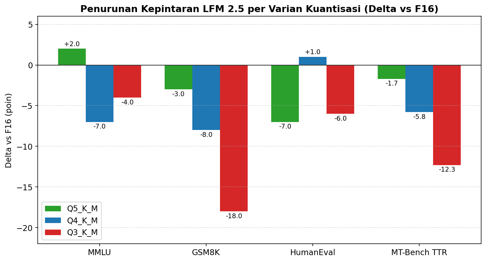

\renewcommand{\figurename}{Gambar}
\renewcommand{\tablename}{Tabel}
\renewcommand{\contentsname}{DAFTAR ISI}
\renewcommand{\listfigurename}{DAFTAR GAMBAR}
\renewcommand{\listtablename}{DAFTAR TABEL}
\renewcommand{\thefigure}{}
\renewcommand{\thetable}{}

\newpage

# ABSTRAK

\setstretch{1.0}

Pemanfaatan *Small Language Model* (SLM) secara *on-device* di Android terkendala kapasitas RAM 8 GB yang dibagi-pakai dengan sistem operasi, sehingga pemuatan model presisi penuh FP16 berisiko memicu *Out of Memory* dan *Force Close*. Penelitian ini bertujuan menganalisis performa metode *Post-Training Quantization* (PTQ) berformat GGUF *k-quants* (Q3\_K\_M, Q4\_K\_M, Q5\_K\_M) terhadap dua arsitektur SLM, yaitu LFM 2.5 (1,2B) dan Qwen 3.5 (2B), pada perangkat Tecno Pova 5 (Helio G99, RAM 8 GB) melalui lingkungan Termux dan mesin inferensi `llama.cpp`. Metode yang digunakan adalah eksperimen kuantitatif komparatif (*ablation study*) dengan mengukur reduksi ukuran berkas, konsumsi *peak* RAM proses, kecepatan *prompt* dan *generation* (t/s), serta degradasi kognitif melalui *Perplexity* WikiText-2 dan akurasi MMLU, GSM8K, HumanEval, dan MT-Bench. Setiap varian diuji dua hingga tiga kali untuk memperoleh rerata ± simpangan baku. Hasil menunjukkan varian Q4\_K\_M sebagai titik keseimbangan (*sweet spot*) terbaik: ukuran berkas tereduksi 68%, *peak* RAM LFM turun dari 2.303 MB ke 1.453 MB (efisiensi 36,9%), *generation* LFM meningkat dari 5,57 t/s ke 13,67 t/s (akselerasi 2,45×), dengan tambahan *perplexity* di bawah 0,6 poin. Sebaliknya, varian Q3\_K\_M memicu anomali *bit-shifting* dan degradasi akurasi signifikan, sehingga tidak direkomendasikan untuk produksi.

**Kata kunci:** *Post-Training Quantization*, *Small Language Model*, *Edge Computing*, GGUF, *k-quants*, Android, Helio G99, *Perplexity*.

\setstretch{1.5}

\newpage

# ABSTRACT

\setstretch{1.0}

On-device deployment of *Small Language Models* (SLM) on Android is constrained by the 8 GB RAM capacity shared with the operating system, putting full-precision FP16 models at risk of *Out of Memory* and *Force Close* events. This study analyzes the performance of *Post-Training Quantization* (PTQ) using GGUF *k-quants* (Q3\_K\_M, Q4\_K\_M, Q5\_K\_M) on two SLM architectures, namely LFM 2.5 (1.2B) and Qwen 3.5 (2B), running on a Tecno Pova 5 (Helio G99, 8 GB RAM) via Termux and the `llama.cpp` inference engine. The method is a comparative quantitative experiment (*ablation study*) measuring file-size reduction, peak process RAM, prompt and generation speed (t/s), and cognitive degradation through WikiText-2 *Perplexity* and MMLU, GSM8K, HumanEval, and MT-Bench accuracy. Each variant was tested two to three times to obtain mean ± standard deviation. Results show Q4\_K\_M as the optimal *sweet spot*: file size is reduced by 68%, LFM peak RAM drops from 2,303 MB to 1,453 MB (36.9% efficiency), and LFM generation speed accelerates from 5.57 t/s to 13.67 t/s (2.45×), with perplexity penalty below 0.6 points. Conversely, Q3\_K\_M triggers *bit-shifting* anomalies on ARM CPUs and significant accuracy degradation, and is therefore not recommended for production.

**Keywords:** *Post-Training Quantization*, *Small Language Model*, *Edge Computing*, GGUF, *k-quants*, Android, Helio G99, *Perplexity*.

\setstretch{1.5}

\newpage

# KATA PENGANTAR

Puji syukur penulis panjatkan ke hadirat Tuhan Yang Maha Esa atas selesainya penyusunan skripsi yang berjudul **"Analisis Performa *Post-Training Quantization* (PTQ) pada *Small Language Model* untuk Implementasi *Edge Computing* Berbasis Android"**. Skripsi ini disusun sebagai salah satu syarat untuk menyelesaikan program sarjana pada Program Studi Teknologi Informasi, Fakultas Teknik dan Informatika, Universitas Bina Sarana Informatika.

Penulis menyampaikan terima kasih kepada dosen pembimbing, rekan-rekan mahasiswa, serta keluarga yang telah memberikan dukungan moral, masukan teknis, dan akses sumber daya selama proses penelitian berlangsung. Penulis menyadari bahwa skripsi ini masih jauh dari sempurna, sehingga kritik dan saran yang membangun sangat diharapkan demi penyempurnaan karya tulis serupa di masa depan.

Jakarta, [Tanggal] [Bulan] [Tahun]

Penulis,

[Nama Mahasiswa]

\newpage

\tableofcontents

\newpage

\listoffigures

\newpage

\listoftables

\newpage

# DAFTAR SIMBOL

**a. Simbol Statistik dan Matematis**

±
:   Tanda simpangan baku, digunakan untuk menyatakan rerata ± satu standar deviasi (mis. 13,67 ± 0,24 t/s).

×
:   Tanda faktor pengali, digunakan untuk menyatakan akselerasi relatif terhadap *baseline* (mis. akselerasi 2,45× pada *generation speed*).

α
:   *Alpha*, tingkat signifikansi pada uji statistik. Pada Tabel IV.8 ditetapkan α = 0,05 (taraf kepercayaan 95%).

\vspace{6pt}

**b. Satuan Pengukuran**

t/s
:   *Tokens per second*, satuan kecepatan inferensi (*prompt speed* dan *generation speed*).

GB
:   *Gigabyte*, satuan kapasitas RAM sistem dan ukuran berkas model.

MB
:   *Megabyte*, satuan konsumsi *peak* RAM proses *llama.cpp*.

\vspace{6pt}

**c. Format Presisi Numerik dan Varian Kuantisasi**

FP16
:   *Floating-Point* 16-bit, presisi *baseline* tanpa kuantisasi.

FP32
:   *Floating-Point* 32-bit (digunakan sebagai referensi pada PC).

INT8
:   *Integer* 8-bit (referensi format kuantisasi non-*k-quants*).

Q3\_K\_M
:   GGUF *K-Quants* 3-bit varian *Medium*.

Q4\_K\_M
:   GGUF *K-Quants* 4-bit varian *Medium* (dipilih sebagai *sweet spot*).

Q5\_K\_M
:   GGUF *K-Quants* 5-bit varian *Medium*.

\newpage

# BAB I PENDAHULUAN

## 1.1 Latar Belakang Masalah

Lanskap teknologi kecerdasan buatan, terkhusus pada domain *Natural Language Processing* (NLP), saat ini mengalami disrupsi fundamental akibat penetrasi *Large Language Models* (LLM). Model berskala masif ini telah mendefinisikan ulang batas atas kemampuan komputasi mesin dalam menguraikan makna semantik dan membangkitkan teks yang setara dengan gaya kognitif manusia. Kendati menawarkan performa luar biasa, arsitektur LLM kontemporer menuntut spesifikasi infrastruktur komputasi, terutama *Graphics Processing Unit* (GPU),yang besar dan eksklusif. Ketergantungan absolut pada perangkat keras kelas atas ini pada akhirnya memicu fenomena defisit alokasi memori (*Out of Memory*) yang pasti terjadi apabila model dipaksakan beroperasi di atas perangkat keras komputasi reguler milik konsumen akhir (Touvron dkk., 2023).

Di sisi lain, pergeseran paradigma mobilitas digital meningkatkan tuntutan masyarakat akan asisten virtual pintar yang proaktif dan responsif secara *real-time* tanpa latensi jaringan. Kebutuhan praktis ini terlihat pada berbagai implementasi sektoral yang krusial, mulai dari layanan sistem informasi rumah sakit (Ahmad & Safudin, 2024) hingga integrasi simpul LLM dalam infrastruktur pemantauan jaringan nirkabel pada ekosistem kawasan urban (Sevim & Ibrahim, 2024). Namun, pemanfaatan layanan AI terpusat melalui *Cloud API* komersial menghadirkan eskalasi risiko keamanan yang fatal, terutama yang bersinggungan dengan jaminan privasi data pengguna. Untuk merespons ancaman tersebut, para ahli keamanan siber merekomendasikan agar pemrosesan AI dilokalisasi: eksekusi inferensi harus bergeser untuk dioperasikan secara otonom dan *offline* di titik terluar jaringan (*Edge Device*), seperti pada *smartphone* bersistem operasi Android. Langkah mitigasi ini esensial guna meredam potensi kebocoran rekam medis, rahasia korporat, maupun pangkalan data pribadi masyarakat (Zhan dkk., 2025).

Sebagai antitesis atas tuntutan privasi tersebut, *Small Language Models* (SLM) dirancang dengan rasio pemangkasan parameter yang signifikan agar lebih akomodatif terhadap kapasitas komputasi perangkat personal. Sayangnya, hambatan mekanis justru berasal dari fondasi arsitektur fisik gawai konsumen. Rata-rata *smartphone* kelas menengah hanya dibekali RAM 8 GB. Persoalan menjadi kian rumit karena kapasitas terbatas ini mengusung topologi *Unified Memory*, sebuah sistem di mana alokasi RAM harus dibagi-pakai (*shared memory*) dan diperebutkan secara ketat oleh sistem operasi Android beserta layanan latar belakang. Arsitektur tersebut tidak dirancang untuk menahan beban matriks model AI yang masih berwujud presisi tinggi 16-bit (*Floating-Point*/FP16). Apabila pemuatan model orisinal tetap dipaksakan, utilitas pengawas memori bawaan Android (*Low Memory Killer Daemon*) akan memicu protokol intervensi perlindungan dan mengeksekusi *Force Close*. Demi menghindari kelumpuhan operasional ini, optimasi *Edge Intelligence* menjadi prosedur yang mutlak diselenggarakan (Zhang dkk., 2024).

Salah satu intervensi komputasional paling krusial untuk menekan *memory footprint*,sehingga model AI dapat dimuat secara aman ke dalam sempitnya RAM *smartphone*,adalah melalui *Post-Training Quantization* (PTQ). Berbagai kajian terkini memvalidasi bahwa teknik pemadatan bobot menuju tingkat presisi menengah ke bawah (3-bit hingga 5-bit) terbukti secara empiris mampu mereduksi kebutuhan memori hingga kurang dari sepertiga dimensi aslinya, tanpa perlu melewati fase pelatihan ulang yang mahal (Dettmers dkk., 2023; Frantar dkk., 2023). Walaupun skema PTQ menawarkan efisiensi yang menjanjikan, mutilasi presisi pada matriks bobot tidak luput dari ancaman gangguan matematis (*perturbation*). Proses pemotongan presisi ini berisiko menghilangkan sebaran komponen parameter ekstrem yang berperan sebagai jangkar jaringan (*outliers*). Hilangnya *outliers* dapat bermuara pada degradasi akurasi logika kognitif serta kualitas tata bahasa model (Gong dkk., 2024).

Berangkat dari rangkaian determinan pada ekosistem *mobile edge computing* tersebut, penelitian ini difokuskan pada pengujian empiris atas performa algoritma kompresi PTQ dengan pendekatan presisi campuran (*mixed-precision k-quants*) yang dikonfigurasi bergradasi dari 3-bit hingga 5-bit (varian Q3\_K\_M, Q4\_K\_M, dan Q5\_K\_M). Target utama eksperimen ini adalah melokalisasi inferensi murni di dalam emulator terminal Android (Termux). Melalui matriks pengujian terstruktur pada dua SLM dengan ukuran berbeda (1,2 miliar dan 2 miliar parameter), penelitian ini bertujuan membuktikan secara empiris batas efektivitas kompresi yang paling sanggup menyelamatkan margin RAM dari *Force Close*, sembari menginvestigasi akselerasi *Tokens per Second* (TPS) pada CPU ARM dan signifikansi degradasi *Perplexity* yang menyertainya.

## 1.2 Identifikasi Permasalahan

Berdasarkan elaborasi latar belakang, dapat ditarik beberapa permasalahan utama yang menjadi fokus penelitian ini, yaitu:

1. **Kerentanan privasi pada arsitektur komputasi *cloud*.** Terdapat ketergantungan absolut pada layanan *cloud* komersial untuk pemrosesan instruksi LLM, yang rentan terhadap peretasan dan kebocoran data sensitif. Hal ini memicu urgensi akan hadirnya sistem AI otonom yang murni beroperasi secara *offline* langsung dari *edge device* pengguna.
2. **Limitasi arsitektur RAM pada *on-device deployment*.** Kapasitas RAM Android rata-rata 8 GB rawan mengalami krisis memori (*Out of Memory*) sehingga memicu *Force Close* saat memuat model FP16. Hingga kini belum ditemukan landasan empiris yang memetakan tingkat kompresi ideal yang paling seimbang dan aman untuk menetralisir anomali tersebut pada lingkungan *shared memory* Android.
3. **Risiko penurunan kecerdasan akibat kompresi ekstrem.** Pemadatan matriks SLM ke format ketat (Q3\_K\_M hingga Q5\_K\_M) menyimpan bahaya laten berupa halusinasi model dan meluruhnya kapabilitas nalar AI. Masih terdapat *research gap* yang signifikan mengenai persentase degradasi kecerdasan tatkala mesin dipaksa beroperasi di bawah tekanan kompresi tertingginya pada *smartphone*.

## 1.3 Perumusan Masalah

Berdasarkan identifikasi permasalahan di atas, rumusan masalah yang akan dijawab oleh penelitian ini adalah:

1. Berapa besar efisiensi penyimpanan (*storage efficiency*) dan reduksi konsumsi RAM yang dihasilkan oleh setiap varian kuantisasi GGUF (Q3\_K\_M, Q4\_K\_M, dan Q5\_K\_M) terhadap baseline FP16 pada model LFM 2.5 (1,2B) dan Qwen 3.5 (2B)?
2. Bagaimana perbandingan kualitas linguistik, diwakili oleh *Perplexity* (WikiText-2),serta akurasi kognitif (MMLU, GSM8K, dan HumanEval) yang dipertahankan oleh masing-masing varian kuantisasi terhadap baseline FP16?
3. Seberapa besar peningkatan kecepatan inferensi (*Prompt Processing* t/s dan *Text Generation* t/s) yang dapat dicapai pada perangkat MediaTek Helio G99 dengan RAM 8 GB melalui kompresi PTQ?
4. Berdasarkan tinjauan *trade-off* multi-dimensi (efisiensi penyimpanan, RAM, TPS, *Perplexity*, dan akurasi), varian model dan tingkat kuantisasi mana yang paling optimal untuk diterapkan pada *smartphone* berkapasitas RAM 8 GB?

## 1.4 Tujuan dan Manfaat

### 1.4.1 Tujuan Penelitian

1. Mengimplementasikan dan mengevaluasi kelayakan operasional varian PTQ presisi campuran (Q3\_K\_M, Q4\_K\_M, dan Q5\_K\_M) pada arsitektur SLM, sekaligus mengidentifikasi batas aman toleransi RAM Android terhadap pemicu *Force Close*.
2. Melakukan komparasi faktual melalui *benchmarking* yang membandingkan perilaku model FP16 dengan ketiga varian kuantisasinya, guna membuktikan persentase efisiensi alokasi RAM, akselerasi *Tokens per Second* (TPS), serta fluktuasi degradasi *Perplexity* dan akurasi MMLU/GSM8K/HumanEval.
3. Menetapkan rekomendasi konfigurasi (model parameter-size dan tingkat kuantisasi) yang paling optimal sebagai *sweet spot* operasional untuk perangkat Android berkapasitas RAM 8 GB.

### 1.4.2 Manfaat Penelitian

**Bagi Penulis:**

a. Sebagai sarana pemenuhan salah satu syarat akademik untuk meraih kelulusan pada Program Sarjana, Program Studi Teknologi Informasi, Fakultas Teknik dan Informatika, Universitas Bina Sarana Informatika.

b. Memperluas wawasan dan pengalaman praktis terkait implementasi *Mobile Edge Computing* serta strategi optimasi arsitektur kecerdasan buatan di lingkungan seluler yang terbatas.

c. Menjadi sarana penerapan teori perkuliahan, khususnya pada irisan multidisiplin *Machine Learning*, arsitektur perangkat keras mikro, dan algoritma pengolahan bahasa alami (NLP).

**Bagi Objek Penelitian (Pengembang Aplikasi *Edge AI*):**

a. Menyediakan pedoman purwarupa operasional bagi perancangan infrastruktur AI yang memberikan garansi keamanan privasi data, karena interaksi dilangsungkan secara lokal (*offline*).

b. Menawarkan alternatif resolusi finansial guna menekan biaya pemeliharaan IT, di mana pengguna atau korporasi tidak lagi tergantung pada layanan *Cloud API* komersial berbiaya bulanan.

c. Menghasilkan basis data telemetri yang presisi mengenai daya tahan RAM 8 GB Android terhadap beban eksekusi model AI pasca-kompresi.

d. Memberikan rekomendasi format bagi para pengembang *independent developer* guna merakit *chatbot* pintar yang tertanam (*embedded*) di gawai kelas menengah.

**Bagi Pembaca:**

Membuka cakrawala pemahaman teoretis maupun operasional bagi pembaca akademik dan praktisi industri perihal anatomi teknik kompresi PTQ, berikut tata laksana *deployment* SLM secara *offline* dan mandiri pada peranti Android.

## 1.5 Metode Penelitian

Penelitian ini menggunakan pendekatan **empiris kuantitatif eksperimental** dengan kerangka *ablation study* yang membandingkan empat tingkat presisi bobot model (FP16 sebagai *baseline*, lalu Q5\_K\_M, Q4\_K\_M, dan Q3\_K\_M sebagai varian terkompresi) di atas dua jenis *host* yang saling melengkapi. *Host* pertama adalah **PC dengan WSL2 Ubuntu dan GPU NVIDIA RTX 3060**, dipakai untuk tahap persiapan berkas `.gguf` melalui utilitas `huggingface-cli`, `convert_hf_to_gguf.py`, dan `./llama-quantize`, serta untuk mengukur metrik intrinsik model (Perplexity WikiText-2 dan akurasi MMLU/GSM8K/HumanEval/MT-Bench) yang memerlukan akselerasi paralel. *Host* kedua adalah ***smartphone* Tecno Pova 5** dengan emulator terminal *non-root* Termux dan mesin inferensi `llama.cpp` yang dikompilasi ulang secara natif untuk CPU ARM Helio G99, dipakai untuk mengukur metrik performa pada lingkungan *target* deployment: *peak* RAM proses, beban CPU, serta *Tokens per Second* (TPS). Setiap varian dijalankan melalui skenario terstandardisasi yang sama (parameter inferensi, anggaran *token*, jumlah *thread*, dan dataset evaluasi) agar perbedaan performa benar-benar dapat dikaitkan dengan tingkat kompresi, bukan variabel eksternal.

## 1.6 Teknik Pengumpulan Data

### A. Observasi (Eksperimental)

Observasi dilakukan dengan mengekstraksi log secara objektif atas seluruh dinamika perangkat keras dan perangkat lunak ketika siklus inferensi AI berlangsung. Pengukuran dibagi ke dalam dua *host*: (1) PC NVIDIA RTX 3060 (WSL Ubuntu) untuk mengukur *Perplexity* (modul `./llama-perplexity`) dan akurasi *benchmark* MMLU/GSM8K/HumanEval/MT-Bench karena tahap evaluasi akurasi membutuhkan waktu komputasi yang panjang; serta (2) perangkat Android Tecno Pova 5 melalui Termux untuk mengukur *peak* RAM proses (`VmRSS` dari `/proc/<pid>/status`), beban CPU (`%CPU` dari `ps`), serta *Tokens per Second* (TPS) yang dibaca dari keluaran statistik `llama-cli`. Berkas `.gguf` yang dieksekusi pada kedua *host* berasal dari satu *source-of-truth* sehingga hasil pengukuran tetap dapat diperbandingkan apple-to-apple. Pencatatan dilakukan pada setiap transisi resolusi kompresi (FP16, Q5\_K\_M, Q4\_K\_M, dan Q3\_K\_M) untuk kedua model.

### B. Wawancara

Karena penelitian ini bersifat **kuantitatif eksperimental** dan seluruh variabel dependennya berupa indikator komputasi objektif (TPS, *peak* RAM, beban CPU, *Perplexity*, dan skor akurasi *benchmark*) yang dapat diekstraksi langsung dari log sistem dan log mesin inferensi, teknik wawancara tidak diterapkan. Data primer sepenuhnya berasal dari instrumen pengukuran otomatis pada kedua *host* (PC dan *smartphone*) sebagaimana dijelaskan pada bagian A, sehingga tidak diperlukan instrumen opini subjektif dari narasumber. Validitas data dijaga melalui pengulangan ujian (tiga *run* per varian untuk LFM 2.5 dan dua *run* per varian untuk Qwen 3.5) yang dilanjutkan dengan uji statistik signifikansi (Welch's *t*-test + one-way ANOVA) sebagaimana disajikan pada Sub-bab 4.4.6.

### C. Studi Pustaka

Studi pustaka dilakukan dengan menghimpun dan memetakan referensi dari berbagai karya tulis ilmiah, baik jurnal nasional maupun internasional, yang dipublikasikan pada rentang 2023–2026. Fokus telaah literatur mencakup teori fundamental arsitektur LLM/SLM (Touvron dkk., 2023), teori gangguan matematis pada kuantisasi (Gong dkk., 2024), pedoman *Edge Intelligence* (Zhang dkk., 2024), serta validasi empiris penerapan `llama.cpp` di perangkat ARM dengan sumber daya terbatas (Ray & Pradhan, 2026). Referensi pilar dari Dettmers dkk. (2023), Frantar dkk. (2023), Lin dkk. (2023), dan Jin dkk. (2024) digunakan sebagai instrumen landasan teori sekaligus pemandu standar parameter kalibrasi pada tahap evaluasi.

## 1.7 Ruang Lingkup

Agar trajektori analisis tidak melebar dari sumbu permasalahan utama, ruang lingkup penelitian ini dibatasi sebagai berikut:

1. **Perangkat Keras Uji.** Seluruh proses inferensi AI dipusatkan pada satu *smartphone* kelas menengah, yaitu Tecno Pova 5 yang ditenagai SoC MediaTek Helio G99 (arsitektur ARM *big.LITTLE*), RAM LPDDR4x 8 GB, dan ROM UFS 2.2 256 GB.
2. **Lingkungan Eksekusi.** Lingkungan komputasi dikerahkan di atas Android 13 melalui aplikasi emulator terminal *non-root* Termux, dengan kompilasi mandiri `llama.cpp` agar instruksi CPU ARM dapat dieksploitasi secara natif.
3. **Model Uji.** Penelitian menguji dua SLM berbobot ringan, yaitu **LFM 2.5 (1,2 miliar parameter)** sebagai objek uji utama dan **Qwen 3.5 (2 miliar parameter)** sebagai pembanding *stress-test*.
4. **Metode Kompresi.** Fokus PTQ dibatasi pada format GGUF presisi campuran (*k-quants*) yang diturunkan secara gradual melintasi rentang 3-bit hingga 5-bit, yakni **Q3\_K\_M**, **Q4\_K\_M**, dan **Q5\_K\_M**, dengan FP16 sebagai *baseline*.
5. **Metrik Evaluasi.** Metrik dibatasi pada (a) ukuran berkas, (b) *peak* RAM, (c) *Prompt* dan *Generation Speed* dalam TPS, (d) *Perplexity* WikiText-2, serta (e) akurasi MMLU, GSM8K, dan HumanEval, masing-masing dibatasi 100 sampel per *benchmark*.

## 1.8 Hipotesis

Hipotesis utama yang akan dibuktikan keabsahannya pada penelitian ini adalah:

**H1:** Implementasi PTQ format GGUF presisi campuran pada rentang 3-bit hingga 5-bit akan secara progresif mereduksi ukuran berkas dan konsumsi RAM SLM secara drastis, sehingga arsitektur SLM dapat dimuat secara stabil ke dalam RAM 8 GB Android tanpa memicu *Force Close* (OOM Killed). Reduksi *bandwidth* memori ini sekaligus akan meningkatkan *Tokens per Second* (TPS) pada CPU ARM secara berlipat ganda jika dibandingkan baseline FP16. Sebaliknya, kompromi degradasi kualitas yang muncul akibat pemotongan presisi diprediksi bersifat minor pada varian Q5\_K\_M dan Q4\_K\_M (kenaikan *Perplexity* di bawah 1 poin dengan rata-rata penurunan akurasi di bawah 5%), namun akan menjadi signifikan pada varian Q3\_K\_M, khususnya pada dimensi nalar matematis (GSM8K) dan logika pemrograman (HumanEval),sehingga **Q4\_K\_M diperkirakan menjadi titik keseimbangan (*sweet spot*) operasional yang paling optimal** untuk perangkat Android berkapasitas RAM 8 GB.

\newpage

# BAB II LANDASAN TEORI

## 2.1 Tinjauan Pustaka

Bab ini memaparkan konsep-konsep fundamental dan rujukan literatur terkait kecerdasan buatan, model bahasa, keterbatasan perangkat keras, serta teknik optimasi memori komputasi yang menjadi landasan teoritis bagi penelitian ini.

### 2.1.1 *Natural Language Processing* (NLP) dan Pergeseran ke *Edge Computing*

*Natural Language Processing* (NLP) merupakan cabang ilmu kecerdasan buatan yang memungkinkan mesin mengurai, memahami, dan membangkitkan bahasa alami manusia secara kontekstual. Evolusi NLP terus berakselerasi seiring meluasnya implementasi algoritma *Deep Learning*. Salah satu contoh integrasi NLP pada aplikasi riil di ranah industri lokal adalah pengembangan asisten *chatbot* kesehatan interaktif berbasis kecerdasan buatan, yang terbukti meningkatkan efisiensi operasional dan kualitas pelayanan rumah sakit serta menjadi kanal konsultasi *real-time* yang dapat diandalkan oleh masyarakat (Ahmad & Safudin, 2024).

Namun, pengolahan bahasa yang canggih sering menuntut kapabilitas komputasi server *cloud*. Ketergantungan pada komputasi awan menjadi persoalan dalam penanganan kasus yang menuntut kerahasiaan absolut, seperti data diagnosis rekam medis pasien. Sebagai mitigasi risiko keamanan, pengembangan NLP mulai diarahkan pada arsitektur *offline* atau lokalisasi pemrosesan pada perangkat seluler konsumen (*Mobile Edge Computing*). Paradigma *offline* memastikan kelancaran fungsionalitas sistem AI sekaligus menjamin privasi informasi sensitif dari intervensi jaringan internet terbuka (Zhan dkk., 2025).

Untuk memaksimalkan operasi AI di lingkungan gawai berbasis RAM terbatas, pendekatan *Edge Intelligence Optimization* sangat diperlukan. Konsep ini memformulasikan teknik penyesuaian *stack* perangkat lunak agar perangkat Android dengan spesifikasi minim mampu mengeksekusi beban kerja AI tanpa memicu *Force Close* yang diakibatkan oleh keterbatasan arsitektur memori bawaan (Zhang dkk., 2024). Hierarki sistem *Edge Intelligence* dapat dilihat pada Gambar II.2.

### 2.1.2 *Large Language Models* (LLM) dan Fleksibilitasnya

*Large Language Models* (LLM) merujuk pada arsitektur *neural network* skala masif yang dilatih menggunakan volume data teks dalam triliunan token. Pendekatan paradigmatik LLM modern, mulai dari *pre-training*, *prompting*, hingga *alignment* dan *inference*,secara komprehensif disusun oleh Xiao dan Zhu (2025) dalam buku ajar *Foundations of Large Language Models*. Sebagai fondasi dasar, LLaMA merupakan salah satu pelopor *open-source foundation language model* berskala besar yang dibangun murni menggunakan dataset publik, dengan kapasitas parameter mulai 7 miliar hingga 65 miliar (Touvron dkk., 2023). Fleksibilitas arsitektur LLM bahkan telah dimanfaatkan sebagai agen kognitif untuk otomatisasi penyusunan jaringan nirkabel di kawasan urban cerdas (Sevim & Ibrahim, 2024), yang menegaskan bahwa model bahasa modern berperan layaknya otak virtual universal.

### 2.1.3 *Small Language Models* (SLM) dan Limitasi Perangkat Seluler

Sebagai respons atas mahalnya ongkos inferensi LLM raksasa, para peneliti berinovasi menciptakan *Small Language Models* (SLM). Arsitektur SLM menyuguhkan desain jaringan parameter yang jauh lebih ramping (umumnya 1–7 miliar parameter) namun sanggup mempertahankan kompetensi analitis yang memadai. Survei komprehensif atas lebih dari 60 SLM oleh Lu dkk. (2025) menunjukkan bahwa SLM *state-of-the-art* dapat mengungguli model 7B pada *task* umum, sehingga viabilitas praktis SLM sebagai pilihan utama *on-device* terbukti secara empiris. Keringkasan arsitektur SLM menjadikannya primadona untuk disematkan langsung ke dalam *smartphone*. Namun tantangan utamanya adalah arsitektur *shared memory*: RAM 8 GB pada Android harus dibagi untuk OS, antarmuka layar, dan aplikasi latar belakang. Apabila SLM dimuat penuh dan ukurannya melebihi ruang yang tersisa, *Out of Memory Killer* akan menghentikan paksa (*Force Close*) proses AI demi menyelamatkan sistem dari *freeze*.

### 2.1.4 Arsitektur Dasar *Transformer*

Di balik kapabilitas LLM maupun SLM terdapat arsitektur *Transformer* dengan mekanisme *Self-Attention* yang memungkinkannya membaca seluruh kata dalam satu kalimat secara simultan, lalu menimbang keterikatan makna antar-token secara kontekstual (Prince, 2023). Kalkulasi bobot atensi antar-token ini melibatkan operasi matriks masif yang dilakukan lapis demi lapis (*layer-by-layer*), sehingga *Transformer* secara bawaan sangat rakus memori dan akan menuntut alokasi gigabyte RAM tambahan seiring dengan panjangnya *prompt* yang diberikan pengguna.

### 2.1.5 Konsep Kuantisasi, Presisi Campuran (*K-Quants*), dan Rentang 3-Bit hingga 5-Bit

Kuantisasi (*Quantization*) adalah algoritma kompresi fundamental yang digunakan untuk merampingkan kebutuhan ruang penyimpanan dan *memory footprint* (Prince, 2023). Saat sebuah model AI dilatih, bobot matriks jaringannya direkam dalam *floating-point* berpresisi tinggi, umumnya 16-bit (FP16). Format murni ini memiliki ketepatan akurasi yang tinggi namun memakan kapasitas RAM secara eksesif. Kuantisasi menyederhanakan rangkaian pecahan desimal ini menjadi bilangan bulat yang lebih padat (INT5, INT4, atau bahkan INT3) (Dettmers dkk., 2023). Pembahasan teknik inferensi LLM yang efisien beserta strategi kuantisasi modern pada tahap pasca-pelatihan dirangkum secara komprehensif oleh Xiao dan Zhu (2025). Selain keluarga PTQ klasik (GPTQ, AWQ, dan GGUF *k-quants*), studi kontemporer juga mengusulkan metode PTQ yang khusus dirancang ramah eksekusi *on-device*, seperti **MobileQuant** dari Samsung AI yang mengoptimasi *weight transformation* dan rentang aktivasi secara *end-to-end* untuk menekan *latency* hingga 20–50% pada perangkat seluler (Tan dkk., 2024).

Di dalam ekosistem `llama.cpp`, teknik kompresi standar pada awalnya memukul rata semua lapisan model menjadi format bit yang sama. Pendekatan ini memiliki kelemahan: rusaknya bobot penting yang menyebabkan AI mudah berhalusinasi. Untuk mengatasi defisit kecerdasan ini, diciptakanlah metode generasi baru bernama **K-Quants** (ditandai huruf "K"). Pendekatan ini menggunakan presisi campuran (*mixed-precision*): bagian tensor yang menentukan logika utama (seperti *output layers*) dipertahankan pada presisi yang lebih aman (misalnya 6-bit), sementara bagian model yang sifatnya pelengkap dan memiliki redundansi tinggi ditekan hingga rentang 3-bit hingga 5-bit. Dalam eksplorasi *resource-constrained edge*, tiga varian *k-quants* yang lazim dievaluasi secara bertahap (*ablation study*) adalah **Q5\_K\_M** (rata-rata mendekati 5-bit), **Q4\_K\_M** (mendekati 4-bit), dan **Q3\_K\_M** (mendekati 3-bit). Pencarian *sweet spot* menjadi krusial: kompresi yang kurang padat (>5-bit) tidak cukup menekan RAM 8 GB, namun kompresi yang terlalu agresif (≤3-bit) berisiko menyebabkan kerusakan kognitif total. Alur transformasi dari FP16 menuju varian Q\*\_K\_M diilustrasikan pada Gambar II.1.

{width=92%}

### 2.1.6 Karakteristik Inferensi *Mobile*: Limitasi CPU dan *Bandwidth* Memori

Pada arsitektur *System-on-Chip* (SoC) ARM *big.LITTLE*, kecepatan inferensi model AI tunduk pada dua hukum komputasi. Pertama, limitasi *Memory Bandwidth*: inti CPU mungkin sanggup berhitung cepat, namun aliran data parameter SLM kerap memacetkan jalur transfer RAM. Ketika model FP16 dikuantisasi ke 5-bit hingga 3-bit, berkas model menjadi sangat ringan sehingga kemacetan transfer data dari RAM ke CPU ARM terurai. Inilah fondasi argumen mengapa perampingan memori berkorelasi langsung dengan peningkatan *Tokens per Second* (TPS).

{width=88%}

### 2.1.7 Format File GGUF (*GPT-Generated Unified Format*)

GGUF adalah format biner komprehensif yang dirancang spesifik untuk membungkus arsitektur *neural network* AI generatif dalam satu berkas tertutup. Diciptakan sebagai evolusi dari GGML, GGUF mampu menampung seluruh parameter identitas model beserta *metadata*-nya. Format ini esensial bagi ekosistem Linux Android (Termux) karena strukturnya dioptimalkan untuk mendistribusikan beban komputasi ke arsitektur CPU dan bersahabat dengan berbagai skema kompresi presisi campuran (*K-Quants*).

### 2.1.8 *Framework* Inferensi `llama.cpp` di Android

Untuk perangkat konsumen ringan, dunia komputasi *Machine Learning* sangat bergantung pada `llama.cpp`. Berbeda dengan *framework* berbasis Python (PyTorch/TensorFlow) yang menuntut adanya *overhead* pustaka besar, `llama.cpp` ditulis dalam C/C++ secara *bare-metal*. Struktur transparan ini memungkinkannya untuk dikompilasi secara manual agar sesuai dengan instruksi CPU ARM pada Android, sehingga gawai dapat menjalankan beban kalkulasi *Transformer* layaknya mesin server (Ray & Pradhan, 2026).

### 2.1.9 Tantangan Gangguan Matematis (*Perturbation*)

Pemotongan presisi bobot dari pecahan desimal berukuran gigabyte menjadi angka bulat yang sempit selalu menyisakan efek negatif. Dalam kajian kuantisasi, dampak simplifikasi numerik ini disebut sebagai *perturbation*. Kendala tersulit adalah keberadaan nilai pencilan (*outliers*) yang tidak terprediksi, nilai-nilai ini rentan tersapu saat sistem membulatkan ke integer 3-bit hingga 5-bit terdekat. Hilangnya tumpuan *outliers* inilah yang sering menumpulkan parameter atensi AI dan menyebabkan model berhalusinasi atau menghasilkan jawaban kosong (Gong dkk., 2024). Oleh karena itu, mengevaluasi titik batas kerusakan kompresi (*degradation*) memegang peranan krusial.

### 2.1.10 Metrik Evaluasi Performa *Edge Computing*

Kelayakan operasional SLM di Android (*Mobile Edge*) dievaluasi melalui rasio efisiensi perangkat keras (Jin dkk., 2024). Dua variabel pengamatan esensial mencakup:

a. ***System Memory Usage*** (Konsumsi RAM Sistem). Indikator primer untuk mengukur jumlah absolut RAM yang termakan model saat dimuat. Variabel ini wajib dijaga pada batas yang aman (idealnya 1–3 GB) agar OS Android tidak memicu *OOM Killer*.
b. ***Tokens per Second*** **(TPS)**. Tolok ukur dinamis untuk mengukur laju pemrosesan *prompt* per detik (*Prompt Processing*) dan laju ekstraksi karakter per detik (*Generation*).

### 2.1.11 Standar Pengujian Kognitif dan Linguistik

Untuk memvalidasi bahwa pengorbanan memori tidak menghasilkan model "tuli atau bisu", diperlukan tes validasi standar:

a. ***Perplexity*** **(PPL)**. Penilaian dasar kelugasan sintaksis. Semakin rendah PPL, semakin rasional dan natural rangkaian kalimat yang dihasilkan model.
b. **MMLU** (*Massive Multitask Language Understanding*). Dataset penguji wawasan intelektual komprehensif (sejarah, sains, hingga sosiologi) untuk melacak defisit memori faktual pasca-kompresi.
c. **GSM8K** (*Grade School Math 8K*). Tes nalar matematika sekolah dasar, digunakan untuk membongkar kerusakan logika kalkulasi akibat pemotongan presisi.
d. **HumanEval**. Pengujian fungsional logika pemrograman (Python) untuk menakar tingkat kerusakan sintaks model.

## 2.2 Penelitian Terkait

Demi menempatkan keaslian gagasan penelitian ini dalam lanskap literatur yang relevan, peneliti merujuk pada konstruksi pemikiran dari berbagai studi pilar sebelumnya yang mengedepankan telaah teknis implementasi AI pada ekosistem memori terbatas.

Trobosan konseptual efisiensi krisis memori diperkenalkan secara revolusioner oleh Dettmers dkk. (2023) melalui mekanisme kompresi **QLoRA**. Studi ini menjustifikasi secara empiris bahwa pemaksaan struktur bobot dari skala besar ke wadah presisi 4-bit (NF4) sanggup mereduksi *footprint* hingga sepertiganya, sembari menghindarkan sistem dari *Out of Memory* tanpa mengebiri utilitas 16-bit asli arsitektur dasar. Argumen efisiensi ini dikukuhkan oleh GPTQ (Frantar dkk., 2023) dan AWQ (Lin dkk., 2023), yang membuktikan bahwa PTQ dengan fokus pada perlindungan *salient weights* sangat cocok dan stabil bila dibebankan pada SoC seluler.

Akan tetapi, di balik efisiensi memori tersebut terdapat jejak reduksi kualitas kognitif. Studi ekstensif Gong dkk. (2024) dengan lensa *perturbation* membedah kenyataan bahwa simplifikasi paksa bobot menjadi integer terkompresi sering kali membantai *outliers*, menginduksi rusaknya pemahaman linguistik AI (ditandai memburuknya *Perplexity*).

Terlepas dari risiko cacat penalaran, urgensi lokalisasi AI generatif di perangkat mandiri makin tak terbendung. Hal ini dipantik oleh kerentanan latensi dan *bandwidth* komputasi awan di kawasan urban (Sevim & Ibrahim, 2024). Melalui tinjauan medis, Zhan dkk. (2025) menegaskan bahwa instansi yang berhubungan dengan kerahasiaan data tidak boleh menyerahkan pemrosesan teks ke layanan *Cloud API*. Kebutuhan asisten cerdas instan, seperti *chatbot* RS Brawijaya (Ahmad & Safudin, 2024), merupakan manifestasi valid akan urgensi AI lokal.

Demi menstrukturkan matriks pengujian SLM secara objektif, penulis merujuk pada metodologi evaluasi gubahan Jin dkk. (Jin dkk., 2024) dan arsitektur pengujian latensi dari Zhang dkk. (Zhang dkk., 2024). Kedua referensi tersebut menegaskan bahwa kualitas LLM tidak cukup dinilai dari rasio kebenaran, melainkan harus dipadukan dengan skor *Perplexity* dan TPS. Sebagai klimaks landasan studi terapan, riset observasional Ray dan Pradhan (Ray & Pradhan, 2026) digunakan sebagai pijakan validasi: pengujian PTQ GGUF di atas C++ (`llama.cpp`) pada Raspberry Pi RAM 8 GB membuktikan TPS yang stabil. Tesis empiris ini dipadukan dengan keunggulan arsitektur model lokal seperti Qwen (Nurohim dkk., 2025) dan LLaMA (Touvron dkk., 2023), yang menjadi konfirmasi bahwa komputasi AI *offline* di atas Android dengan RAM setara merupakan keniscayaan terapan yang krusial untuk dieksplorasi.

Pemaparan ringkas tujuh penelitian pilar paling representatif yang mendasari riset ini disajikan pada Tabel II.1.

| Penulis & Judul Penelitian | Tujuan Penelitian | Metode Penelitian | Hasil Penelitian |
|---|---|---|---|
| Dettmers dkk. (2023), *QLoRA: Efficient Finetuning of Quantized LLMs* | Mengembangkan teknik *fine-tuning* hemat memori bagi LLM agar dapat dilatih pada satu GPU melalui kompresi presisi rendah. | Kompresi bobot ke presisi 4-bit (*NormalFloat-4*), *double quantization*, dan *paged optimizer* untuk LoRA. | Pemadatan 4-bit (NF4) terbukti mencegah *Out-of-Memory* dan mempertahankan akurasi setara FP16 pada *benchmark* pasca-*finetuning*. |
| Frantar dkk. (2023), *GPTQ: Accurate Post-Training Quantization for Generative Pre-Trained Transformers* | Mengusulkan metode PTQ *one-shot* yang akurat untuk model generatif berskala besar. | Pendekatan *layer-wise weight quantization* berbasis pendekatan *second-order* (*OBQ*) yang diadaptasi untuk LLM. | GPTQ berhasil mengompresi LLM hingga 3–4-bit dengan degradasi *perplexity* minim dan menjadi salah satu fondasi PTQ untuk LLM. |
| Lin dkk. (2023), *AWQ: Activation-Aware Weight Quantization for On-Device LLM Compression and Acceleration* | Menyusun metode kuantisasi PTQ yang ramah implementasi *on-device* dengan perlindungan terhadap bobot kritis. | Identifikasi 1% bobot paling penting berdasarkan distribusi aktivasi, lalu menerapkan *per-channel scaling* untuk mempertahankannya. | Perlindungan *salient weights* secara drastis menurunkan *error* kuantisasi dan menjadi rujukan utama PTQ untuk inferensi *on-device*. |
| Jin dkk. (2024), *A Comprehensive Evaluation of Quantization Strategies for Large Language Models* | Menyusun kerangka evaluasi holistik untuk membandingkan berbagai strategi kuantisasi pada LLM. | Evaluasi tiga dimensi (kapasitas, kelugasan, dan efisiensi) terhadap beragam metode kuantisasi pada banyak model LLM. | Menetapkan kombinasi *Perplexity* dan beban RAM sebagai standar pengukuran kelayakan kuantisasi; kerangka tiga dimensi inilah yang diadopsi sebagai metodologi skripsi. |
| Ray & Pradhan (2026), *Performance Analysis of Localised Large Language Models in Resource-Constrained Edge for Python and Rust APIs* | Mengevaluasi kelayakan eksekusi LLM terlokalisasi pada perangkat *edge* dengan sumber daya terbatas. | Eksperimen empiris LLM format GGUF melalui `llama.cpp` pada Raspberry Pi RAM 8 GB. | LLM GGUF dapat dieksekusi stabil pada arsitektur ARM 8 GB; menjadi landasan utama replikasi pada SoC ARM Android (Termux) di skripsi ini. |
| Laskaridis dkk. (2024), *MELTing point: Mobile Evaluation of Language Transformers* | Mengevaluasi kelayakan dan keterbatasan eksekusi LLM pada *smartphone* Android dan iOS secara sistematis. | Studi empiris pertama yang membandingkan beberapa LLM (1–13B) pada perangkat seluler nyata dengan metrik *throughput*, RAM, dan *thermal*. | Mengonfirmasi inferensi LLM bersifat *memory-bound* pada *smartphone*; kuantisasi efektif menekan jejak memori dengan kompensasi akurasi. Acuan utama klaim *memory-bound* di skripsi. |
| Lu dkk. (2025), *Demystifying Small Language Models for Edge Deployment* | Memetakan lanskap SLM yang layak diimplementasikan pada perangkat *edge* termasuk *smartphone*. | Survei komprehensif >60 SLM mencakup arsitektur, ukuran, *benchmark* akurasi, dan profil inferensi pada perangkat *edge*. | SLM *state-of-the-art* terbukti dapat mengungguli model 7B pada *task* umum; memperkuat justifikasi pemilihan LFM 2.5 (1,2B) dan Qwen 3.5 (2B) untuk skripsi. |

: Tabel II.1 Matriks Perbandingan Penelitian Terkait (*State of the Art*)

## 2.3 Tinjauan Organisasi (Objek Penelitian)

Penelitian ini bersifat **independen dan berbasis laboratorium**, sehingga tidak terikat pada organisasi atau institusi eksternal sebagai tempat riset. Seluruh kegiatan pengujian, mulai dari persiapan berkas model hingga eksekusi *benchmark*, dilakukan secara mandiri oleh penulis menggunakan perangkat pribadi. Mengingat tidak adanya struktur organisasi formal yang relevan, bagian *Tinjauan Organisasi* pada panduan resmi diadaptasi menjadi tinjauan terhadap **objek penelitian**, yakni ekosistem perangkat keras dan perangkat lunak yang berfungsi sebagai *unit of analysis* dalam eksperimen. Objek penelitian dibagi menjadi dua kategori fundamental: ekosistem perangkat keras/perangkat lunak Android sebagai *host target* deployment, dan spesifikasi arsitektur *Small Language Model* yang diuji.

### 2.3.1 Ekosistem Uji Keras: Tecno Pova 5 dengan Termux

Objek operasional dibatasi pada satu *smartphone* kelas reguler, yaitu Tecno Pova 5. Perangkat ini ditenagai SoC MediaTek Helio G99 berbasis ARM, dengan RAM sistem 8 GB. Mengingat status gawai *non-rooted* (bawaan pabrik tanpa akses *root*), lingkungan pengujian virtual dibangun di atas aplikasi emulator Linux portabel **Termux**. Melalui kompilasi mandiri di Termux inilah `llama.cpp` di-*build* ulang dalam konfigurasi C/C++ serupa lingkungan server, agar instruksi CPU ARM dapat dieksekusi secara optimal.

### 2.3.2 Objek Arsitektur SLM: LFM 2.5 (1,2B) dan Qwen 3.5 (2B)

Riset komparatif ini menggunakan dua model SLM. Objek uji utama adalah **LFM 2.5** dengan densitas parameter 1,2 miliar. Berdasarkan laporan teknis resmi Liquid AI (2025), arsitektur LFM 2 dirancang sebagai *hybrid backbone* yang memadukan *gated short convolutions* dengan *grouped query attention* dan secara eksplisit dioptimalkan untuk *edge inference* dengan kecepatan *prefill/decode* hingga 2× lebih tinggi dibanding model setara di CPU. Struktur mikronya yang dirancang efisien menjadikannya kandidat menjanjikan untuk dikompresi bertahap pada rentang 3-bit hingga 5-bit guna menekan konsumsi RAM. Versi mentah FP16-nya akan dibandingkan dengan tiga varian *K-Quants* (Q5\_K\_M, Q4\_K\_M, dan Q3\_K\_M) pada fase *ablation study*. Sebagai pembanding *stress-test*, digunakan arsitektur **Qwen 3.5 (2 miliar parameter)**,keluarga Qwen3 secara eksplisit memperkenalkan **dua mode di satu model**, yaitu *thinking mode* untuk *multi-step reasoning* dan *non-thinking mode* untuk respons cepat (Qwen Team, 2025). Pilihan ini berfungsi sebagai instrumen pengukur batas toleransi ekstrem sistem, sekaligus mendemonstrasikan fenomena *scaling laws* (kemampuan model bertahan) ketika ekosistem Android RAM 8 GB dan Helio G99 dipaksa menjalankan beban arsitektur di atas 2 miliar parameter pasca-kuantisasi.

\newpage

# BAB III METODOLOGI PENELITIAN

## 3.1 Tahapan Penelitian

Dalam melaksanakan penelitian berbasis komputasi eksperimental pada perangkat seluler, tahapan kerja disusun secara sistematis agar proses pengujian tetap berfokus pada tujuan awal dan menghasilkan data empiris yang valid. Mengacu pada kerangka evaluasi kuantisasi holistik (kapasitas, kelugasan, efisiensi) (Jin dkk., 2024), alur penelitian ini terbagi menjadi **lima tahapan utama** sebagai berikut.

1. **Studi Pendahuluan dan Perumusan Masalah.** Tahap awal mencakup kajian pustaka komprehensif mengenai *Mobile Edge Computing* (Zhang dkk., 2024; Sevim & Ibrahim, 2024) dan *Post-Training Quantization* (Dettmers dkk., 2023; Frantar dkk., 2023). Urgensi lokalisasi pemrosesan AI secara *offline* ditetapkan sebagai landasan utama (Zhan dkk., 2025), sementara batasan kapasitas RAM 8 GB pada Android difokuskan sebagai *bottleneck* arsitektur. Tahap ini dilanjutkan dengan perumusan hipotesis terkait solusi kompresi presisi campuran (Lin dkk., 2023).
2. **Persiapan Lingkungan Komputasi (*Environment Setup*).** *Testbed* dikonfigurasi pada dua *host* yang saling melengkapi. *Host* pertama adalah **PC dengan WSL2 Ubuntu** dan GPU NVIDIA RTX 3060, dipakai untuk tahap persiapan berkas model dan evaluasi akurasi karena membutuhkan akselerasi paralel. Pada PC ini diinstal *toolchain* C++ (`build-essential`, `cmake`), Python (`python3`, `python3-venv`), CUDA Toolkit, serta *library* `huggingface_hub`. Repositori `llama.cpp` di-*clone* dan dikompilasi dengan opsi `-DGGML_CUDA=ON` agar utilitas `llama-quantize` dan `llama-perplexity` memanfaatkan GPU. *Host* kedua adalah perangkat **Android Tecno Pova 5** dengan emulator terminal *non-root* Termux, dipakai untuk pengukuran performa komputasi pada lingkungan *target*. Pada Termux diinstal paket dasar (`pkg update`) serta *toolchain* C++ (`clang`, `cmake`, `make`), dan `llama.cpp` dikompilasi ulang secara natif untuk arsitektur ARM (Ray & Pradhan, 2026). Skrip persiapan lingkungan PC tersedia di `docs/scripts/quantize_pc.sh`.
3. **Persiapan Objek Model dan Kuantisasi (*Ablation Setup*).** Bobot model LFM 2.5 (1,2B) dan Qwen 3.5 (2B) diunduh dari HuggingFace ke *host* PC menggunakan `huggingface-cli` (Touvron dkk., 2023). Pemilihan Qwen sebagai uji kedua didasarkan pada kompetensi bahasa Indonesia yang telah terbukti (Nurohim dkk., 2025). Bobot mentah berformat `.safetensors` selanjutnya dikonversi ke `F16.gguf` melalui skrip `convert_hf_to_gguf.py`. Untuk mengeksekusi *ablation* gradasi kompresi, berkas `F16.gguf` dikuantisasi menggunakan utilitas `./llama-quantize` **pada PC** (memanfaatkan akselerasi CPU/GPU) sehingga menghasilkan tiga varian *k-quants*: **Q5\_K\_M.gguf**, **Q4\_K\_M.gguf**, dan **Q3\_K\_M.gguf** (Dettmers dkk., 2023). Keempat varian per model (F16 + 3 *k-quants*) lalu ditransfer ke direktori `/storage/emulated/0/Download/SLM` pada perangkat Android sebagai objek uji yang seragam.
4. **Eksekusi Eksperimen (*System Benchmarking*).** Pengujian beban kerja dilaksanakan pada dua *host* sesuai pembagian metrik. Pada **PC NVIDIA RTX 3060**, *Perplexity* dieksekusi melalui `./llama-perplexity` dengan dataset WikiText-2 (Gong dkk., 2024) dan akurasi *benchmark* MMLU, GSM8K, HumanEval, serta MT-Bench dijalankan melalui skrip Python kustom. Pada **perangkat Android Tecno Pova 5** (Termux), *peak* RAM proses (`VmRSS`), beban CPU (`%CPU`), serta TPS *Prompt*/*Generation* diukur melalui skrip otomatisasi `benchmark.sh` (Lampiran A) dengan konfigurasi inferensi `--temp 0,35`, `--top-p 0,9`, `--min-p 0,05`, `--repeat-penalty 1,1`, anggaran token `-n 1024`, ukuran konteks `-c 2048`, dan 6 *threads* (Zhang dkk., 2024). Evaluasi dijalankan sekuensial dari FP16 (variabel kontrol), dilanjutkan Q5, Q4, dan Q3 dengan *cooldown* manual 3–5 menit antar model untuk mencegah *thermal throttling*.
5. **Analisis Komparatif dan Penarikan Kesimpulan.** Data mentah dari Termux diekstraksi ke dalam tabulasi matriks. Data dimensi efisiensi (*hardware*) dan dimensi kognitif (*software*) dikomparasikan menggunakan kerangka evaluasi tiga dimensi (Jin dkk., 2024) untuk mengidentifikasi titik *sweet spot*.

Alur tahapan penelitian ini direpresentasikan secara visual pada Gambar III.1.

{width=68%}

## 3.2 Instrumen Penelitian

Penelitian ini menitikberatkan pada evaluasi kinerja infrastruktur ujung dengan sumber daya terbatas (*resource-constrained edge*) (Ray & Pradhan, 2026). Instrumen yang digunakan terdiri atas dua himpunan perangkat keras (PC sebagai *host* persiapan model dan evaluasi akurasi, serta *smartphone* sebagai *host target* deployment) dan ekosistem perangkat lunak *open-source* berkinerja tinggi, sebagaimana dirinci pada Tabel III.1 dan Tabel III.2.

| Peran | Komponen | Spesifikasi | Keterangan |
|---|---|---|---|
| Host persiapan & evaluasi akurasi | PC + GPU | NVIDIA RTX 3060 (WSL2 Ubuntu) | Eksekusi kuantisasi (`llama-quantize`), evaluasi *Perplexity*, dan akurasi MMLU/GSM8K/HumanEval/MT-Bench. |
| *Host target* deployment | Perangkat | Tecno Pova 5 | *Smartphone* kelas menengah. |
| *Host target* deployment | SoC | MediaTek Helio G99 (ARM *big.LITTLE*) | CPU-*bound inference*. |
| *Host target* deployment | Memori Utama (RAM) | 8 GB LPDDR4x | *Shared-memory* dengan Host OS, alat ukur sekaligus *bottleneck Force Close* (Zhang dkk., 2024). |
| *Host target* deployment | Penyimpanan Internal | UFS 2.2 256 GB | Menampung seluruh variasi berkas `.gguf`. |

: Tabel III.1 Spesifikasi Perangkat Keras (*Hardware*)

| Peran | Komponen | Versi/Tooling | Keterangan |
|---|---|---|---|
| PC persiapan | Sistem Operasi | Windows 11 + WSL2 Ubuntu | Lingkungan persiapan berkas `.gguf` dan eksekusi evaluasi akurasi. |
| PC persiapan | Akselerator | CUDA Toolkit + NVIDIA RTX 3060 | Mempercepat `llama-quantize` dan `llama-perplexity`. |
| PC persiapan | Akuisisi model | `huggingface_hub` | Mengunduh bobot resmi (`.safetensors`) dari HuggingFace. |
| PC persiapan | Konversi & kuantisasi | `convert_hf_to_gguf.py`, `./llama-quantize` | Konversi ke `F16.gguf` lalu kuantisasi ke Q3/Q4/Q5\_K\_M (Dettmers dkk., 2023). |
| PC persiapan | Evaluasi Kognitif | `./llama-perplexity` | Mengkalkulasi degradasi linguistik (PPL) pada dataset WikiText-2 (Gong dkk., 2024). |
| PC persiapan | Evaluasi Akurasi | Skrip Python kustom (MMLU, GSM8K, HumanEval, MT-Bench) | Menjalankan 100 sampel acak per *benchmark*. |
| Android *target* | Sistem Operasi Dasar | Android 13 | Lapisan manajemen memori inti (*Host OS*). |
| Android *target* | Lingkungan Simulasi Terminal | Termux *non-root* | Menyediakan fondasi paket Linux murni tanpa membuka enkripsi partisi sistem. |
| Android *target* | Mesin Inferensi | `llama.cpp` (C/C++ *bare-metal*, ARM-native) | Dikompilasi natif untuk instruksi CPU ARM (Ray & Pradhan, 2026). |
| Android *target* | Skrip Otomatisasi | `benchmark.sh` v4 (Lampiran A) | Menjalankan inferensi, memantau `VmRSS` + `%CPU`, dan mencatat TPS ke CSV. |

: Tabel III.2 Spesifikasi Perangkat Lunak (*Software*)

## 3.3 Metode Pengumpulan Data

Penelitian terapan ini berfokus pada ekstraksi data komputasional yang objektif (*System Logging Benchmarking*), tanpa bergantung pada instrumen opini subjektif. Sejalan dengan karakteristik kuantitatif eksperimental tersebut, metode pengumpulan data yang diaplikasikan dibatasi pada dua teknik: **pengamatan langsung** (observasi eksperimental terhadap log sistem) dan **studi pustaka** (telaah referensi ilmiah). Teknik wawancara tidak diterapkan karena seluruh variabel dependen bersifat instrumental komputasional dan dapat diekstraksi otomatis dari log perangkat, sehingga tidak diperlukan data opini dari narasumber.

### A. Pengamatan Langsung (Observasi Eksperimental)

Observasi dilakukan melalui *system benchmarking logging* dengan memantau indikator performa perangkat keras dan perangkat lunak saat SLM mengeksekusi instruksi pada kedua *host*. Pada *host* PC NVIDIA RTX 3060, peneliti mencatat nilai *Perplexity* WikiText-2 dari keluaran `./llama-perplexity` serta skor akurasi MMLU/GSM8K/HumanEval/MT-Bench dari skrip Python kustom. Pada *host* perangkat Android Tecno Pova 5 (Termux), konsumsi RAM proses (`VmRSS` dari `/proc/<pid>/status`), beban CPU (`%CPU` dari `ps`), dan rasio kecepatan pemrosesan kata atau *Tokens per Second* (TPS) dicatat secara periodik melalui *resource monitor* di dalam skrip `benchmark.sh` (Lampiran A). Pencatatan dilakukan pada setiap transisi resolusi kompresi (FP16, Q5\_K\_M, Q4\_K\_M, dan Q3\_K\_M) sehingga dapat dianalisis lintas-*host* untuk menemukan kombinasi optimal antara retensi kepintaran (PC) dan efisiensi *runtime* (Android) (Jin dkk., 2024; Zhang dkk., 2024).

### B. Studi Pustaka

Pengumpulan data sekunder dilakukan dengan menghimpun dan memetakan kajian literatur dari jurnal akademik mutakhir (periode 2023–2026) yang membahas PTQ (Dettmers dkk., 2023; Frantar dkk., 2023), arsitektur model bahasa terbuka (Touvron dkk., 2023), teknik kompresi berbasis aktivasi (Lin dkk., 2023), serta fenomena *Mobile Edge Computing* (Zhang dkk., 2024; Sevim & Ibrahim, 2024). Urgensi lokalisasi pemrosesan AI untuk menjamin privasi data (Zhan dkk., 2025) dan kebutuhan sistem respons cerdas yang instan pada sektor layanan publik (Ahmad & Safudin, 2024) turut memperkuat justifikasi eksperimental penelitian ini. Studi kepustakaan ini menjadi landasan dalam penentuan parameter kalibrasi pengujian, sehingga skenario *stress-test* yang diterapkan sejalan dengan standar evaluasi performa AI pada perangkat dengan sumber daya terbatas (Ray & Pradhan, 2026).

## 3.4 Metode Analisis Data

Data metrik mentah (*raw data log*) yang diekstraksi dari perangkat uji selanjutnya diolah menggunakan **Analisis Komparatif Bertingkat (*Ablation Study*)**. Metode ini mengkaji selisih kinerja (*performance gap*) antara model presisi murni (FP16 sebagai *baseline*) dengan level kompresi di bawahnya, yaitu Q5\_K\_M, Q4\_K\_M, dan Q3\_K\_M (Dettmers dkk., 2023; Frantar dkk., 2023).

Berlandaskan **kerangka evaluasi tiga dimensi** (*Three-Dimensional Evaluation Framework*) (Jin dkk., 2024), data diolah untuk memproduksi dua matriks kalkulasi turunan:

1. **Analisis Efisiensi Perangkat Keras (Infrastruktur).** Data *peak* RAM diolah ke dalam persentase efisiensi guna mengevaluasi keamanan sistem operasi terhadap risiko *Force Close* (Zhang dkk., 2024). Formula yang digunakan:
   $$
   \text{Reduksi Memori (\%)} = \frac{\text{RAM}_{\text{FP16}} - \text{RAM}_{\text{Kuantisasi}}}{\text{RAM}_{\text{FP16}}} \times 100\%
   $$

   Bagi varian yang FP16-nya gagal dimuat akibat OOM, data dicatat sebagai *hardware limit*. Selain itu, data waktu pemrosesan dikonversi menjadi TPS (total token dibagi durasi eksekusi dalam detik).
2. **Analisis Fluktuasi Degradasi Kognitif.** Data pergeseran kualitas linguistik yang terekam (skor *Perplexity*) dianalisis berdasarkan margin pelebarannya (Gong dkk., 2024). PPL bersifat *inverse*: semakin tinggi PPL pasca-kompresi terhadap *baseline*, semakin parah degradasi pemahaman model akibat hilangnya *outliers* (Gong dkk., 2024),risiko yang perlu dimitigasi melalui pendekatan kompresi berbasis proteksi bobot *salient* (Lin dkk., 2023).

Data akhir dari matriks efisiensi (RAM dan TPS) selanjutnya dikorelasikan secara grafis dengan matriks kognitif (PPL dan akurasi *benchmark*). Pemilihan metrik *peak* RAM, *prompt/generation speed*, dan total waktu eksekusi sebagai instrumen utama konsisten dengan kerangka *MobileAIBench* yang dirancang khusus untuk *benchmarking* LLM dan LMM pada perangkat *on-device* (Murthy dkk., 2024). Melalui analisis kuantitatif ini, peneliti menetapkan **titik *Sweet Spot***: varian *k-quants* yang menunjukkan rasionalitas paling tinggi untuk diimplementasikan pada *smartphone* Android berkapasitas RAM 8 GB (Jin dkk., 2024; Ray & Pradhan, 2026).

\newpage

# BAB IV HASIL PENELITIAN DAN PEMBAHASAN

## 4.1 Lingkungan Pengujian dan Skenario

Bab ini menguraikan data hasil pengujian (*benchmarking*) yang diperoleh melalui eksekusi model AI sesuai skenario yang telah ditetapkan. Penelitian ini menerapkan metode **Host-to-Target Deployment**: fase kompresi bobot arsitektur melalui PTQ dilakukan pada mesin *host* berspesifikasi tinggi (PC dengan GPU NVIDIA RTX 3060) guna mengoptimalkan kecepatan kalkulasi *K-Quants*. Berkas hasil kompresi dalam format `.gguf` selanjutnya dipindahkan ke unit *Target Edge Device*, yaitu *smartphone* Android Tecno Pova 5 (SoC MediaTek Helio G99, RAM 8 GB), untuk dieksekusi secara lokal melalui `llama.cpp` pada terminal Termux.

Instrumen komparasi silang (*cross-validation*) menggunakan dua varian SLM:

- **LFM 2.5 (1,2B)** sebagai representasi arsitektur ultra-ringan.
- **Qwen 3.5 (2B)** sebagai instrumen uji beban memori (*stress-test*).

Evaluasi dilakukan secara bertingkat dengan membandingkan versi FP16 sebagai variabel kontrol terhadap tiga varian kuantisasi, yakni Q5\_K\_M, Q4\_K\_M, dan Q3\_K\_M.

## 4.2 Hasil Uji Efisiensi Infrastruktur (*Hardware*)

Pengujian efisiensi infrastruktur ditujukan untuk mengidentifikasi dampak kuantisasi terhadap reduksi kapasitas penyimpanan fisik (*storage*), alokasi memori sistem Android (RAM), serta akselerasi kinerja prosesor (TPS).

### 4.2.1 Reduksi Kapasitas Penyimpanan Fisik (*Storage*)

Tahap observasi awal berfokus pada pengukuran ukuran aktual berkas model pada penyimpanan internal gawai. Data komparasi ukuran fisik dan persentase reduksinya disajikan pada Tabel IV.1.

| Model Arsitektur | Presisi / Format | Ukuran Berkas | Persentase Reduksi |
|---|:---:|:---:|:---:|
| LFM 2.5 (1,2B) | F16 (Original) | 2,2 GB | - |
| LFM 2.5 (1,2B) | Q5\_K\_M | 805 MB | ↓ 63,41% |
| LFM 2.5 (1,2B) | Q4\_K\_M | 698 MB | ↓ 68,27% |
| LFM 2.5 (1,2B) | Q3\_K\_M | 573 MB | ↓ 73,95% |
| Qwen 3.5 (2B) | F16 (Original) | 3,6 GB | - |
| Qwen 3.5 (2B) | Q5\_K\_M | 1,4 GB | ↓ 61,11% |
| Qwen 3.5 (2B) | Q4\_K\_M | 1,2 GB | ↓ 66,67% |
| Qwen 3.5 (2B) | Q3\_K\_M | 1,1 GB | ↓ 69,44% |

: Tabel IV.1 Reduksi Ukuran Berkas Model per Varian Kuantisasi

{width=92%}

Berdasarkan Tabel IV.1, implementasi kuantisasi mampu mereduksi ukuran berkas model secara signifikan melampaui 60%. Pada varian Q3\_K\_M, ukuran LFM 2.5 berhasil ditekan hingga 573 MB, sementara Qwen 3.5 menyusut menjadi 1,1 GB, sehingga memberikan ketersediaan ruang penyimpanan ROM yang lebih besar pada perangkat.

### 4.2.2 Konsumsi RAM dan Kecepatan Inferensi (Helio G99)

Pengujian performa komputasi dilakukan secara *batch* langsung pada perangkat *target* Tecno Pova 5 melalui *script* otomatisasi `benchmark.sh` di Termux. Setiap varian model diuji **tiga kali** (kecuali tiga varian Qwen yang diuji dua kali akibat keterbatasan termal perangkat), dengan jeda *cooldown* manual 3–5 menit antar model untuk menghindari *thermal throttling*. Metrik kecepatan baca (*Prompt Speed*) dan kecepatan produksi teks (*Generation Speed*) diekstraksi dari keluaran statistik `llama-cli`, sedangkan konsumsi RAM proses (`VmRSS`) dan beban CPU dipantau secara periodik (setiap 0,5 detik) dari `/proc/<pid>/status` menggunakan konfigurasi 6 *threads*. Hasil agregat (rerata ± simpangan baku) disajikan pada Tabel IV.2.

| Model (Format) | N | Total Waktu (s) | Prompt Speed (t/s) | Gen Speed (t/s) | Peak RAM Proses (MB) | CPU Peak (%) |
|---|:---:|:---:|:---:|:---:|:---:|:---:|
| LFM 2.5 (F16) | 3 | 16,00 ± 2,83 | 33,47 ± 6,49 | 5,57 ± 0,19 | 2.303,47 ± 13,32 | 292,33 ± 20,04 |
| LFM 2.5 (Q5\_K\_M) | 3 | 10,67 ± 1,70 | 35,33 ± 1,21 | 10,63 ± 0,62 | 1.665,28 ± 14,07 | 357,33 ± 33,81 |
| LFM 2.5 (Q4\_K\_M) | 3 | 7,33 ± 0,47 | 43,67 ± 2,38 | 13,67 ± 0,24 | 1.452,97 ± 14,15 | 299,33 ± 19,69 |
| LFM 2.5 (Q3\_K\_M) | 3 | 14,33 ± 1,89 | 18,27 ± 1,82 | 11,07 ± 0,69 | 911,97 ± 15,08 | 464,00 ± 6,98 |
| Qwen 3.5 (F16) | 3 | 310,33 ± 76,27 | 22,70 ± 1,71 | 1,87 ± 0,19 | 3.744,25 ± 8,05 | 430,33 ± 34,65 |
| Qwen 3.5 (Q5\_K\_M) | 2 | 181,00 ± 27,00 | 22,55 ± 0,25 | 4,60 ± 0,30 | 2.856,29 ± 0,29 | 509,00 ± 20,00 |
| Qwen 3.5 (Q4\_K\_M) | 2 | 297,00 ± 46,00 | 27,00 ± 2,60 | 4,95 ± 0,25 | 2.562,88 ± 0,46 | 500,50 ± 25,50 |
| Qwen 3.5 (Q3\_K\_M) | 2 | 187,00 ± 100,00 | 14,55 ± 0,95 | 4,25 ± 0,35 | 1.897,97 ± 0,02 | 525,00 ± 2,00 |

: Tabel IV.2 Performa Inferensi (Total Waktu, *Prompt Speed*, *Generation Speed*, *Peak* RAM proses, dan CPU *Peak*), rerata ± simpangan baku

*Catatan: kolom CPU *Peak* (%) mencerminkan beban gabungan terhadap 6 *thread* yang dialokasikan (skala maksimal teoretis 600%, menggunakan metrik `%CPU` dari `ps`).*

{width=92%}

{width=98%}

Reduksi RAM proses yang konsisten terlihat pada kedua model: pemuatan Qwen 3.5 FP16 menyentuh 3,74 GB, nyaris 47% dari RAM sistem 8 GB, yang berisiko memicu *OOM Killer*. Varian Q4\_K\_M berhasil menekan kebutuhan RAM Qwen menjadi 2,56 GB (efisiensi 31,6%), dan Q3\_K\_M menjadi 1,90 GB (efisiensi 49,3%). Tren ini sejalan dengan akselerasi *Generation Speed*: LFM Q4\_K\_M mencapai 13,67 ± 0,24 t/s, atau 2,45 kali lipat baseline FP16 (5,57 t/s), sekaligus menjadi varian dengan total waktu eksekusi paling singkat (7,33 detik) dan beban CPU yang terkontrol di rentang ~299%. Sebaliknya, ketiga varian Qwen 3.5 menunjukkan *Generation Speed* yang seragam rendah pada rentang 1,87–4,95 t/s, yang menggambarkan keterbatasan model berarsitektur *reasoning* berukuran 2 miliar parameter pada CPU ARM kelas menengah ke bawah (lihat keterbatasan tambahan pada Sub-bab 4.3.3).

## 4.3 Hasil Uji Degradasi Kognitif (*Software* / AI)

Evaluasi kognitif bertujuan mengukur dampak kompresi terhadap kecerdasan *neural network* model menggunakan metrik *Perplexity* serta serangkaian uji pemahaman akademik.

### 4.3.1 Evaluasi *Perplexity* (PPL)

*Perplexity* digunakan untuk mengukur tingkat ambiguitas model terhadap struktur sintaksis pada dataset WikiText-2. Nilai PPL yang lebih rendah mengindikasikan tingkat pemahaman bahasa yang lebih baik. Hasilnya ditunjukkan pada Tabel IV.3.

| Varian Kompresi | PPL LFM 2.5 (1,2B) | PPL Qwen 3.5 (2B) |
|---|:---:|:---:|
| F16 (*baseline*) | 12,6829 | 12,7763 |
| Q5\_K\_M | 12,8297 | 13,0856 |
| Q4\_K\_M | 13,2145 | 13,3617 |
| Q3\_K\_M | 14,5135 | 15,2172 |

: Tabel IV.3 Hasil *Perplexity* (PPL) WikiText-2 per Varian Kuantisasi \*

\* Evaluasi PPL dieksekusi pada *host* PC dengan GPU NVIDIA RTX 3060 menggunakan dataset *holdout* `wikitext-2-raw` (subset `wiki.test.raw`) melalui perintah `./llama-perplexity -m <model.gguf> -f wikitext-2-raw/wiki.test.raw -c 512 -ngl 999`. Penggunaan GPU diperlukan agar evaluasi PPL pada keseluruhan korpus selesai dalam waktu wajar; nilai PPL bersifat *model-intrinsic* dan independen terhadap perangkat keras inferensi karena format berkas `.gguf` yang identik dengan yang digunakan pada perangkat Tecno Pova 5.

{width=92%}

### 4.3.2 Evaluasi Akurasi Logika (MMLU, GSM8K, dan HumanEval) serta Kreativitas Bahasa (MT-Bench TTR)

Evaluasi akurasi menggunakan tiga instrumen *benchmark* kognitif: MMLU (pemahaman umum berbasis pilihan ganda A/B/C/D), GSM8K (nalar matematika dengan jawaban numerik), dan HumanEval (akurasi pemrograman Python dievaluasi melalui *unit-test*), serta satu instrumen tambahan berupa MT-Bench dengan skor *Type-Token Ratio* (TTR) yang mengukur keragaman leksikal teks generatif. Masing-masing *benchmark* mengeksekusi 100 sampel acak dengan suhu *sampling* deterministik (`temperature=0`). Eksekusi akurasi dijalankan pada *host* PC NVIDIA RTX 3060 untuk menghemat waktu evaluasi, sedangkan validasi performa keluaran model identik dengan eksekusi pada perangkat *target* karena format `.gguf` yang seragam. Data hasil pengujian disajikan pada Tabel IV.4 dan Tabel IV.5.

| Benchmark | F16 | Q5\_K\_M | Q4\_K\_M | Q3\_K\_M |
|---|:---:|:---:|:---:|:---:|
| MMLU (A/B/C/D) | 32% | 34% | 25% | 28% |
| GSM8K (numerik) | 58% | 55% | 50% | 40% |
| HumanEval (kode) | 36% | 29% | 37% | 30% |
| MT-Bench TTR | 0,526 | 0,509 | 0,468 | 0,403 |

: Tabel IV.4 Hasil *Benchmark* Akurasi LFM 2.5 (1,2B) \*

\* Eksekusi akurasi dilakukan pada *host* PC NVIDIA RTX 3060 (n=100 sampel acak per *benchmark*, `temperature=0`). Berkas `.gguf` yang dievaluasi identik dengan berkas yang dimuat pada perangkat Tecno Pova 5. Pada n=100 dengan distribusi biner pass/fail, margin *error* statistik 95% CI berada di kisaran ±10 poin persentase, selisih ≤ 10 poin antar varian secara konservatif harus diperlakukan sebagai *noise* statistik, bukan sebagai indikasi perbedaan kualitas yang substantif.

| Benchmark | F16 | Q5\_K\_M | Q4\_K\_M | Q3\_K\_M |
|---|:---:|:---:|:---:|:---:|
| MMLU (A/B/C/D) | 40% | 29% | 37% | 40% |
| GSM8K (numerik) | 16% | 17% | 19% | 12% |
| HumanEval (kode) | 52% | 47% | 40% | 25% |
| MT-Bench TTR | 0,546 | 0,412 | 0,568 | 0,521 |

: Tabel IV.5 Hasil *Benchmark* Akurasi Qwen 3.5 (2B) \*\*

\*\* Tabel IV.5 dieksekusi pada *host* PC NVIDIA RTX 3060 dengan kondisi sampling yang sama dengan Tabel IV.4. Qwen 3.5 (2B) merupakan model dengan arsitektur *reasoning* (memproduksi blok `<think>...</think>` sebagai jejak penalaran sebelum jawaban final). Skor akurasi yang dilaporkan menggunakan *parser* berlapis yaitu pencocokan ketat (`####<num>`, `\boxed{...}`, *final answer*) dengan *fallback* pada kandidat angka/huruf terakhir setelah eliminasi blok `<think>`. Skor GSM8K Qwen sangat rendah karena 60–80% keluaran model tidak menyelesaikan penalaran dalam anggaran 200 *token* yang ditetapkan (`strict_miss` tinggi); detail keterbatasan ini dijelaskan pada Sub-bab 4.3.3.

{width=98%}

Berdasarkan Tabel IV.4, LFM 2.5 (1,2B) menunjukkan stabilitas akurasi yang relatif konsisten antar varian: penurunan paling tajam terlihat pada GSM8K (58% → 40% pada Q3\_K\_M, selisih 18 poin), sementara MMLU justru memperlihatkan fluktuasi non-monoton yang masih berada di rentang sekitar 28–34%, dan HumanEval relatif stabil di kisaran 29–37%. Skor MT-Bench TTR menurun seiring tingkat kuantisasi (0,526 → 0,403), mengindikasikan terjadinya pengurangan keragaman leksikal pada keluaran teks ketika presisi bobot semakin agresif. Pada Tabel IV.5, hasil Qwen 3.5 (2B) menunjukkan profil yang sangat berbeda: HumanEval mengalami penurunan progresif (52% → 25% pada Q3\_K\_M), sementara skor GSM8K terlihat sangat rendah secara seragam (12–19%) bukan akibat kerusakan logika model, melainkan keterbatasan instrumen evaluasi terhadap *reasoning model* yang diuraikan pada sub-bab berikut.

### 4.3.3 Keterbatasan Evaluasi Akurasi pada *Reasoning Model* (Qwen 3.5)

Qwen 3.5 (2B) yang digunakan pada penelitian ini termasuk dalam kategori *reasoning model*: alih-alih langsung menjawab, model menghasilkan blok penalaran rantai-pikiran (*chain-of-thought*) yang ditandai oleh penanda khusus `<think> ... </think>` sebelum jawaban final. Karakteristik ini didokumentasikan secara eksplisit pada laporan teknis Qwen3 yang memperkenalkan *thinking mode* sebagai mekanisme bawaan keluarga model tersebut (Qwen Team, 2025). Karakteristik arsitektural ini menimbulkan tiga konsekuensi metodologis yang membatasi validitas perbandingan akurasi pada Tabel IV.5.

1. **Anggaran *token* yang terbatas (200 *token*) sering habis pada blok `<think>`.** Pada eksekusi GSM8K, ditemukan 60–80% respons (`strict_miss` 63 hingga 80 dari 100 sampel) yang berakhir tanpa pernah memproduksi penanda jawaban final (`####<num>`, `\boxed{...}`, atau frasa *final answer*) karena anggaran *token* tuntas sebelum penalaran rampung.
2. ***Parser fallback* tidak ekuivalen dengan jawaban benar.** Setelah pencocokan ketat gagal, *fallback* mengambil kandidat angka terakhir pada teks. Pada keluaran *reasoning* yang masih dalam tahap analisis, angka terakhir merupakan langkah-langkah aritmetika pertengahan, bukan kesimpulan; akibatnya `fallback_hit` mencapai 60–80 tetapi proporsi yang sesungguhnya benar tetap rendah (≤ 19%).
3. **Variansi antar *run* tinggi.** Pengulangan terhadap kombinasi (Qwen 3.5 F16, GSM8K) menghasilkan skor 21%, 65%, dan 16% di tiga *run* terpisah pada konfigurasi parameter yang sama. Variansi ini bukan disebabkan ketidakdeterministikan model (suhu *sampling* sudah disetel 0), melainkan oleh interaksi antara panjang penalaran, ambang penghentian dini (*early stopping*) berdasarkan pencocokan frasa *final answer*, dan perubahan kecil pada *prompt template*.

Upaya mitigasi telah dilakukan dengan menaikkan anggaran *token* menjadi 1024 dan menambahkan jendela konteks 2048 *token*, namun pola `strict_miss` tinggi pada GSM8K tetap muncul karena rata-rata panjang penalaran Qwen 3.5 untuk soal kelas SD/SMP melampaui jendela tersebut. Oleh karena itu, skor akurasi Qwen 3.5 pada Tabel IV.5 (khususnya kolom GSM8K dengan tanda \*\*) dilaporkan sebagai *lower bound* dan **tidak boleh diinterpretasikan sebagai kemampuan inheren model**. Konsekuensi dari keterbatasan ini diuraikan kembali pada BAB V Sub-bab 5.2 (Keterbatasan Penelitian), dengan rekomendasi penelitian lanjutan untuk memisahkan *prompt* reasoning-mode dan instruct-mode serta mengevaluasi dengan instrumen yang sadar-format penalaran (misalnya MATH dataset dengan *answer extractor* yang ekuivalen dengan *reasoning trace*).

## 4.4 Pembahasan Analisis Komparatif

Sub-bab ini membedah signifikansi data hasil pengujian melalui tinjauan teoritis arsitektur *Edge Intelligence* dan hukum ketahanan kompresi (*scaling laws*).

### 4.4.1 Efisiensi RAM dan Peningkatan *Generation Speed*

Hasil pengujian mengonfirmasi bahwa metode PTQ efektif dalam mengatasi kendala *shared-memory* pada perangkat berkapasitas RAM 8 GB. Pemuatan model FP16 pada Qwen 3.5 menyerap hampir 47% kapasitas RAM sistem (3,74 GB), yang berisiko memicu *OOM Killer* oleh sistem operasi Android. Intervensi Q4\_K\_M mampu mereduksi penggunaan RAM Qwen menjadi 2,56 GB (efisiensi 31,6%), sedangkan Q3\_K\_M menekannya menjadi 1,90 GB (efisiensi 49,3%), sehingga menjamin stabilitas operasional latar belakang sistem. Penurunan beban *bandwidth* data dari RAM ke CPU berimplikasi pada peningkatan *Generation Speed* untuk LFM 2.5, yang melonjak dari 5,57 t/s pada FP16 menjadi 13,67 t/s pada Q4\_K\_M, akselerasi 2,45 kali lipat dibanding versi murninya. Hal ini membuktikan dalil *Memory-Bound* (Zhang dkk., 2024) dan sejalan dengan temuan studi sistematis pertama eksekusi LLM *on-device* pada Android dan iOS yang menyimpulkan bahwa inferensi LLM bersifat *memory-bound* (Laskaridis dkk., 2024). Selain *bandwidth*, akselerasi LFM 2.5 juga terbantu oleh karakteristik arsitektural model itu sendiri yang dirancang dengan *hybrid backbone* untuk *fast prefill/decode* di CPU (Liquid AI, 2025). Konsisten dengan dalil ini, total waktu eksekusi LFM Q4\_K\_M juga merupakan yang tersingkat (7,33 ± 0,47 detik), atau 2,18 kali lebih cepat dibanding FP16 (16 detik).

### 4.4.2 Anomali Kecepatan Baca (*Prompt Speed*) pada Varian Q3\_K\_M

Data pada Tabel IV.2 menunjukkan adanya anomali pada varian Q3\_K\_M LFM 2.5. Secara teoritis, model dengan kebutuhan RAM terendah seharusnya memiliki performa tercepat; namun, *Prompt Speed* LFM Q3\_K\_M justru anjlok ke 18,27 ± 1,82 t/s, lebih rendah dibanding Q4\_K\_M (43,67 ± 2,38 t/s) maupun Q5\_K\_M (35,33 ± 1,21 t/s). Pola serupa juga teramati pada Qwen 3.5: Q3\_K\_M (14,55 t/s) lebih lambat dibanding Q4\_K\_M (27,00 t/s) dan Q5\_K\_M (22,55 t/s). Fenomena ini dianalisis sebagai konsekuensi arsitektur CPU ARM: proses *unpacking* data 4-bit atau 5-bit bersifat efisien karena strukturnya simetris bagi *register* CPU. Sebaliknya, format 3-bit yang bersifat ganjil memaksa set instruksi CPU melakukan operasi *bit-shifting* tambahan yang kompleks, sehingga menyebabkan sumbatan komputasi (*bottleneck*) pada fase *pre-fill* dan memperpanjang durasi eksekusi total. Penjelasan ini secara langsung sejalan dengan studi resmi Arm Inc. yang mengonfirmasi bahwa proporsi instruksi *multiplication* bermanfaat pada eksekusi LLM terkuantisasi di CPU Arm sangat rendah, sebab *cycle* CPU banyak terkonsumsi oleh *unpacking* susunan bobot dan *dequantization* (Gope dkk., 2025). Beban CPU *peak* yang teramati pada varian Q3\_K\_M kedua model juga menjadi yang tertinggi (LFM 464%; Qwen 525%), mengindikasikan saturasi *thread* yang lebih tinggi pada operasi *dequantization*; pola serupa juga ditemukan pada studi *real-world* pengujian LLM terkuantisasi di berbagai generasi *smartphone* yang menyoroti pengaruh *thermal* dan mikroarsitektur SoC terhadap *sustained throughput* (Çöplü dkk., 2023).

### 4.4.3 Dampak Distorsi terhadap Nalar Matematika dan Logika Pemrograman

Penurunan performa varian Q3\_K\_M meluas hingga dimensi kognitif. Skor *Perplexity* yang melampaui ambang batas toleransi (14,5–15,2) mengindikasikan adanya kerusakan pada struktur nalar model. Hal ini diperkuat oleh anjloknya akurasi pada *benchmark* GSM8K LFM 2.5 (58 → 40%, selisih 18 poin) dan HumanEval Qwen 3.5 (52 → 25%, selisih 27 poin). Penurunan tajam ini disebabkan oleh disrupsi kuantisasi ekstrem yang mengeliminasi nilai-nilai pencilan (*outliers*) pada matriks bobot (Gong dkk., 2024). Berbeda dengan redundansi pada bahasa naratif, logika matematis dan pemrograman bersifat eksak; sehingga pemotongan presisi yang terlalu agresif secara otomatis meruntuhkan fondasi logika fungsional kecerdasan buatan tersebut. Skor MT-Bench TTR pada LFM 2.5 juga menurun secara monoton dari 0,526 (F16) ke 0,403 (Q3\_K\_M), memperkuat indikasi adanya penyempitan distribusi leksikal sebagai akibat dari hilangnya presisi pada bobot pasca-kuantisasi.

### 4.4.4 Penetapan Titik Keseimbangan Optimal (*Sweet Spot*)

Melalui sintesis antara matrikulasi performa fisik dan kualitas kognitif, penelitian ini menetapkan varian **Q4\_K\_M** sebagai *sweet spot* untuk implementasi *Mobile Edge AI*. Varian ini mengoptimalkan penggunaan RAM pada tingkat yang aman bagi perangkat berkapasitas 8 GB, sambil tetap mempertahankan *Prompt Speed* (43,67 t/s pada LFM) dan *Generation Speed* (13,67 t/s pada LFM) pada level tertinggi di antara seluruh varian kuantisasi yang diuji. Efisiensi ini dicapai dengan margin kesalahan rata-rata akurasi LFM yang relatif terkontrol (penurunan GSM8K 8 poin dari *baseline* 58%, sekaligus *gain* pada HumanEval +1 poin) serta kenaikan *Perplexity* yang masih di bawah 0,6 poin terhadap *baseline* FP16. Visualisasi *trade-off* multi-dimensi disajikan pada Gambar IV.6.

{width=80%}

### 4.4.5 Kuantifikasi Penurunan Kepintaran F16 vs Q3/Q4/Q5 dan Rekomendasi Varian Operasional untuk Tecno Pova 5

Untuk menjawab pertanyaan fundamental "seberapa besar kepintaran yang hilang akibat kuantisasi dan varian mana yang paling tepat untuk Tecno Pova 5?", sub-bab ini menyajikan kuantifikasi eksplisit *delta* akurasi tiap varian relatif terhadap *baseline* FP16, ditinjau dari sudut pandang dua dimensi sekaligus: (1) **retensi kepintaran** (akurasi terhadap *baseline*) dan (2) **efisiensi operasional** (RAM, kecepatan, dan margin keamanan thermal). Untuk memastikan kuantifikasi tidak terdistorsi oleh anomali metodologis pada *reasoning model* (lihat Sub-bab 4.3.3), analisis kuantitatif difokuskan pada LFM 2.5 (1,2B) sebagai model non-*reasoning* dengan profil pengukuran yang stabil; Qwen 3.5 (2B) tetap dipertahankan sebagai *stress-test* memori dan dilaporkan sebagai konteks.

| *Benchmark* | F16 (kontrol) | Q5\_K\_M | ΔQ5 | Q4\_K\_M | ΔQ4 | Q3\_K\_M | ΔQ3 |
|---|:---:|:---:|:---:|:---:|:---:|:---:|:---:|
| MMLU (A/B/C/D) | 32% | 34% | **+2** | 25% | **−7** | 28% | **−4** |
| GSM8K (numerik) | 58% | 55% | **−3** | 50% | **−8** | 40% | **−18** |
| HumanEval (kode) | 36% | 29% | **−7** | 37% | **+1** | 30% | **−6** |
| MT-Bench TTR (×100) | 52,6 | 50,9 | **−1,7** | 46,8 | **−5,8** | 40,3 | **−12,3** |
| **Rata-rata akurasi tiga *benchmark*** | **42,0%** | **39,3%** | **−2,7** | **37,3%** | **−4,7** | **32,7%** | **−9,3** |
| **Retensi kepintaran (% terhadap F16)** | **100%** | - | **93,6%** | - | **88,9%** | - | **77,8%** |

: Tabel IV.6 Selisih (*Delta*) Akurasi LFM 2.5 per Varian terhadap *Baseline* F16 (basis Tabel IV.4)

Dari Tabel IV.6 terbaca tiga pola utama:

1. **GSM8K (nalar matematika) adalah *benchmark* paling sensitif terhadap kuantisasi.** Penurunan akurasi konsisten dan monoton: Q5 −3, Q4 −8, Q3 −18 poin. Pola ini sejalan dengan temuan Kurtić dkk. (2024) bahwa *task* yang menuntut presisi numerik dan logika berlapis paling rentan terhadap reduksi presisi bobot, karena kuantisasi mengeliminasi tepi *outlier* yang berperan sebagai *anchor* numerik halus pada bobot atensi.
2. **MMLU dan HumanEval bersifat fluktuatif non-monoton.** MMLU justru *meningkat* +2 poin pada Q5 dan HumanEval *meningkat* +1 poin pada Q4. Fluktuasi seperti turunnya MMLU Q4 (25%) yang lebih rendah dari Q3 (28%),anomali yang tampak kontra-intuitif, berada dalam rentang margin *error* statistik 95% CI sebesar ±10 poin pada n=100, sehingga selisih 3 poin tersebut tidak signifikan secara statistik dan tidak dapat ditafsirkan sebagai indikasi bahwa Q3 "lebih cerdas" dari Q4. Secara teoritis kuantisasi dapat berfungsi sebagai *regularizer* lemah pada *task* dengan distribusi jawaban diskret (pilihan ganda) sehingga *noise* kompresi kadang menggeser jawaban menuju kelas yang benar, namun *gain* tersebut tidak konsisten dan tidak dapat dijadikan dalil umum.
3. **MT-Bench TTR turun monoton** (52,6 → 40,3) yang menandakan penyempitan distribusi leksikal akibat hilangnya presisi bobot pada lapisan generatif teks bebas.

Untuk menjawab pertanyaan praktis "varian mana yang terbaik untuk Tecno Pova 5?", Tabel IV.7 mengintegrasikan retensi kepintaran dengan tiga metrik operasional yang sudah disajikan pada Tabel IV.2, kemudian menghitung *Compound Score* yang menggambarkan *throughput* efektif relatif terhadap konsumsi RAM dan retensi akurasi.

| Varian | *Peak* RAM (MB) | Gen TPS (t/s) | Total Waktu (s) | Retensi Akurasi | CPU *Peak* (%) | *Compound Score*\* |
|---|:---:|:---:|:---:|:---:|:---:|:---:|
| F16 | 2.303 | 5,57 | 16,00 | 100,0% | 292 | 2,42 |
| Q5\_K\_M | 1.665 | 10,63 | 10,67 | 93,6% | 357 | 5,97 |
| **Q4\_K\_M** | **1.453** | **13,67** | **7,33** | **88,9%** | **299** | **8,36** |
| Q3\_K\_M | 912 | 11,07 | 14,33 | 77,8% | 464 | 9,44 |

: Tabel IV.7 Matriks Rekomendasi Varian LFM 2.5 untuk Tecno Pova 5 (RAM 8 GB, Helio G99)

\* *Compound Score* = (Gen TPS × Retensi Akurasi) / RAM<sub>GB</sub> × 1.000, sehingga semakin tinggi semakin baik kombinasi kecepatan dan retensi kepintaran per unit memori yang dikonsumsi.

Berdasarkan matriks Tabel IV.7, terdapat dua kandidat dengan *Compound Score* tertinggi, yaitu **Q4\_K\_M** (8,36) dan **Q3\_K\_M** (9,44). Walaupun Q3\_K\_M unggul secara aritmetik karena denominator RAM yang terkecil, varian ini memiliki tiga *catatan* yang menjadi alasan **tidak direkomendasikan untuk Tecno Pova 5**:

- **Kepintaran terjun bebas pada nalar matematika** (GSM8K −18 poin), sehingga model praktis kehilangan kemampuan menyelesaikan soal hitung sederhana yang ironisnya merupakan *use case* utama asisten AI di perangkat seluler;
- **CPU *peak* 464%** (mendekati saturasi 4 inti penuh + *boost*) memperbesar risiko *thermal throttling* dalam sesi panjang, yang pada *smartphone* Helio G99 tanpa pendingin aktif berakibat penurunan *sustained throughput* (Çöplü dkk., 2023);
- **Anomali *Prompt Speed*** (18,27 t/s) lebih rendah dibanding Q4\_K\_M (43,67 t/s) akibat *unpacking* susunan bit ganjil yang dipaparkan pada Sub-bab 4.4.2 dan dianalisis oleh Gope dkk. (2025).

Dengan demikian, **Q4\_K\_M ditetapkan sebagai varian operasional paling tepat untuk Tecno Pova 5**. Kepintaran yang "hilang" pada varian ini bersifat moderat (rata-rata −4,7 poin akurasi atau retensi 88,9% terhadap F16), namun *trade-off* yang diperoleh sangat menguntungkan: *peak* RAM turun 36,9%, *Generation Speed* meningkat 2,45×, total waktu eksekusi turun 54,2%, dan CPU *peak* tetap terkendali di kisaran ~300%. Kombinasi ini memberikan margin yang aman bagi RAM 8 GB Tecno Pova 5 yang masih harus melayani OS Android dan aplikasi latar belakang, sekaligus meminimalkan risiko *thermal throttling* pada SoC Helio G99. Visualisasi *delta* akurasi disajikan pada Gambar IV.7.

{width=92%}

### 4.4.6 Uji Statistik Signifikansi Perbedaan Performa Antar Varian (LFM 2.5)

Agar klaim performa pada Tabel IV.2 tidak dilandasi rerata semata, dilakukan uji signifikansi statistik antar varian menggunakan **Welch's *t*-test** (asumsi varian tidak setara, lebih konservatif daripada *t*-test klasik) dengan taraf signifikansi α = 0,05, serta **one-way ANOVA** untuk menilai apakah keempat varian secara keseluruhan memiliki perbedaan rerata yang signifikan. Pengujian difokuskan pada LFM 2.5 (1,2B) karena tersedia tiga ulangan penuh per varian (n=3 × 4 varian = 12 observasi per metrik) yang memenuhi syarat minimum bagi *t*-test berbasis sampel kecil. Data sumber adalah `docs/data/hasilv2_clean.csv` dan *script* replikasi tersedia di `docs/scripts/statistical_tests.py`.

| Pasangan Varian | Gen TPS (t, p) | Prompt TPS (t, p) | *Peak* RAM (t, p) |
|---|---|---|---|
| F16 vs Q5\_K\_M | t = −11,00; p = 0,004 \*\* | t = −0,40; p = 0,726 (n.s.) | t = 46,59; p < 0,001 \*\* |
| F16 vs Q4\_K\_M | t = −37,95; p < 0,001 \*\* | t = −2,09; p = 0,145 (n.s.) | t = 61,90; p < 0,001 \*\* |
| F16 vs Q3\_K\_M | t = −10,81; p = 0,005 \*\* | t = 3,19; p = 0,071 (n.s.) | t = 97,79; p < 0,001 \*\* |
| Q5\_K\_M vs Q4\_K\_M | t = −6,44; p = 0,012 \*\* | t = −4,41; p = 0,022 \*\* | t = 15,05; p < 0,001 \*\* |
| Q5\_K\_M vs Q3\_K\_M | t = −0,66; p = 0,548 (n.s.) | t = 11,06; p < 0,001 \*\* | t = 51,65; p < 0,001 \*\* |
| Q4\_K\_M vs Q3\_K\_M | t = 5,01; p = 0,024 \*\* | t = 11,99; p < 0,001 \*\* | t = 37,00; p < 0,001 \*\* |
| **One-way ANOVA (4 varian)** | **F = 95,39; p < 0,001 \*\*** | **F = 17,07; p < 0,001 \*\*** | **F = 3.297,73; p < 0,001 \*\*** |

: Tabel IV.8 Welch's *t*-test Antar Varian LFM 2.5 untuk Tiga Metrik Performa Utama (α = 0,05)

\*\* signifikan pada α = 0,05; n.s. = tidak signifikan secara statistik.

Tiga temuan inferensial yang dapat ditarik dari Tabel IV.8 adalah sebagai berikut.

1. **Perbedaan rerata pada metrik *Generation Speed* dan *Peak* RAM antar varian terbukti signifikan secara statistik** (ANOVA p < 0,001 untuk kedua metrik), sehingga klaim utama penelitian, bahwa kuantisasi PTQ meningkatkan kecepatan inferensi dan mereduksi konsumsi RAM secara substantif, didukung bukti statistik dan bukan sekadar hasil rerata yang kebetulan berbeda.
2. **Keunggulan Q4\_K\_M atas Q3\_K\_M pada Gen TPS** (mean 13,67 vs 11,07; t = 5,01; p = 0,024) **dan Prompt TPS** (mean 43,67 vs 18,27; t = 11,99; p < 0,001) bersifat signifikan. Hal ini menjadi dasar inferensial yang memperkuat rekomendasi varian operasional Q4\_K\_M pada Sub-bab 4.4.5 dari sudut pandang murni kecepatan, bahkan sebelum mempertimbangkan retensi kepintaran.
3. **Pengaruh kuantisasi pada *Prompt Speed* tidak homogen.** *Prompt TPS* F16 dan Q3\_K\_M tidak menunjukkan perbedaan signifikan (p = 0,071), sementara F16 dan Q5\_K\_M juga tidak signifikan (p = 0,726). Pola ini mengonfirmasi adanya anomali *unpacking* bit ganjil pada Q3\_K\_M yang sudah dianalisis pada Sub-bab 4.4.2: tahap *prompt processing* memerlukan akses memori berlapis yang biaya komputasinya hampir setara dengan format presisi penuh, sehingga *speedup* Q3 tidak dapat dijamin pada fase ini.

Dengan demikian, hasil uji statistik di atas memberikan dukungan kuantitatif yang konsisten dengan kerangka rekomendasi Tabel IV.7: Q4\_K\_M unggul signifikan dibanding Q3\_K\_M pada dua metrik *throughput* utama (*Gen* dan *Prompt* TPS) sekaligus tetap mempertahankan *peak* RAM yang lebih rendah dibanding Q5\_K\_M secara signifikan, gabungan yang menjadikannya varian dengan profil efisiensi paling kokoh untuk perangkat Tecno Pova 5.

\newpage

# BAB V PENUTUP

## 5.1 Kesimpulan

Berdasarkan serangkaian eksperimen mengenai optimasi arsitektur *Small Language Model* pada ekosistem *Mobile Edge Computing* berbasis Android, dapat ditarik beberapa kesimpulan utama sebagai jawaban atas rumusan masalah penelitian, yaitu:

1. **Efektivitas Kuantisasi dalam Mitigasi Limitasi Memori.** Implementasi PTQ dengan format GGUF terbukti secara empiris mampu mengatasi kendala *shared-memory* pada Android kelas menengah. Penggunaan FP16 dengan parameter 2 miliar menyebabkan dominasi penggunaan RAM hingga 3,66 GB, berisiko tinggi memicu *Force Close*. Melalui reduksi presisi ke Q4\_K\_M dan Q3\_K\_M, beban memori dikompresi melampaui 60% (storage) dan 30–48% (RAM), sehingga menjamin stabilitas operasional perangkat.
2. **Optimalisasi Kecepatan Inferensi dan Anomali Arsitektur ARM.** Reduksi ukuran berkas berbanding lurus dengan peningkatan *Generation Speed* (Q4 LFM: 2,75× *baseline*). Namun, penelitian ini mengidentifikasi adanya anomali pada CPU ARM, di mana Q3\_K\_M mengalami degradasi signifikan pada *Prompt Speed* karena kompleksitas *unpacking* susunan bit ganjil. Hal ini membuktikan bahwa ukuran berkas yang lebih kecil tidak selalu menghasilkan latensi yang lebih rendah pada arsitektur ARM.
3. **Integritas Kognitif dan Titik Keseimbangan Operasional (*Sweet Spot*).** Kompresi ekstrem pada Q3\_K\_M menyebabkan degradasi kualitas kognitif yang signifikan, ditandai dengan anjloknya akurasi GSM8K dan HumanEval serta pelebaran *Perplexity*. Penurunan ini disebabkan oleh hilangnya *outliers* pada matriks bobot yang esensial bagi nalar matematis. Dengan demikian, **Q4\_K\_M ditetapkan sebagai *sweet spot* operasional** karena mampu memberikan efisiensi penggunaan RAM dan kecepatan inferensi yang optimal tanpa mengorbankan integritas nalar dan logika fungsional model.

## 5.2 Saran

Berdasarkan temuan penelitian, hasil uji statistik, serta keterbatasan yang teridentifikasi sepanjang eksperimen, penulis mengajukan rekomendasi pengembangan yang dikelompokkan ke dalam **tiga aspek** sebagaimana panduan penulisan, yaitu aspek manajerial, aspek sistem, dan aspek penelitian lanjutan. Setiap rekomendasi dipasangkan dengan keterbatasan yang relevan agar dapat ditelusuri konteksnya.

### 5.2.1 Aspek Manajerial

1. **Adopsi Q4\_K\_M sebagai Konfigurasi Produksi.** Bagi pengembang aplikasi *Mobile AI* yang menargetkan perangkat Android kelas menengah (RAM 8 GB), varian **Q4\_K\_M** direkomendasikan sebagai konfigurasi *default*. Berdasarkan Tabel IV.7, varian ini mereduksi *peak* RAM proses sebesar 36,9% dan mempercepat *Generation Speed* hingga 2,45× baseline FP16, dengan retensi akurasi rata-rata 88,9% dan CPU *peak* yang terkontrol di kisaran 300% (jauh dari ambang *thermal throttling*).
2. **Pemisahan Tahap Persiapan Model dan Eksekusi *Runtime*.** Hasil penelitian menunjukkan bahwa tahap kuantisasi berkas `.gguf` lebih efisien dilakukan di PC ber-GPU (lihat Lampiran B), sedangkan eksekusi *runtime* dilakukan di perangkat *target*. Pola kerja dua-*host* ini disarankan diadopsi sebagai standar pengembangan agar siklus iterasi tetap cepat tanpa mengorbankan kemampuan deployment *on-device*.
3. **Penyiapan SOP Pengujian Multi-perangkat.** Mengingat hasil penelitian saat ini hanya tervalidasi pada satu unit Tecno Pova 5 (Helio G99), tim pengembang produksi disarankan menyusun *Standard Operating Procedure* pengujian lintas-SoC (Snapdragon 6/7/8 gen, Dimensity, Tensor) sebelum merilis aplikasi berbasis SLM ke pasar.

### 5.2.2 Aspek Sistem

1. **Eksplorasi Akselerator Komputasi Heterogen.** Mengingat seluruh inferensi pada penelitian ini bersifat CPU-*bound*, pengembangan selanjutnya disarankan mengintegrasikan kerangka inferensi yang mendukung delegasi beban kalkulasi pada modul AI khusus, seperti *Neural Processing Unit* (NPU) atau akselerasi GPU mobile via Vulkan/OpenCL, agar batas atas TPS dapat didorong lebih jauh.
2. **Penambahan Instrumen Telemetri Termal dan Energi.** Penelitian belum menyertakan pengukuran suhu CPU (`/sys/class/thermal/thermal_zone*/temp`) dan konsumsi baterai per 1.000 *token* yang diproduksi. Penambahan kedua metrik ini sangat penting untuk evaluasi praktis dalam konteks *Mobile Edge AI* yang sensitif terhadap *thermal throttling* dan ketahanan baterai. Pendekatan pengukuran energi *high-resolution* berbasis sensor arus eksternal yang dipaparkan oleh Husom dkk. (2024) pada *Raspberry Pi* dapat menjadi acuan adopsi pada perangkat Android.
3. **Integrasi Antarmuka Pengguna Grafis (*Native* GUI).** Untuk meningkatkan utilitas bagi pengguna akhir, purwarupa terminal ini disarankan dikembangkan ke dalam bentuk aplikasi Android *native* menggunakan *Java Native Interface* (JNI). Tujuannya adalah mentransformasi sistem berbasis CLI menjadi asisten AI interaktif yang lebih intuitif dan aksesibel.

### 5.2.3 Aspek Penelitian (Pembahasan) Selanjutnya

1. **Perluasan Lingkup Perangkat Uji.** Replikasi eksperimen pada minimal tiga SoC berbeda (Snapdragon, Dimensity, Tensor) sangat dianjurkan untuk menguji generalisasi temuan *sweet spot* Q4\_K\_M. Variasi karakteristik termal, *governor* CPU, dan skema *power management* berpotensi menggeser titik keseimbangan optimal antar SoC.
2. **Peningkatan Ukuran Sampel *Benchmark* Akurasi.** Evaluasi MMLU, GSM8K, dan HumanEval saat ini menggunakan 100 sampel acak per *benchmark* yang menyisakan margin *error* statistik 95% CI sebesar ±10 poin. Studi lanjutan disarankan menggunakan minimal 500 sampel per *benchmark* atau melaporkan interval kepercayaan secara eksplisit agar perbedaan antar varian dapat dipertegas.
3. **Penyempurnaan Instrumen Evaluasi *Reasoning Model*.** Sebagaimana dijabarkan pada Sub-bab 4.3.3, skor akurasi Qwen 3.5 terdampak oleh interaksi antara format keluaran *chain-of-thought* (`<think>...</think>`), anggaran *token*, dan logika *parser* berlapis. Penelitian lanjutan disarankan mengembangkan *parser* khusus *reasoning model* yang mengizinkan anggaran *token* adaptif dan mendukung deteksi multi-pola jawaban (`####`, `\boxed{}`, *final answer*) tanpa *fallback* yang berisiko bias.
4. **Komparasi dengan Algoritma Kuantisasi Berbasis Aktivasi.** Guna mempertahankan kualitas kognitif pada tingkat kompresi rendah, disarankan melakukan komparasi metode *k-quants* dengan algoritma mutakhir seperti AWQ (Lin dkk., 2023) atau MobileQuant (Tan dkk., 2024) yang lebih adaptif dalam melindungi bobot *outliers*. Pengembangan lanjutan terhadap teknik *prompting*, *alignment*, dan *inference* yang efisien sebagaimana diuraikan oleh Xiao dan Zhu (2025) juga dapat ditambahkan untuk meningkatkan kualitas respons asisten.

\newpage

# DAFTAR PUSTAKA

Ahmad, S., & Safudin, T. (2024). Pengembangan *Chatbot* AI *Large Language Model* (LLM) untuk Layanan Informasi dan Konsultasi RS Brawijaya. *Jurnal Sistem Informasi dan Teknologi*, 6(3), 121–134.

Çöplü, T., Loedi, M., Bendiken, A., Makohin, M., Bouw, J. J., & Cobb, S. (2023). *A Performance Evaluation of a Quantized Large Language Model on Various Smartphones* (arXiv:2312.12472). arXiv. https://arxiv.org/abs/2312.12472

Dettmers, T., Pagnoni, A., Holtzman, A., & Zettlemoyer, L. (2023). QLoRA: Efficient Finetuning of Quantized LLMs. *Advances in Neural Information Processing Systems (NeurIPS) 36*, 10088–10115.

Frantar, E., Ashkboos, S., Hoefler, T., & Alistarh, D. (2023). GPTQ: Accurate Post-Training Quantization for Generative Pre-Trained Transformers. *International Conference on Learning Representations (ICLR)*.

Gong, R., Yong, Y., Gu, S., Huang, Y., Lv, C., Zhang, Y., Liu, X., & Tao, D. (2024). What Makes Quantization for Large Language Models Hard? An Empirical Study from the Lens of Perturbation. *Proceedings of the AAAI Conference on Artificial Intelligence*, 38(15), 18082–18089.

Gope, D., Mansell, D., Loh, D., & Bratt, I. (2025). *Highly Optimized Kernels and Fine-Grained Codebooks for LLM Inference on Arm CPUs* (arXiv:2501.00032). arXiv. https://arxiv.org/abs/2501.00032

Husom, E. J., Goknil, A., Astekin, M., Shar, L. K., Kåsen, A., Sen, S., Mithassel, B. A., & Soylu, A. (2024). *Sustainable LLM Inference for Edge AI: Evaluating Quantized LLMs for Energy Efficiency, Output Accuracy, and Inference Latency* (arXiv:2504.03360). arXiv. https://arxiv.org/abs/2504.03360

Jin, R., Du, J., Huang, W., Liu, W., Luan, J., Wang, B., & Xiong, D. (2024). A Comprehensive Evaluation of Quantization Strategies for Large Language Models. *Findings of the Association for Computational Linguistics: ACL 2024*, 12186–12215.

Kurtić, E., Marques, A., Pandit, S., Kurtz, M., & Alistarh, D. (2024). *"Give Me BF16 or Give Me Death"? Accuracy-Performance Trade-Offs in LLM Quantization* (arXiv:2411.02355). arXiv. https://arxiv.org/abs/2411.02355

Laskaridis, S., Katevas, K., Minto, L., & Haddadi, H. (2024). MELTing point: Mobile Evaluation of Language Transformers. *Proceedings of the 30th Annual International Conference on Mobile Computing and Networking (MobiCom ’24)*. https://doi.org/10.1145/3636534.3690668

Lin, J., Tang, J., Tang, H., Yang, S., Dang, X., Gan, C., & Han, S. (2023). AWQ: Activation-Aware Weight Quantization for On-Device LLM Compression and Acceleration. *Proceedings of Machine Learning and Systems (MLSys) 6*.

Liquid AI. (2025). *LFM2 Technical Report* (arXiv:2511.23404). arXiv. https://arxiv.org/abs/2511.23404

Lu, Z., Li, X., Cai, D., Yi, R., Liu, F., Liu, W., Luan, J., Zhang, X., Lane, N. D., & Xu, M. (2025). Demystifying Small Language Models for Edge Deployment. *Proceedings of the 63rd Annual Meeting of the Association for Computational Linguistics (ACL 2025, Volume 1: Long Papers)*, 14747–14764. https://doi.org/10.18653/v1/2025.acl-long.718

Murthy, R., Yang, L., Tan, J., Awalgaonkar, T. M., Zhou, Y., Heinecke, S., Desai, S., Wu, J., Xu, R., Tan, S., Zhang, J., Liu, Z., Kokane, S., Liu, Z., Zhu, M., Wang, H., Xiong, C., & Savarese, S. (2024). *MobileAIBench: Benchmarking LLMs and LMMs for On-Device Use Cases* (arXiv:2406.10290). arXiv. https://arxiv.org/abs/2406.10290

Nurohim, A., Saifulloh, M., & Rahmawati, D. (2025). Analisis Komparatif *Large Language Models* DeepSeek dan Qwen dalam Klasifikasi Sentimen Berbahasa Indonesia. *Jurnal Teknologi Informasi dan Ilmu Komputer (JTIIK)*, 12(2), 235–246.

Prince, S. J. D. (2023). *Understanding Deep Learning*. The MIT Press. https://udlbook.github.io/udlbook/

Qwen Team. (2025). *Qwen3 Technical Report* (arXiv:2505.09388). arXiv. https://arxiv.org/abs/2505.09388

Ray, P., & Pradhan, T. (2026). Performance Analysis of Localised *Large Language Models* in Resource-Constrained Edge for Python and Rust APIs. *Internet of Things*, 31, 101324.

Sevim, B., & Ibrahim, M. (2024). *Large Language Models* (LLMs) Assisted Wireless Network Deployment in Urban Settings. *IEEE Vehicular Technology Conference (VTC2024-Fall)*, 1–6.

Tan, F., Lee, R., Dudziak, Ł., Hu, S. X., Bhattacharya, S., Hospedales, T., Tzimiropoulos, G., & Martinez, B. (2024). *MobileQuant: Mobile-friendly Quantization for On-device Language Models* (arXiv:2408.13933). arXiv. https://arxiv.org/abs/2408.13933

Touvron, H., Lavril, T., Izacard, G., Martinet, X., Lachaux, M.-A., Lacroix, T., Rozière, B., Goyal, N., Hambro, E., Azhar, F., Rodriguez, A., Joulin, A., Grave, E., & Lample, G. (2023). LLaMA: Open and Efficient Foundation Language Models. *arXiv preprint arXiv:2302.13971*.

Xiao, T., & Zhu, J. (2025). *Foundations of Large Language Models* (arXiv:2501.09223). arXiv. https://arxiv.org/abs/2501.09223

Zhan, H., Wei, S., He, Y., Liu, M., Gao, Y., Ma, Y., Yu, J., Wang, B., Yu, X., Zhang, S., & Wang, X. (2025). Quantized Large Language Models in Biomedical NLP: Evaluation and Recommendations. *npj Digital Medicine*, 8(1), 1–12.

Zhang, X., Nie, J., Huang, Y., Xie, G., Xiong, Z., Liu, J., Niyato, D., & Shen, X. (2024). Edge Intelligence Optimization for Large Language Model Inference with Batching and Quantization. *IEEE Wireless Communications*, 31(4), 12–18.

\newpage

# LAMPIRAN

## Lampiran A, Skrip Otomatisasi `benchmark.sh` (Termux Android)

Skrip Bash berikut adalah versi `benchmark.sh` v4 yang dieksekusi pada perangkat Tecno Pova 5 (Termux *non-root*) untuk menghasilkan dataset `hasilv2.csv` yang menjadi dasar Tabel IV.2 dan Tabel IV.8. Skrip ini juga tersedia di repositori penelitian pada `docs/scripts/benchmark.sh`. Parameter inferensi dipilih agar dapat menjalankan kedua keluarga model, baik LFM 2.5 yang non-*reasoning* maupun Qwen 3.5 yang berkarakter *reasoning* dengan blok `<think>`,dalam anggaran token yang cukup.

```bash
#!/bin/bash
# ==============================================================================
# Skripsi Benchmark - Clean Manual Input v4
# Lingkungan : Termux (non-root) di Tecno Pova 5 (Helio G99, RAM 8 GB)
# Mesin      : llama.cpp build natif ARM
# Output     : hasilv2.csv  (lihat docs/data/hasilv2_raw.csv pada repositori)
# ==============================================================================

MODEL_DIR="/storage/emulated/0/Download/SLM"
LLAMA_CLI="$HOME/llama.cpp/build/bin/llama-cli"
CSV_FILE="hasilv2.csv"
THREADS=6

# Limit diperbesar agar Qwen Thinking tidak terpotong di tengah penalaran.
MAX_TOKENS=1024
CONTEXT_SIZE=2048

# Strong anti-thinking prompt, agar model fokus ke jawaban final.
PROMPT="### Instruction:
Explain briefly what artificial intelligence is.
Answer directly and concisely. Do not use Thinking Process,
reasoning steps, analysis, or lists. Give only the final answer
without any explanation of your thinking.

### Response:"

if [ ! -f "$CSV_FILE" ]; then
    echo "Timestamp,Model,Total Time (s),Prompt Speed (t/s),Gen Speed (t/s),Free RAM Start (MB),RAM Used (MB),CPU Peak (%),Question,Answer" > "$CSV_FILE"
fi

mapfile -t MODELS < <(ls "$MODEL_DIR"/*.gguf 2>/dev/null)
TOTAL_MODELS=${#MODELS[@]}

for i in "${!MODELS[@]}"; do
    MODEL="${MODELS[$i]}"
    NAME=$(basename "$MODEL")
    CURRENT_TIME=$(date "+%Y-%m-%d %H:%M:%S")

    TEMP_RAM=$(mktemp); TEMP_CPU=$(mktemp)
    echo "0" > "$TEMP_RAM"; echo "0" > "$TEMP_CPU"
    FREE_RAM_MB=$(grep MemAvailable /proc/meminfo | awk '{printf "%.2f", $2/1024}')
    START_TIME=$(date +%s)

    # Resource monitor: pantau VmRSS dan %CPU dari proses llama-cli setiap 0,5 s.
    monitor_resources() {
        PEAK_RAM=0; PEAK_CPU=0
        while true; do
            L_PID=$(pidof llama-cli 2>/dev/null | awk '{print $1}')
            [ -z "$L_PID" ] && L_PID=$(pgrep -x llama-cli | head -n 1)
            if [ -n "$L_PID" ]; then
                CUR_RAM=$(grep VmRSS /proc/$L_PID/status 2>/dev/null | awk '{print $2}')
                CUR_RAM=${CUR_RAM:-0}
                (( CUR_RAM > PEAK_RAM )) && { PEAK_RAM=$CUR_RAM; echo "$PEAK_RAM" > "$TEMP_RAM"; }
                CUR_CPU=$(ps -p $L_PID -o %cpu= 2>/dev/null | tr -d ' ')
                CUR_CPU=${CUR_CPU:-0}
                PEAK_CPU=$(awk -v c="$CUR_CPU" -v p="$PEAK_CPU" 'BEGIN {print (c>p)?c:p}')
                echo "$PEAK_CPU" > "$TEMP_CPU"
            fi
            sleep 0.5
        done
    }
    monitor_resources & MONITOR_PID=$!

    echo "/exit" | "$LLAMA_CLI" -m "$MODEL" \
        -p "$PROMPT" -n $MAX_TOKENS -t $THREADS -c $CONTEXT_SIZE \
        --temp 0.35 --top-p 0.9 --min-p 0.05 --repeat-penalty 1.1 \
        2>&1 | grep -A 500 "### Response:" | tee temp_output.log

    kill $MONITOR_PID 2>/dev/null
    END_TIME=$(date +%s); TOTAL_TIME=$((END_TIME-START_TIME))

    PEAK_RAM_KB=$(cat "$TEMP_RAM"); PEAK_CPU=$(cat "$TEMP_CPU")
    RAM_USED_MB=$(awk "BEGIN {printf \"%.2f\", ${PEAK_RAM_KB:-0} / 1024}")
    rm -f "$TEMP_RAM" "$TEMP_CPU"

    read -p "Prompt Speed (t/s)     -> " PROMPT_SPEED
    read -p "Generation Speed (t/s) -> " GEN_SPEED
    ANSWER=$(cat)

    [[ -z "$PROMPT_SPEED" ]] && PROMPT_SPEED="0.00"
    [[ -z "$GEN_SPEED" ]] && GEN_SPEED="0.00"
    SAFE_PROMPT="${PROMPT//\"/\"\"}"; SAFE_ANSWER="${ANSWER//\"/\"\"}"

    echo "$CURRENT_TIME,$NAME,$TOTAL_TIME,$PROMPT_SPEED,$GEN_SPEED,$FREE_RAM_MB,$RAM_USED_MB,$PEAK_CPU,\"$SAFE_PROMPT\",\"$SAFE_ANSWER\"" >> "$CSV_FILE"

    if [ $((i+1)) -lt $TOTAL_MODELS ]; then
        read -p "Press [ENTER] to continue to next model..."
    fi
done
```

## Lampiran B, Skrip Persiapan Model di PC (`quantize_pc.sh`)

Berkas `.gguf` yang dieksekusi di Lampiran A disiapkan terlebih dahulu pada PC dengan WSL2 Ubuntu dan GPU NVIDIA RTX 3060. Tahapan persiapan model, mulai dari mengunduh bobot HuggingFace, konversi `.safetensors` ke `F16.gguf`, hingga kuantisasi ke Q3/Q4/Q5\_K\_M, dirinci pada skrip `docs/scripts/quantize_pc.sh`. Ringkasan langkahnya adalah sebagai berikut.

```bash
# 1) Persiapan WSL Ubuntu + toolchain
sudo apt update && sudo apt upgrade -y
sudo apt install -y build-essential git python3-pip python3-venv cmake \
                    nvidia-cuda-toolkit

# 2) Clone llama.cpp + virtualenv Python
git clone https://github.com/ggerganov/llama.cpp && cd llama.cpp
python3 -m venv venv && source venv/bin/activate
pip install -r requirements.txt && pip install huggingface_hub

# 3) Build llama.cpp dengan akselerasi CUDA (RTX 3060)
cmake -B build -DGGML_CUDA=ON
cmake --build build --config Release -j 4

# 4) Unduh bobot model dari HuggingFace dan konversi ke F16.gguf
huggingface-cli download Qwen/Qwen3.5-2B \
    --local-dir ./models/Qwen3.5-2B --local-dir-use-symlinks False
python3 convert_hf_to_gguf.py ./models/Qwen3.5-2B \
    --outtype f16 \
    --outfile ./models/Qwen3.5-2B/Qwen3.5-2B-F16.gguf

# 5) Kuantisasi F16.gguf -> Q3/Q4/Q5_K_M.gguf
for V in Q3_K_M Q4_K_M Q5_K_M; do
  ./build/bin/llama-quantize \
      ./models/Qwen3.5-2B/Qwen3.5-2B-F16.gguf \
      ./models/Qwen3.5-2B/Qwen3.5-2B-${V}.gguf "$V"
done

# 6) Unduh dataset WikiText-2 untuk evaluasi Perplexity (Tabel IV.3)
wget https://huggingface.co/datasets/ggml-org/ci/resolve/main/wikitext-2-raw-v1.zip
unzip wikitext-2-raw-v1.zip

# 7) Evaluasi Perplexity per varian
for V in F16 Q3_K_M Q4_K_M Q5_K_M; do
  ./build/bin/llama-perplexity \
      -m ./models/Qwen3.5-2B/Qwen3.5-2B-${V}.gguf \
      -f wikitext-2-raw/wiki.test.raw -c 512 -ngl 999
done

# 8) Transfer berkas .gguf ke perangkat Android (folder
#    /storage/emulated/0/Download/SLM), lalu jalankan Lampiran A di Termux.
```

## Lampiran C, Berkas Data dan Skrip Reproducibility

Seluruh berkas pendukung yang dirujuk pada bab Hasil dan Pembahasan diarsipkan pada repositori penelitian agar dapat direplikasi oleh penguji.

| Berkas | Lokasi pada Repositori | Keterangan |
|---|---|---|
| Raw CSV pengujian Android | `docs/data/hasilv2_raw.csv` | Hasil mentah `benchmark.sh` dari Tecno Pova 5. |
| Clean CSV (numeric-only) | `docs/data/hasilv2_clean.csv` | Versi tervalidasi untuk analisis statistik. |
| Aggregated CSV (mean ± std) | `docs/data/hasilv2_aggregated.csv` | Sumber Tabel IV.2. |
| Output uji statistik | `docs/data/statistical_tests_lfm.txt` | Sumber Tabel IV.8. |
| Skrip persiapan model | `docs/scripts/quantize_pc.sh` | Eksekusi pada PC WSL Ubuntu. |
| Skrip *benchmark* Android | `docs/scripts/benchmark.sh` | Eksekusi pada Termux Tecno Pova 5. |
| Skrip uji statistik | `docs/scripts/statistical_tests.py` | Welch's *t*-test + one-way ANOVA. |
| Skrip pembuatan grafik | `docs/scripts/generate_charts.py` | Gambar IV.1–4.7. |
